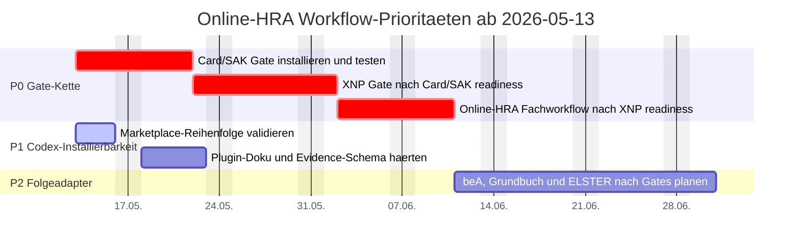

# OaC8: Organization as Code mit Enterprise Control Plane

Dieses Repository zeigt, wie ein Unternehmen als deklaratives und versioniertes System betrieben werden kann (`Organization as Code`). Fachanwender arbeiten ueber ein LLM-Frontend in natuerlicher Sprache, waehrend Git, Pull Requests, Reviews, Actions und signierte Abschluesse die verbindliche Prozessfuehrung uebernehmen. `OaC8` ist dabei die konkrete Auspraegung als Enterprise Control Plane.

## Kernidee

- Das LLM erzeugt aus Prompts strukturierte Prozessantraege.
- Git repraesentiert den offiziellen Lebenszyklus eines Geschaeftsvorgangs.
- Python validiert fachliche Regeln und fuehrt wiederholbare Prozesse deterministisch aus.
- GitHub Actions orchestrieren Checks, Freigaben, periodische Jobs und Artefakt-Erzeugung.

## Positionierung

- Architekturmodell: `Organization as Code`
- Betriebsprinzip: `Enterprise GitOps`
- konkrete Umsetzung in diesem Repo: `OaC8`
- Plattformname: `Enterprise Control Plane`
- Referenz: `docs/organization-as-code-positioning.md`

## Meine konkrete Empfehlung

Wenn du das ernsthaft als Produkt, Plattform oder internes Transformationsmodell aufziehen willst, wuerde ich es so framen:

- Begriff: `Organization as Code`
- Plattformname: `Enterprise Control Plane`
- erstes Produktversprechen: "Team-, Rollen- und Zugriffsaenderungen laufen deklarativ, auditierbar und automatisiert ueber Git."

Das ist konkret, glaubwuerdig und gross genug, um das Paradigma zu zeigen.

Der Ein-Satz-Pitch:

Organization as Code ist ein Betriebsmodell, in dem Unternehmensstruktur, Policies und operative Aenderungen deklarativ in Git beschrieben und ueber eine Enterprise Control Plane in reale Systeme reconciled werden.

## Prozessklassen

- `formation`: Gruendung, Rollen, Register- und Fristenschritte
- `invoice`: Angebot, Rechnungsentwurf, Freigabe, Versand, Zahlung
- `bookkeeping`: Buchungssatz, Kontierung, Belegbezug, Monatsabschluss
- `tax`: Steuerfall, Aggregation, Voranmeldung, Abgabevorbereitung
- `team`, `role_change`, `joiner_mover`: MVP-Startset fuer Org/Access/Tooling-Onboarding

## Aktuelle Workflow-Prioritaeten

Die Online-HRA-Schiene ist notariatsseitig eine Gate-Kette. Die Reihenfolge ist verbindlich, weil XNP erst nach lokal funktionierendem Kartenpfad sinnvoll getestet werden kann.

| Prio | Workflow | Blockiert | Sichtbares Ergebnis |
| --- | --- | --- | --- |
| P0 | `oac-cyberjack-rfid` Card/SAK Gate | XNP-Login-Test | Karte, Kartenleser, PC/SC, SAK lite/XNP-Kartenpfad und secureFramework sind lokal readiness-geprueft |
| P0 | `oac-bnotk-xnp` XNP Gate | HRA/XNotar-Workflow | XNP, lokale Anmeldung, Amtstaetigkeitskontext, XNotar-Modul und Austauschordner sind readiness-geprueft |
| P0 | `oac-handelsregister` Online-HRA Layer | produktionsnahes HRA-Paket | HRA/HRB-Spur, Pflichtangaben, Notarroute, Freigaben und Evidence-Metadaten sind vorbereitet |
| P1 | Installierbarkeit und Validierung | Pilotbetrieb | Codex-Marketplace-Reihenfolge, Plugin-Manifeste und Validator sind stabil |
| P2 | Folgeadapter beA, Grundbuch, ELSTER | Cross-Domain-Ausbau | bleiben nachgelagert, bis Card/SAK-, XNP- und HRA-Gates stabil sind |



## Repository-Struktur

- `docs/` erklaert das fachliche Modell und die Architektur.
- `docs/fachanwender-guide.md` erklaert das Modell ohne IT-Vorkenntnisse.
- `docs/START_HERE.md` fuehrt neue Nutzer durch die Einfuehrung.
- `docs/vscode-copilot-start.md` ist der Startpfad fuer VS Code + GitHub Copilot.
- `docs/vscode-first-user-path.md` fuehrt Erstnutzer mit einem Formularpfad.
- `docs/copilot-quickstart-15min.md` ist die 15-Minuten-Kurzanleitung fuer Copilot.
- `docs/platform-onboarding-matrix.md` sichert plattformuebergreifende Synchronitaet.
- `docs/fork-and-release-operating-model.md` definiert Upstream/Fork/Domaenen-Betrieb.
- `docs/release-sync-playbook.md` beschreibt den verbindlichen Upstream-Sync-Ablauf.
- `docs/parallelbetrieb-version-binding.md` regelt Alt-/Neu-Mischbetrieb je Vorgangsstart.
- `docs/issue-taxonomie-pro-repo.md` definiert Issue-Fuehrung ueber mehrere Repos.
- `docs/einfuehrung-greenfield-brownfield.md` trennt Einfuehrungspfade fuer Greenfield/Brownfield.
- `docs/service-business-core-vertical-blueprint.md` beschreibt Core-und-Vertical-Struktur fuer Dienstleister.
- `docs/vertical-starter-prozesskatalog.md` liefert Starter-Prozesse fuer fuenf Verticals.
- `docs/repo-refactor-plan-single-repo-modules.md` beschreibt Zielstruktur und Migration in einem Repo.
- `docs/arbeitsmodell-agile-cadence.md` definiert Arbeits-Cadence fuer `agile` und `kanban`.
- `docs/access-and-issue-operations.md` regelt Rollen, Zugriffe und repo-uebergreifende Issue-Uebersicht.
- `docs/plugin-plans/` enthaelt lokale Plugin- und Connector-Plaene fuer GitHub, OCI, Fachsysteme und Codex-Laufzeit.
- `docs/revisionssicherheit-eventstreaming.md` definiert revisionssicheren Event-Journal-Betrieb.
- `docs/eventstream-implementation-templates.md` liefert konkrete AWS-/Azure-/GCP-/OCI-Implementierungsvorlagen.
- `docs/eventstream-runbook-azure.md` ist das konkrete Azure-Betriebsrunbook.
- `docs/eventstream-runbook-aws.md` ist das konkrete AWS-Betriebsrunbook.
- `docs/eventstream-runbook-gcp.md` ist das konkrete GCP-Betriebsrunbook.
- `docs/eventstream-runbook-oci.md` ist das konkrete OCI-Betriebsrunbook.
- `docs/tenant-ownership-and-eventlock-service.md` beschreibt Tenant-Owner- und Service-Modell.
- `docs/avv-checkliste-eventlock-saas.md` liefert die AVV-Checkliste fuer EventLock-SaaS.
- `docs/function8-service-catalog.md` listet alle Function8-Leistungen transparent.
- `docs/third-party-operations-and-exit.md` beschreibt Drittbetrieb und Exit ohne Lock-in.
- `docs/organization-as-code-positioning.md` schaerft den Begriffsrahmen OaC/GitOps/OaC8.
- `docs/oac-enterprise-control-plane-mvp.md` beschreibt MVP-Scope, 6-Monats-Plan und KPI-Set.
- `docs/quality-gate.md` beschreibt den deterministischen Pruefpfad fuer lokale und CI-Gates.
- `docs/technology-decision.md` beschreibt verbindliche Technikentscheidungen.
- `docs/sbom-products.md` beschreibt SBOM-Produkte und Lizenzmodell.
- `docs/public-readiness.md` enthaelt den Public-Go-Live-Status.
- `docs/issue-backlog-public.md` enthaelt priorisierte Public-Issues.
- `docs/startup-verification.md` beschreibt den lokalen Startcheck.
- `docs/role-model.md` enthaelt Rollen, Qualifikationen und Approval-Matrix.
- `docs/github-identity-role-model.md` erklaert GitHub-Login zu Rollenreferenz.
- `prompts/` enthaelt Prompt-Standards fuer das LLM-Frontend.
- `prompts/onboarding/` enthaelt gefuehrte Einfuehrungs-Prompts je Branche.
- `prompts/onboarding/vscode-first-user-assistant.md` ist der gefuehrte Erstnutzer-Prompt.
- `scripts/startup_check.py` prueft Setup, Policies und optional Tests.
- `scripts/onboarding_wizard.py` speichert Onboarding-Status ueber mehrere Tage/Personen.
- `policies/` enthaelt Kultur-, Sprach- und Prozessvorgaben.
- `policies/technology-policy.yaml` definiert den verbindlichen Technikstack.
- `policies/data-protection-policy.yaml` definiert Datenschutz- und Secret-Regeln.
- `policies/sbom-policy.yaml` definiert den verbindlichen SBOM-Standard.
- `policies/role-model-policy.yaml` definiert Rollenrechte und Qualifikations-Gates.
- `policies/access-control-policy.yaml` definiert verbindlich Zugriff, Sichtbarkeit und Gastregeln.
- `policies/revisionssicherheit-eventstream-policy.yaml` definiert Eventstream- und WORM-Pflichten.
- `policies/tenant-ownership-policy.yaml` definiert Tenant-Ownership und Provider/Kunden-Verantwortung.
- `policies/provider-open-services-policy.yaml` erzwingt offene Leistungsdokumentation und Ersetzbarkeit.
- `policies/onboarding-flow.json` definiert Fragen, Phasen und Rollenwissen fuer Onboarding.
- `policies/onboarding-diagrams.json` definiert BPMN-/Mermaid-Referenzen je Frage.
- `policies/github-identity-registry.json` mappt GitHub-Login auf technische Rollen.
- `.cursor/rules/` enthaelt persistente Cursor-Regeln fuer das Vorgehen.
- `.cursor/rules/11-cloud-runbook-parity.mdc` erzwingt Pflegeparitaet fuer AWS, Azure, GCP, OCI.
- `.cursor/rules/12-open-service-portability.mdc` erzwingt offene Leistungsdoku und Ersetzbarkeit.
- `schemas/` definiert strukturierte Prozessantraege.
- `bpmn/` enthaelt fachlich verbindliche BPMN-2.0-Quellmodelle.
- `processes/` enthaelt beispielhafte fachliche Instanzen.
- `src/business_os/` enthaelt die Python-Engine.
- `.github/workflows/` enthaelt Governance- und Runtime-Workflows.
- `.github/workflows/sbom-export.yml` erzeugt SBOM-Artefakte fuer Releases.
- `.github/copilot-instructions.md` enthaelt Repository-Anweisungen fuer Copilot.
- `.github/ISSUE_TEMPLATE/` enthaelt strukturierte Issue-Formulare.
- `.github/workflows/governance-policy-sync.yml` erzwingt Policy-zu-Rule-Synchronitaet.

## Schnellstart

```bash
python -m business_os validate processes/invoices/2026/REQ-2026-0001.json
python -m business_os render-summary processes/invoices/2026/REQ-2026-0001.json
python -m business_os monthly-close --year 2026 --month 3
```

## Betriebsmodell

1. Ein Fachanwender beschreibt einen Vorgang per Prompt.
2. Das LLM erstellt einen Prozessantrag als JSON-Datei und eroeffnet einen Branch oder Pull Request.
3. Die Python-Engine validiert Schema, Zustandsuebergaenge und Idempotenz.
4. GitHub Actions fuehren automatische Checks aus und fordern Freigaben an.
5. Nach dem Merge nach `main` gilt der Vorgang als verbindlich freigegeben und kann exportiert, archiviert oder periodisch aggregiert werden.

## Governance

- `main` ist geschuetzt und wird nur per Pull Request aktualisiert.
- Sensible Schritte wie Steuerabgabe oder Zahlungsfreigabe erhalten manuelle Reviewer-Gates.
- Tags und Releases repraesentieren Monats- oder Quartalsabschluesse.
- Erzeugte Artefakte koennen als Actions-Artefakte archiviert werden.
- Laufende Vorgaenge bleiben auf der beim Start gebundenen Prozessversion.

## Hinweise

Dieses Repo ist ein Referenzsystem. Es ersetzt kein vorgeschriebenes Fachsystem, sondern zeigt, wie Git als Orchestrierungs-, Kontroll- und Nachweisschicht fuer kaufmaennische Prozesse dienen kann.

## Lizenz

Dieses Repository steht unter `GPL-3.0` (siehe `LICENSE`).

## Empfohlene Lesereihenfolge fuer Nicht-IT

1. `docs/fachanwender-guide.md` fuer Zielbild, Nutzen und Einfuehrung.
2. `docs/START_HERE.md` fuer den konkreten Start im eigenen Unternehmen.
3. `docs/business-os.md` fuer Rollen, Prozesslogik und Grenzen.
4. `docs/governance.md` fuer Freigabe- und Nachweispflichten.

## Branchen-Onboarding

- Kanzlei: `prompts/onboarding/law-firm-first-setup.md`
- Notariat: `prompts/onboarding/notary-first-setup.md`
- Hausverwaltung: `prompts/onboarding/property-management-first-setup.md`
- Softwareunternehmen: `prompts/onboarding/software-company-first-setup.md`
- Steuerbuero: `prompts/onboarding/tax-office-first-setup.md`
- Vermoegensverwaltung: `prompts/onboarding/wealth-management-first-setup.md`
- VS Code + Copilot Start: `prompts/onboarding/vscode-copilot-business-os-setup.md`

Default fuer synchrone MVP-Pfade in diesem Repo:

- `software_company`
- `notary`
- `wealth_management`

Zusaetzlicher MVP-Use-Case:

- `property_management`

## Plattform-Regel

Konzeptaenderungen werden immer fuer Cursor und VS Code + Copilot synchron gepflegt.

## Startcheck

Vor produktiver Arbeit:

`python scripts/startup_check.py --ide auto --run-tests`

## Technik-Regel

In diesem Musterrepo sind nur Techniken aus `policies/technology-policy.yaml` zulaessig.

## Datenschutz-Regel

In diesem Musterrepo sind keine echten personenbezogenen Daten oder Secrets zulaessig.
