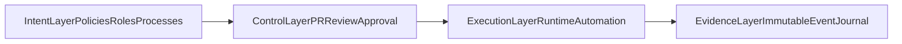
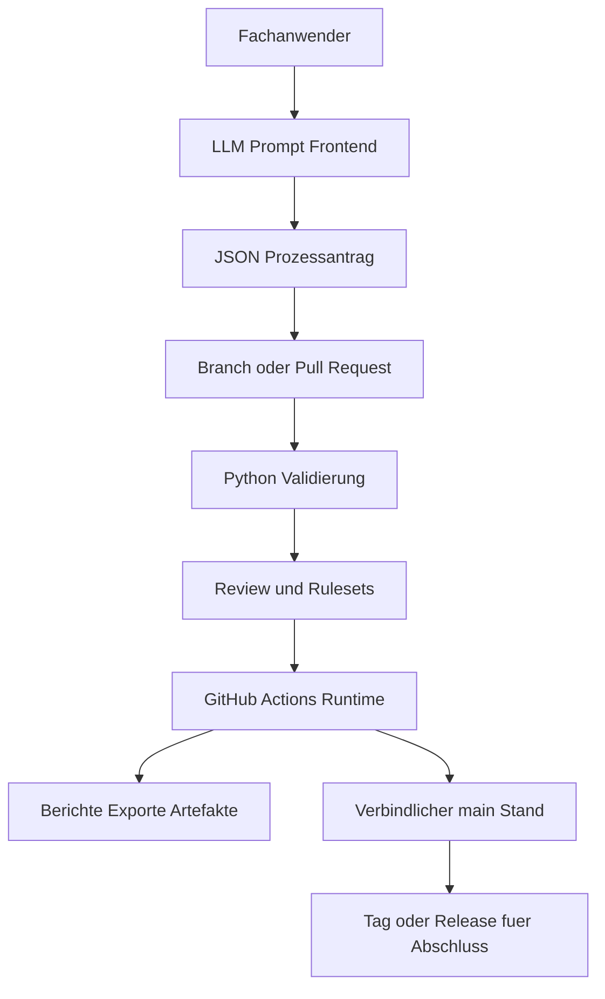
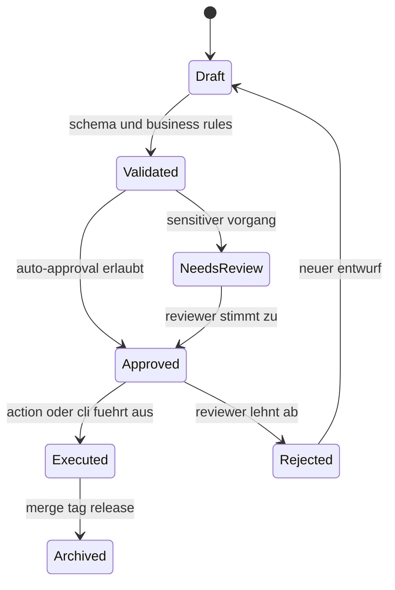
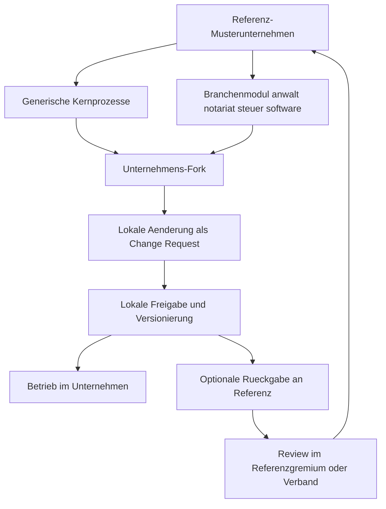

# Architektur

## Architekturrahmen

Diese Architektur folgt dem Modell `Notariat as Code` mit `Enterprise GitOps` als Steuerungsprinzip.
`NoC` ist die konkrete Auspraegung dieses Rahmens.

Referenz: `docs/de/organization-as-code-positioning.md`

## Schichten

1. `Prompt Frontend`
   Ein LLM oder Bot nimmt Anfragen in Alltagssprache entgegen und fuellt standardisierte Prozessantraege.
2. `Git Control Plane`
   Branches, Pull Requests, Reviews, Rulesets, Tags und Releases fuehren den offiziellen Lebenszyklus.
3. `Python Execution Plane`
   Die Engine validiert Schemas, prueft Zustandsuebergaenge, berechnet Folgewerte und erzeugt Zusammenfassungen.
4. `Automation Plane`
   GitHub Actions fuehren PR-Checks, periodische Prozesse und Genehmigungsgates aus.

## NoC-Layer-Mapping

## Datenfluss

## Fachlicher Zustandsautomat

## Steuerung per GitHub Actions

### `validate-process.yml`

- startet auf `pull_request` und `workflow_dispatch`
- validiert geaenderte Prozessdateien
- erzeugt eine lesbare Zusammenfassung fuer Reviewer

### `run-process.yml`

- erlaubt einen gezielten manuellen Lauf fuer einen Vorgang
- nutzt den Python-CLI-Einstieg
- eignet sich fuer Bot-Aufrufe aus einem LLM-Frontend

Die lokale Operator-Webapp ist ein Bedienkanal fuer Arbeitsplatz-Gates. Sie
fuehrt NoC nicht remote aus, sondern spricht eine per CLI gestartete
`127.0.0.1`-Bridge an, die freigegebene lokale Pruefskripte im Workspace
startet und minimierte Readiness-Metadaten zurueckgibt.

### `monthly-close.yml`

- laeuft periodisch oder manuell
- aggregiert Buchungen und Rechnungen fuer einen Monatsabschluss
- erzeugt einen Abschlussbericht als Artefakt

## Governance-Mapping

- Pull Request: fachlicher Antrag
- Review: menschliche Freigabe
- Environment: harter Freigabepunkt fuer sensible Prozesse
- Ruleset: Repository-weite Durchsetzungsregel
- Tag: versionierter Abschluss
- Release-Artefakt: extern pruefbare Ableitung

## Referenz, Fork und Rueckfluss

Operative Details sind ausgelagert nach:

- `docs/de/operations/fork-and-release-operating-model.md`
- `docs/de/operations/release-sync-playbook.md`
- `docs/de/operations/parallelbetrieb-version-binding.md`
- `docs/de/issues/taxonomy.md`
- `docs/de/service-model/core-vertical-blueprint.md`
- `docs/de/service-model/vertical-starter-process-catalog.md`
- `docs/de/operations/single-repo-refactor-plan.md`

## Python-Komponenten

- `models.py`: normalisierte Datenklassen fuer Prozessantraege
- `registry.py`: Prozessdefinitionen mit erlaubten Zustandsuebergaengen
- `schema_tools.py`: leichtgewichtige Validierung gegen JSON-Schemas
- `engine.py`: Orchestrierung, Idempotenzpruefung und Monatsabschluss
- `cli.py`: Kommandozeilenoberflaeche fuer lokale und CI-Laeufe
- `scripts/nac_hw_bridge.py`: per CLI gestartete Localhost-Bridge fuer die
  lokale Operator-Webapp und Hardware-Readiness-Pruefungen
