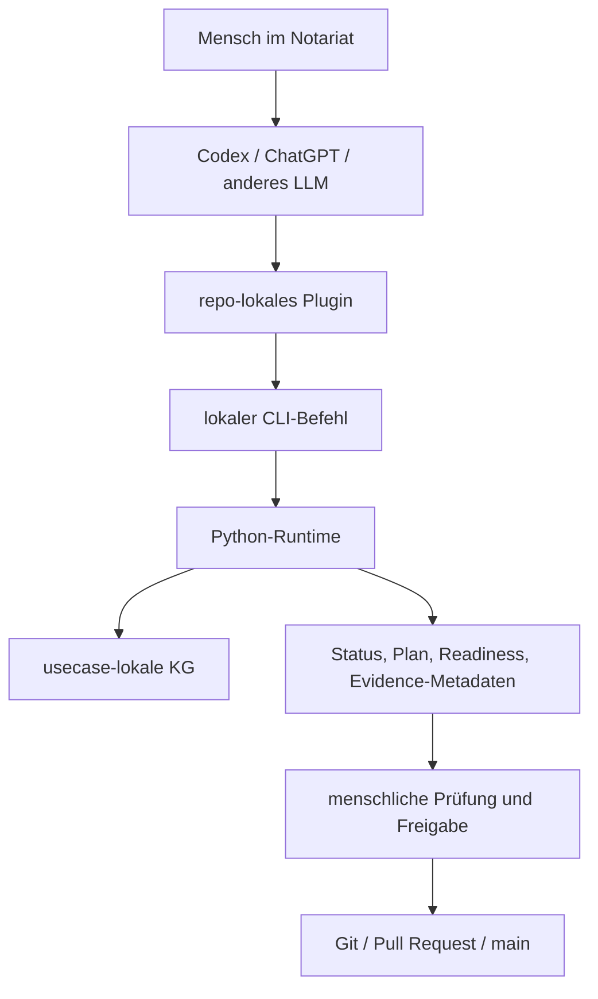

# Ausführungsmodell: Warum NaC CLI-First Ist

NaC ist heute bewusst CLI-first. Das heißt: Die stabile Ausführung liegt in
lokalen, prüfbaren Befehlen. Codex-Plugins, spätere Apps oder eine UI dürfen
diese Befehle bedienen, aber sie sind nicht die fachliche Wahrheit.

## Was Bedeutet CLI?

CLI steht für "Command Line Interface", also Kommandozeilen-Schnittstelle. Für
Nicht-Techniker ist das am einfachsten so zu verstehen:

Eine CLI ist ein eindeutig benannter Arbeitsauftrag an den Computer. Statt auf
einen Button zu klicken, wird ein Befehl ausgeführt, zum Beispiel:

```bash
python scripts/nac.py status
```

Der Vorteil ist nicht, dass Menschen gerne Befehle tippen sollen. Der Vorteil
ist, dass derselbe Auftrag von vielen Oberflächen aus sauber, wiederholbar und
protokollierbar gestartet werden kann.

## Heutiges Produktbild



## Warum Das Elegant Ist

| Grund | Bedeutung |
| --- | --- |
| Wiederholbar | Derselbe Befehl liefert denselben prüfbaren Ablauf, lokal und in CI. |
| Einfach einzuführen | Python und Git laufen auf vielen Umgebungen, ohne sofort eine zentrale Web-App zu betreiben. |
| Gut für sensible Daten | Befehle können lokal am Arbeitsplatz laufen; echte Mandatsdaten müssen nicht in eine externe UI. |
| Automatisierbar | GitHub Actions, Codex-Plugins, lokale Skripte oder spätere Apps können dieselbe Runtime aufrufen. |
| UI-unabhängig | Eine spätere Web-UI oder ChatGPT-App ist eine Bedienoberfläche, nicht der Kern der Logik. |
| Zukunftsfähig | Neue Oberflächen können ergänzt werden, ohne die fachliche Runtime neu zu erfinden. |
| Auditierbar | Befehl, Eingabe, Ergebnis, Review und Merge lassen sich versioniert nachvollziehen. |

## Warum Nicht Zuerst Eine UI?

Eine UI wirkt für Anwender zunächst einfacher, aber sie kann zu frueh die
falschen Dinge festlegen: Masken, Klickwege, Rollen und Datenfluesse. NaC will
zuerst den prüfbaren Kern stabil machen:

1. Welche Vorgangstypen gibt es?
2. Welche offenen Angaben, Dokumente, Entscheidungen und Gates sind nötig?
3. Welche Daten dürfen nicht in Git?
4. Welche lokalen Checks und Plugin-Gates sind sicher?
5. Welche menschliche Freigabe ist erforderlich?

Wenn diese Logik stabil ist, kann eine UI dieselbe CLI/Runtimeschicht bedienen.
So entsteht eine UI auf einem geprüften Fundament statt eine Oberfläche ohne
belastbare Prozesslogik.

## Heute, Pilot, Später

| Ebene | Stand | Rolle |
| --- | --- | --- |
| Zentrale `nac`-CLI und Python-Runtime | Heute nutzbar | Prüft KG, BPMN, Konfiguration, Status, Editor-View und Quality Gates. |
| Codex-Plugins | Pilotfähig | Führen lokale Readiness-, Plan- und Evidence-Prüfungen geführt aus. |
| GitHub Actions | Heute nutzbar | Führen Gates und Validierungen reproduzierbar aus. |
| BPMN-js Business Layer | Erstes Profil vorhanden | Visuelle BPMN-Bearbeitung für fachliche Abläufe; Python prüft das Modell vor Merge. |
| Lokaler Webserver | Heute nutzbar | Zeigt BPMN- und KG-Ansichten lokal im Browser, ohne Cloud und ohne echte Mandatsdaten. |
| Sidecar-Editor | Geplant | Grafische Bedienung für KG-Formulare und Checklisten. |
| ChatGPT-App oder Workspace-App | Geplant | Komfortable Bedienoberfläche für berechtigte Nutzer. |
| Eigenständige NaC-Web-App | Nicht heutiger Kern | Möglich, aber erst sinnvoll, wenn Runtime, Rollen und Gates stabil sind. |

## Merksatz

CLI-first bedeutet nicht "nur für Techniker". Es bedeutet: Der Kern ist klein,
lokal, prüfbar, automatisierbar und später von vielen Oberflächen aus
bedienbar.

Die verbindliche Bedienkante heißt künftig `nac`. Direkte Skripte bleiben als
interne oder kompatible Ebene möglich, aber neue Produktfunktionen sollen über
die zentrale CLI erreichbar sein.

## Nächste Dokumente

- [docs/de/notar-start.md](notar-start.md)
- [docs/de/cli.md](cli.md)
- [docs/de/betriebsstart.md](betriebsstart.md)
- [docs/de/integration-start.md](integration-start.md)
- [docs/de/kg-editor-workstream.md](kg-editor-workstream.md)
- [docs/de/bpmn-js-business-layer.md](bpmn-js-business-layer.md)
- [docs/de/lokaler-webserver.md](lokaler-webserver.md)
- [workflows/python/README.md](../../workflows/python/README.md)
