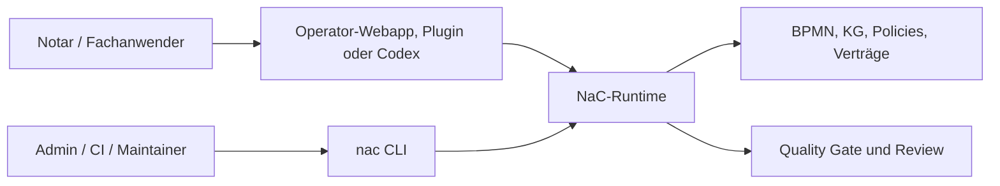

# NaC-CLI: Technische Steuerfläche Hinter Der Bürooberfläche

Status: erste zentrale CLI umgesetzt am 2026-05-19

## Idee

Die NaC-CLI ist nicht die Produktoberfläche für das Notariat. Sie ist die
technische Steuer- und Prüfschicht hinter der lokalen Bürooberfläche, hinter
Codex-Plugins und hinter späteren Automatisierungen.

Für fachliche Nutzer beginnt NaC mit der lokalen Operator-Webapp:

```bash
python scripts/nac.py operator --open
```

Die CLI bleibt wichtig, weil sie dieselben Prüfungen reproduzierbar macht:
Status, Quality Gate, BPMN, Knowledge Graphs, Plugins und Konfigurationen.

Der gemeinsame Einstieg heißt:

```bash
nac
```

Ohne Installation kann derselbe Einstieg direkt aus dem Repo gestartet werden:

```bash
python scripts/nac.py status
```

Nach einer lokalen Installation aus dem Repo steht der kurze Befehl bereit:

```bash
python -m pip install -e .
nac status
```

## Warum Das Für Nicht-Techniker Trotzdem Relevant Ist

Eine CLI ist ein klar benannter Arbeitsauftrag an den Computer. Ein Notar muss
diese Befehle nicht auswendig können. Aber das Büro profitiert davon, dass
jeder Button, jeder Plugin-Aufruf und jeder automatische Check auf eine
prüfbare technische Handlung zurückgeführt werden kann.

| Frage | Antwort |
| --- | --- |
| Muss der Notar Befehle auswendig können? | Nein. Der sichtbare Einstieg ist die Bürooberfläche; die CLI ist die technische Prüffläche dahinter. |
| Warum nicht nur Web-UI? | Eine reine UI kann Logik verstecken. Die CLI macht Prüfungen, Ergebnisse und Wiederholung sichtbar. |
| Warum ist das zukunftsfähig? | Lokale Webapp, Codex-Plugin, CI und spätere Apps können dieselbe geprüfte Runtime nutzen. |
| Was wird protokollierbar? | Befehl, Eingabe, Ergebnis, Review und Git-Änderung. |

## Erste Befehle

```bash
python scripts/nac.py status
python scripts/nac.py doctor --profile strict
python scripts/nac.py web
python scripts/nac.py kg status
python scripts/nac.py bpmn validate
python scripts/nac.py config list
python scripts/nac.py plugins actions
```

Nach Installation entsprechend:

```bash
nac status
nac doctor --profile strict
nac web
nac kg status
nac bpmn validate
nac config list
nac plugins actions
nac tenant status --repo ../demo8notariat
nac qms status
```

## Technische Bedienflächen

| Bereich | Befehl | Aufgabe |
| --- | --- | --- |
| Überblick | `nac status` | Zeigt Usecases, offene Pflichtangaben, BPMN-Modelle und Konfigurationen. |
| Qualität | `nac doctor --profile strict` | Führt den strikten Quality Gate aus. |
| Bürooberfläche | `nac operator --open` | Startet die lokale Operator-Webapp mit Vorgängen, Checklisten, BPMN, Editor und Arbeitsplatztests. |
| Grafische Modellansicht | `nac web` | Startet den lokalen Webserver für BPMN- und KG-Ansichten. |
| Knowledge Graphs | `nac kg status` | Zeigt den Stand der usecase-lokalen Wissensgraphen. |
| BPMN | `nac bpmn list` und `nac bpmn validate` | Listet und prüft fachliche BPMN-Prozessmodelle. |
| Prozesse | `nac process validate-all` | Prüft deterministische Prozessanträge. |
| Plugins | `nac plugins actions` und `nac plugins install --mode dry-run` | Listet fachliche Plugin-Befehle und prüft die lokale Plugin-Spiegelung. |
| Konfiguration | `nac config list` und `nac config validate` | Zeigt und prüft steuernde Policies, Verträge und Runtime-Konfiguration. |
| Datenrepo | `nac tenant status --repo ../demo8notariat` | Prüft ein getrenntes NaC-Datenrepo für Demo- oder spätere Produktivdaten. |
| QMS | `nac qms status` und `nac qms evidence --repo ../demo8notariat` | Zeigt ISO-9001/QMS-Artefakte und Nachweiszahlen aus dem Datenrepo. |

## QMS- und ISO-9001-Schicht

NaC enthält eine QMS-Schicht unter [qms/](../../qms). Sie ordnet
Qualitätspolitik, Qualitätsziele, Rollen, Prozesslandkarte, interne Audits,
Managementbewertung und Abweichungen den NaC-Artefakten zu.

```bash
nac qms status
nac qms iso9001-map
nac qms audit-plan
nac qms evidence --repo ../demo8notariat
```

## Getrenntes Datenrepo

NaC schreibt Vorgangs- und Testdaten nicht in das Produktrepo. Für synthetische
Demo-Daten gibt es ein getrenntes Datenrepo, zum Beispiel `../demo8notariat`:

```bash
nac tenant init --repo ../demo8notariat --name demo8notariat --remote-url https://github.com/ofunk/demo8notariat.git
nac tenant write-sample-akte --repo ../demo8notariat --akten-id UVZ-2026-0001
nac tenant write-demo immobilienkaufvertrag --repo ../demo8notariat --case-id DEMO-2026-0001
```

Das führende Aktenmodell nutzt kleine JSON-Dateien mit stabilen IDs für Akten,
Personen, Dokumente, Ereignisse und Indizes. PDF-, JPG- und andere
Binärdateien liegen als Dateien neben ihren Metadaten. Die Trennung ist
dokumentiert in
[datenrepo-demo8notariat.md](datenrepo-demo8notariat.md).

## Plugin-Befehle

Die Plugin-Verwaltung und die bereits vorhandenen lokalen Plugin-Fachprüfungen
laufen jetzt ebenfalls über `nac`:

```bash
nac plugins actions
nac plugins validate
nac plugins install --mode dry-run
nac plugins card-readiness
nac plugins xnp-reader-prompt
nac plugins pkcs7-inspect --input beispiel.p7b
```

| Befehl | Bedeutung |
| --- | --- |
| `nac plugins card-readiness` | Prüft lokale Kartenleser-, SAK-/XNP- und Readiness-Metadaten. Bei installierter Hardware ist ein echter lokaler Hardwaretest möglich; PINs und Kartenrohdaten werden nicht gespeichert. |
| `nac plugins xnp-reader-prompt` | Erzeugt einen sicheren XNP-Reader-Prompt mit vorgeschaltetem Karten-Gate. |
| `nac plugins pkcs7-inspect` | Prüft ein lokales PKCS7/P7B/P7C-Zertifikatsbündel metadata-only, ohne Signatur oder Private-Key-Zugriff. |

Die alten Plugin-Skripte bleiben die interne Ausführungsebene. Sichtbar für
Anwender, Doku und Agenten ist der `nac plugins ...`-Aufruf.

Für einen Arbeitsplatz mit installierter echter Hardware:

```bash
nac plugins card-readiness --manual-card-present yes --manual-rfid-off yes --probe-morris-api --json
nac plugins xnp-reader-prompt --manual-card-present yes --manual-rfid-off yes --probe-morris-api --json
```

Diese Befehle dürfen reale lokale Treiber, morris, PC/SC, Kartenleser- und
XNP-Erreichbarkeit prüfen. Gesperrt bleiben produktive Portalaktionen,
Signaturvorgänge, PIN-Erfassung, Kartenrohdaten, Secrets und Mandatsdaten im
Repository.

## Architekturregel

Neue NaC-Funktionalität braucht eine verständliche Bedienfläche und eine
prüfbare technische Ausführung. Für fachliche Nutzung kann das eine Webapp-,
Plugin- oder Codex-Fläche sein; für Reproduzierbarkeit, Tests und Betrieb soll
die technische Kante über `nac` erreichbar sein. Direkte Skripte wie
`scripts/quality_gate.py` dürfen als interne oder kompatible Ebene bleiben.

Für schreibende Konfigurationsänderungen gilt eine zusätzliche Grenze:
Solange eine Konfiguration kein klares Schema, keine Validierung und keine
Freigaberegel besitzt, zeigt und prüft die CLI diese Datei nur. Schreibbefehle
werden pro Konfigurationsfamilie ergänzt, sobald der sichere Änderungsvertrag
feststeht.

## Beziehung Zur Lokalen Webapp

Die lokale Webapp ist die sichtbare Bürooberfläche. Sie startet über `nac`,
liest dieselben BPMN-/KG-Dateien und nutzt dieselbe geprüfte Runtime-Familie.
Das Zielbild ist:



Dadurch wird NaC für das Büro visuell nutzbar und bleibt für Betrieb, Prüfung
und Weiterentwicklung maschinell nachvollziehbar.
