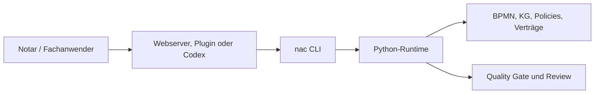

# NaC-CLI: Ein Steuerpult Für Das Repository

Status: erste zentrale CLI umgesetzt am 2026-05-19

## Idee

NaC wird CLI-first gebaut. Das bedeutet nicht, dass ein Notar dauerhaft im
Terminal arbeiten soll. Es bedeutet: Jede fachliche Aktion hat einen
eindeutigen, prüfbaren Befehl. Eine Weboberfläche, ein Plugin oder Codex darf
diesen Befehl später auslösen, aber die Logik bleibt dieselbe.

Der gemeinsame Einstieg heißt:

```bash
nac
```

Ohne Installation kann derselbe Einstieg direkt aus dem Repo gestartet werden:

```bash
python scripts/nac.py status
```

Nach einer lokalen Installation aus dem Repo steht der kurze Befehl bereit:

```bash
python -m pip install -e .
nac status
```

## Warum Das Für Nicht-Techniker Wichtig Ist

Eine CLI ist ein klar benannter Arbeitsauftrag an den Computer. Im Alltag kann
daraus später ein Button, ein Plugin-Aufruf oder eine geführte Webansicht
werden. Der Vorteil ist, dass alle diese Wege dieselbe geprüfte Handlung
ausführen.

| Frage | Antwort |
| --- | --- |
| Muss der Notar Befehle auswendig können? | Nein. Die CLI ist die stabile technische Bedienkante. Oberflächen können sie nutzen. |
| Warum nicht nur Web-UI? | Eine reine UI kann Abläufe verstecken. Die CLI macht jeden Schritt wiederholbar und auditierbar. |
| Warum ist das zukunftsfähig? | Lokaler Webserver, Codex-Plugin, CI und spätere Apps können dieselben Befehle verwenden. |
| Was wird protokollierbar? | Befehl, Eingabe, Ergebnis, Review und Git-Änderung. |

## Erste Befehle

```bash
python scripts/nac.py status
python scripts/nac.py doctor --profile strict
python scripts/nac.py web
python scripts/nac.py kg status
python scripts/nac.py bpmn validate
python scripts/nac.py config list
python scripts/nac.py plugins actions
```

Nach Installation entsprechend:

```bash
nac status
nac doctor --profile strict
nac web
nac kg status
nac bpmn validate
nac config list
nac plugins actions
```

## Bedienflächen

| Bereich | Befehl | Aufgabe |
| --- | --- | --- |
| Überblick | `nac status` | Zeigt Usecases, offene Pflichtangaben, BPMN-Modelle und Konfigurationen. |
| Qualität | `nac doctor --profile strict` | Führt den strikten Quality Gate aus. |
| Grafische Ansicht | `nac web` | Startet den lokalen Webserver für BPMN- und KG-Ansichten. |
| Knowledge Graphs | `nac kg status` | Zeigt den Stand der usecase-lokalen Wissensgraphen. |
| BPMN | `nac bpmn list` und `nac bpmn validate` | Listet und prüft fachliche BPMN-Prozessmodelle. |
| Prozesse | `nac process validate-all` | Prüft deterministische Prozessanträge. |
| Plugins | `nac plugins actions` und `nac plugins install --mode dry-run` | Listet fachliche Plugin-Befehle und prüft die lokale Plugin-Spiegelung. |
| Konfiguration | `nac config list` und `nac config validate` | Zeigt und prüft steuernde Policies, Verträge und Runtime-Konfiguration. |

## Plugin-Befehle

Die Plugin-Verwaltung und die bereits vorhandenen lokalen Plugin-Fachprüfungen
laufen jetzt ebenfalls über `nac`:

```bash
nac plugins actions
nac plugins validate
nac plugins install --mode dry-run
nac plugins card-readiness
nac plugins xnp-reader-prompt
nac plugins pkcs7-inspect --input beispiel.p7b
```

| Befehl | Bedeutung |
| --- | --- |
| `nac plugins card-readiness` | Prüft lokale Kartenleser-, SAK-/XNP- und Readiness-Metadaten. Bei installierter Hardware ist ein echter lokaler Hardwaretest möglich; PINs und Kartenrohdaten werden nicht gespeichert. |
| `nac plugins xnp-reader-prompt` | Erzeugt einen sicheren XNP-Reader-Prompt mit vorgeschaltetem Karten-Gate. |
| `nac plugins pkcs7-inspect` | Prüft ein lokales PKCS7/P7B/P7C-Zertifikatsbündel metadata-only, ohne Signatur oder Private-Key-Zugriff. |

Die alten Plugin-Skripte bleiben die interne Ausführungsebene. Sichtbar für
Anwender, Doku und Agenten ist der `nac plugins ...`-Aufruf.

Für einen Arbeitsplatz mit installierter echter Hardware:

```bash
nac plugins card-readiness --manual-card-present yes --manual-rfid-off yes --probe-morris-api --json
nac plugins xnp-reader-prompt --manual-card-present yes --manual-rfid-off yes --probe-morris-api --json
```

Diese Befehle dürfen reale lokale Treiber, morris, PC/SC, Kartenleser- und
XNP-Erreichbarkeit prüfen. Gesperrt bleiben produktive Portalaktionen,
Signaturvorgänge, PIN-Erfassung, Kartenrohdaten, Secrets und Mandatsdaten im
Repository.

## Architekturregel

Neue NaC-Funktionalität muss künftig mindestens eine CLI-Bedienkante haben.
Direkte Skripte wie `scripts/quality_gate.py` dürfen als interne oder
kompatible Ebene bleiben, aber die Dokumentation soll den zentralen Weg über
`nac` zeigen.

Für schreibende Konfigurationsänderungen gilt eine zusätzliche Grenze:
Solange eine Konfiguration kein klares Schema, keine Validierung und keine
Freigaberegel besitzt, zeigt und prüft die CLI diese Datei nur. Schreibbefehle
werden pro Konfigurationsfamilie ergänzt, sobald der sichere Änderungsvertrag
feststeht.

## Beziehung Zum Lokalen Webserver

Der lokale Webserver ist eine Bedienoberfläche. Er ersetzt die CLI nicht,
sondern nutzt dieselbe Runtime-Schicht. Das Zielbild ist:



Dadurch bleibt NaC zugleich visuell nutzbar und maschinell prüfbar.
