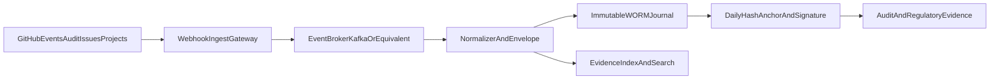

# Revisionssicherheit mit Eventstreaming (statt Export-only)

## Ausgangspunkt

GitHub Issues sind eine starke operative Arbeitsoberflaeche, aber nicht die alleinige revisionssichere Ablage.
Die revisionssichere Ebene wird als unveraenderbares Event-Journal umgesetzt.

## Warum Eventstreaming besser passt

- Ereignisse werden nah an Echtzeit erfasst (nicht nur periodisch exportiert).
- Das Journal ist append-only, kryptografisch verknuepft und signiert.
- Loeschungen/Manipulationen in der operativen Ebene bleiben im Journal nachweisbar.
- Fachbetrieb (Issues, Projects) und Nachweisebene (Journal) werden sauber getrennt.

## Referenzarchitektur

## Verbindliches Datenmodell je Event

Pflichtfelder:

- `event_id` (global eindeutig)
- `event_time_utc`
- `event_source`
- `repo`
- `issue_or_object_id`
- `actor_login`
- `action_type`
- `payload_hash`
- `previous_event_hash`
- `event_hash`
- `signature_ref`

Damit entsteht eine hash-verkettete, pruefbare Ereigniskette.

## Technische Leitplanken

1. Webhook-Signaturen pruefen (HMAC).
2. Broker mit TLS und eindeutiger Producer-Identitaet betreiben.
3. Dead-Letter-Queue fuer fehlerhafte Events verpflichtend.
4. Speicherung nur in WORM-faehigem Ziel.
5. Tagesanker (`daily anchor`) mit Signatur erzeugen.
6. Regelmaessige Restore- und Integritaetstests durchfuehren.

## Betriebsmodell

- Issues bleiben operative Steuerung.
- Das Event-Journal ist rechtlich relevante Nachweisschicht.
- Auditoren arbeiten primaer gegen Journal/Evidence-Index, nicht gegen mutable Issue-Historien.

## Schritt-fuer-Schritt Implementierung

1. Eventquellen festlegen (Org Audit, Issues, Projects, Approvals).
2. Webhook-Ingest-Endpunkt in geschuetzter Runtime bereitstellen.
3. Stream-Broker aufsetzen (Kafka/Event Hubs/Kinesis).
4. Normalizer mit Hash-Chain-Logik implementieren.
5. WORM-Store mit Aufbewahrungsfrist aktivieren.
6. Evidence-Index fuer Abfragen aufbauen.
7. taeglichen Hash-Anker und Signaturprozess aktivieren.
8. Governance-Prozess und Incident-Playbook finalisieren.

## Hinweis zur heise-Einordnung

Der Ansatz passt zur Richtung „auditierbare GRC-Assistenten“ (nachvollziehbare Quellen, Guardrails, kontrollierte Betriebsfuehrung), muss in eurem Fall aber um ein unveraenderbares Event-Journal ergaenzt werden, damit die taegliche Revisionssicherheit belastbar ist: [heise-Artikel](https://www.heise.de/news/iX-Workshop-GenAI-fuer-Security-Auditierbare-GRC-Assistenten-und-SOC-Reporting-11211724.html).
