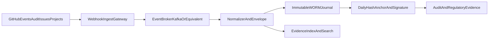

# Revisionssicherheit mit Eventstreaming (statt Export-only)

## Ausgangspunkt

GitHub Issues sind eine starke operative Arbeitsoberfläche, aber nicht die alleinige revisionssichere Ablage.
Die revisionssichere Ebene wird als unveränderbares Event-Journal umgesetzt.

## Warum Eventstreaming besser passt

- Ereignisse werden nah an Echtzeit erfasst (nicht nur periodisch exportiert).
- Das Journal ist append-only, kryptografisch verknüpft und signiert.
- Löschungen/Manipulationen in der operativen Ebene bleiben im Journal nachweisbar.
- Fachbetrieb (Issues, Projects) und Nachweisebene (Journal) werden sauber getrennt.

## Referenzarchitektur

## Verbindliches Datenmodell je Event

Pflichtfelder:

- `event_id` (global eindeutig)
- `event_time_utc`
- `event_source`
- `repo`
- `issue_or_object_id`
- `actor_login`
- `action_type`
- `payload_hash`
- `previous_event_hash`
- `event_hash`
- `signature_ref`

Damit entsteht eine hash-verkettete, prüfbare Ereigniskette.

## Technische Leitplanken

1. Webhook-Signaturen prüfen (HMAC).
2. Broker mit TLS und eindeutiger Producer-Identität betreiben.
3. Dead-Letter-Queue für fehlerhafte Events verpflichtend.
4. Speicherung nur in WORM-fähigem Ziel.
5. Tagesanker (`daily anchor`) mit Signatur erzeugen.
6. Regelmäßige Restore- und Integritaetstests durchführen.

## Betriebsmodell

- Issues bleiben operative Steuerung.
- Das Event-Journal ist rechtlich relevante Nachweisschicht.
- Auditoren arbeiten primär gegen Journal/Evidence-Index, nicht gegen mutable Issue-Historien.

## Schritt-für-Schritt Implementierung

1. Eventquellen festlegen (Org Audit, Issues, Projects, Approvals).
2. Webhook-Ingest-Endpunkt in geschützter Runtime bereitstellen.
3. Stream-Broker aufsetzen (Kafka/Event Hubs/Kinesis).
4. Normalizer mit Hash-Chain-Logik implementieren.
5. WORM-Store mit Aufbewahrungsfrist aktivieren.
6. Evidence-Index für Abfragen aufbauen.
7. täglichen Hash-Anker und Signaturprozess aktivieren.
8. Governance-Prozess und Incident-Playbook finalisieren.

## Hinweis zur heise-Einordnung

Der Ansatz passt zur Richtung „auditierbare GRC-Assistenten“ (nachvollziehbare Quellen, Guardrails, kontrollierte Betriebsführung), muss in eurem Fall aber um ein unveränderbares Event-Journal ergänzt werden, damit die tägliche Revisionssicherheit belastbar ist: [heise-Artikel](https://www.heise.de/news/iX-Workshop-GenAI-fuer-Security-Auditierbare-GRC-Assistenten-und-SOC-Reporting-11211724.html).
