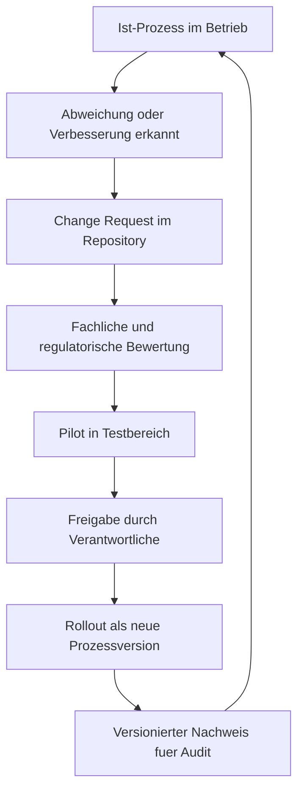

# Fachanwender-Guide: Git als Business-OS ohne IT-Spezialwissen

## Warum dieses Modell hilfreich ist

Ein Unternehmen lebt von wiederholbaren Entscheidungen und nachvollziehbaren Ablaeufen. In vielen Firmen existieren diese Regeln nur in Koepfen, E-Mails oder einzelnen Tools. Das fuehrt zu:

- unklaren Verantwortlichkeiten,
- unvollstaendiger Dokumentation,
- schwerer Pruefbarkeit bei Audit, Steuer oder Qualitaetsnachweisen,
- hoher Abhaengigkeit von Einzelpersonen.

Git als Business-OS loest dieses Problem, indem jeder relevante Prozessschritt versioniert, freigegeben und dauerhaft nachvollziehbar dokumentiert wird.

Kurz gesagt:

- Das LLM ist die einfache Spracheingabe fuer Mitarbeitende.
- Git ist das verlaessliche Protokoll- und Freigabesystem.
- Python ist die standardisierte Ausfuehrung fuer wiederholbare Prozesse.

## Warum Prozesse zuerst gebaut werden sollten

Bevor ein Prozess in der Organisation ausgerollt wird, sollte er im Muster sauber modelliert sein. Sonst werden Fehler erst im Tagesgeschaeft sichtbar. Das Muster liefert:

- klare Rollen,
- eindeutige Statusschritte,
- definierte Freigabepunkte,
- pruefbare Dokumentationspflichten.

Dadurch gilt: Erst Prozessdesign, dann operative Einfuehrung.

## Warum auch bereits implementierte Prozesse dokumentiert werden sollen

Auch bestehende Ablaeufe muessen in das System ueberfuehrt werden, damit:

- Ist-Prozesse transparent werden,
- Risiken und Abweichungen sichtbar werden,
- Verbesserungen versioniert geplant werden koennen,
- Audits belastbare Nachweise sehen.

Praktisch bedeutet das: Bestehende Prozesse werden zuerst als "Ist-Version" aufgenommen, dann schrittweise in verbesserte "Soll-Versionen" ueberfuehrt.

## Generische und branchenspezifische Bausteine

### Generische Prozesse (fuer fast alle Unternehmen)

- Rollen und Freigaben
- Rechnungsstellung
- Buchfuehrung
- Steuerprozesse
- Monats- und Jahresabschluss
- Fristen- und Nachweismanagement

### Branchenspezifisches Wissen (als Wahloptionen)

- Anwaltskanzlei: Mandatsannahme, Fristenkalender, Konfliktpruefung, Aktenabschluss
- Notariat: Urkundenvorbereitung, Identitaetspruefung, Vollzugsschritte
- Steuerbuero: Mandanten-Onboarding, Deklarationszyklen, Plausibilitaetspruefung
- Softwareunternehmen: Release-Freigaben, SLA/Support-Prozesse, Compliance-Nachweise

Das Musterunternehmen kombiniert immer beides:

- Kernprozesse aus dem generischen Standard
- Fachmodule aus der jeweiligen Branche

## Entscheidungsprinzip bei unterschiedlichen Arbeitsweisen

Wenn Unternehmen unterschiedlich arbeiten, muss das als konfigurierbare Wahlmoeglichkeit modelliert sein, nicht als Ausnahme.

Beispiel:

- Variante A: Rechnung wird nach fachlicher Freigabe automatisch versendet.
- Variante B: Rechnung wird erst nach kaufmaennischer Endfreigabe versendet.

Beide Varianten koennen gueltig sein. Das System dokumentiert, welche Variante fuer welches Unternehmen gilt und seit wann.

## So startet ein Nicht-IT-Entscheider in der eigenen Firma

## Schritt 1: Verantwortung und Zielbild festlegen

- Benennen Sie einen fachlichen Prozessverantwortlichen.
- Definieren Sie 3-5 Kernprozesse fuer den Start.
- Legen Sie fest, welche Nachweise aus Pruefungs- oder Haftungssicht zwingend sind.

## Schritt 2: Eigenes Unternehmens-Repository aufsetzen

- Legen Sie ein eigenes Git-Repository fuer Ihr Unternehmen an.
- Nutzen Sie dieses Muster als Vorlage und uebernehmen Sie nur passende Teile.
- Definieren Sie Zugriff und Rollen (wer darf vorschlagen, pruefen, freigeben).

## Schritt 3: Muster klonen und erste Firmenvariante erstellen

- Klonen Sie das Muster in Ihre Umgebung.
- Passen Sie Branchenmodule an Ihr konkretes Geschaeft an.
- Starten Sie mit einer Pilotstrecke, z. B. Rechnungsprozess fuer einen Standort.

## Schritt 4: Freigaberegeln verbindlich machen

- Prozesse duerfen nur ueber Pull Request geaendert werden.
- Sensible Schritte erhalten Vier-Augen-Freigabe.
- Monatsabschluesse werden als versionierte Staende markiert.

## Schritt 5: Betrieb mit kontinuierlicher Verbesserung

- Jede Abweichung wird als Change Request dokumentiert.
- Jede Aenderung erhaelt eine Versionsnummer mit Begruendung.
- Jede neue Version wird vor Rollout in einer Teststrecke geprueft.

## Kontinuierliches Verbesserungswesen (KVP) in Git

## Wie alle von Verbesserungen profitieren koennen

Sinnvoll ist ein Modell aus:

- zentralem Referenz-Muster (generisch + branche),
- Unternehmens-Forks fuer lokale Anpassungen,
- geregeltem Rueckfluss guter Verbesserungen in den Referenzstandard.

Damit entstehen:

- lokale Flexibilitaet,
- gemeinsamer Lerngewinn,
- stabiler, versionierter Dokumentationsstandard.

## Alt- und Neu-Prozess parallel betreiben

Wenn waehrend laufender Verfahren ein neues Release kommt, gilt:

- laufende Faelle bleiben auf ihrer Startversion,
- neue Faelle starten auf der neu freigegebenen Version,
- beide Linien bleiben im Audit sauber trennbar.

Beispiel Notariat:

- Akte A startet um 10:15 auf `v1.4.0` und bleibt dort.
- Akte B startet nach Freigabe um 13:00 auf `v1.5.0`.

Details: `docs/de/operations/parallelbetrieb-version-binding.md`

## Rolle von Verbaenden und Zertifizierung

Ihre Idee ist fachlich sehr sinnvoll: Wenn z. B. 1000 Kanzleien denselben Kernprozess nutzen, kann ein Verband eine referenzierte Standardversion fachlich pruefen und empfehlen.

Moegliches Modell:

- Verbands-Referenzprozess mit klarer Versionshistorie
- Formale Pruefung gegen Qualitaets- und Compliance-Kriterien
- Optionales Zertifikat oder Testat fuer eine bestimmte Prozessversion
- Oeffentliche Nachweise, welche Version geprueft wurde

Wichtig:

- Das Zertifikat sollte immer auf eine konkrete Version verweisen.
- Jede Aenderung nach Zertifizierung braucht neue Bewertung.
- Unternehmen duerfen lokal erweitern, verlieren aber ggf. den Zertifizierungsstatus fuer geaenderte Teile, bis diese neu geprueft sind.

## Praktische Empfehlung fuer den Start in 90 Tagen

- Woche 1-2: Zielbild, Rollen, Pilotprozesse festlegen
- Woche 3-4: Repository aufsetzen, Muster uebernehmen, Freigaberegeln definieren
- Woche 5-8: Pilot fuer Rechnung und Buchfuehrung durchfuehren
- Woche 9-10: Steuer- und Fristenprozess anbinden
- Woche 11-12: Lessons Learned, Change Requests, Version 1.0 freigeben

So erhalten Sie ein belastbares, pruefbares und lernfaehiges Prozessbetriebssystem fuer Ihr Unternehmen.
