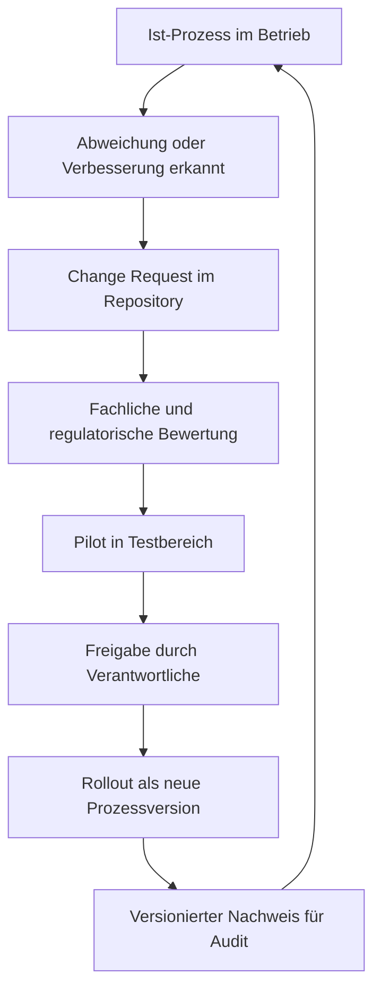

# Fachanwender-Guide: Git als Business-OS ohne IT-Spezialwissen

## Warum dieses Modell hilfreich ist

Ein Unternehmen lebt von wiederholbaren Entscheidungen und nachvollziehbaren Abläufen. In vielen Firmen existieren diese Regeln nur in Koepfen, E-Mails oder einzelnen Tools. Das führt zu:

- unklaren Verantwortlichkeiten,
- unvollständiger Dokumentation,
- schwerer Prüfbarkeit bei Audit, Steuer oder Qualitätsnachweisen,
- hoher Abhängigkeit von Einzelpersonen.

Git als Business-OS loest dieses Problem, indem jeder relevante Prozessschritt versioniert, freigegeben und dauerhaft nachvollziehbar dokumentiert wird.

Kurz gesagt:

- Das LLM ist die einfache Spracheingabe für Mitarbeitende.
- Git ist das verlaessliche Protokoll- und Freigabesystem.
- Python ist die standardisierte Ausführung für wiederholbare Prozesse.

## Warum Prozesse zuerst gebaut werden sollten

Bevor ein Prozess in der Organisation ausgerollt wird, sollte er im Muster sauber modelliert sein. Sonst werden Fehler erst im Tagesgeschäft sichtbar. Das Muster liefert:

- klare Rollen,
- eindeutige Statusschritte,
- definierte Freigabepunkte,
- prüfbare Dokumentationspflichten.

Dadurch gilt: Erst Prozessdesign, dann operative Einführung.

## Warum auch bereits implementierte Prozesse dokumentiert werden sollen

Auch bestehende Abläufe müssen in das System überführt werden, damit:

- Ist-Prozesse transparent werden,
- Risiken und Abweichungen sichtbar werden,
- Verbesserungen versioniert geplant werden können,
- Audits belastbare Nachweise sehen.

Praktisch bedeutet das: Bestehende Prozesse werden zuerst als "Ist-Version" aufgenommen, dann schrittweise in verbesserte "Soll-Versionen" überführt.

## Generische und branchenspezifische Bausteine

### Generische Prozesse (für fast alle Unternehmen)

- Rollen und Freigaben
- Rechnungsstellung
- Buchführung
- Steuerprozesse
- Monats- und Jahresabschluss
- Fristen- und Nachweismanagement

### Branchenspezifisches Wissen (als Wahloptionen)

- Anwaltskanzlei: Mandatsannahme, Fristenkalender, Konfliktprüfung, Aktenabschluss
- Notariat: Urkundenvorbereitung, Identitätsprüfung, Vollzugsschritte
- Steuerbüro: Mandanten-Onboarding, Deklarationszyklen, Plausibilitätsprüfung
- Softwareunternehmen: Release-Freigaben, SLA/Support-Prozesse, Compliance-Nachweise

Das Musterunternehmen kombiniert immer beides:

- Kernprozesse aus dem generischen Standard
- Fachmodule aus der jeweiligen Branche

## Entscheidungsprinzip bei unterschiedlichen Arbeitsweisen

Wenn Unternehmen unterschiedlich arbeiten, muss das als konfigurierbare Wahlmöglichkeit modelliert sein, nicht als Ausnahme.

Beispiel:

- Variante A: Rechnung wird nach fachlicher Freigabe automatisch versendet.
- Variante B: Rechnung wird erst nach kaufmaennischer Endfreigabe versendet.

Beide Varianten können gültig sein. Das System dokumentiert, welche Variante für welches Unternehmen gilt und seit wann.

## So startet ein Nicht-IT-Entscheider in der eigenen Firma

## Schritt 1: Verantwortung und Zielbild festlegen

- Benennen Sie einen fachlichen Prozessverantwortlichen.
- Definieren Sie 3-5 Kernprozesse für den Start.
- Legen Sie fest, welche Nachweise aus Prüfungs- oder Haftungssicht zwingend sind.

## Schritt 2: Eigenes Unternehmens-Repository aufsetzen

- Legen Sie ein eigenes Git-Repository für Ihr Unternehmen an.
- Nutzen Sie dieses Muster als Vorlage und übernehmen Sie nur passende Teile.
- Definieren Sie Zugriff und Rollen (wer darf vorschlagen, prüfen, freigeben).

## Schritt 3: Muster klonen und erste Firmenvariante erstellen

- Klonen Sie das Muster in Ihre Umgebung.
- Passen Sie Branchenmodule an Ihr konkretes Geschäft an.
- Starten Sie mit einer Pilotstrecke, z. B. Rechnungsprozess für einen Standort.

## Schritt 4: Freigaberegeln verbindlich machen

- Prozesse dürfen nur über Pull Request geändert werden.
- Sensible Schritte erhalten Vier-Augen-Freigabe.
- Monatsabschlüsse werden als versionierte Stände markiert.

## Schritt 5: Betrieb mit kontinuierlicher Verbesserung

- Jede Abweichung wird als Change Request dokumentiert.
- Jede Änderung erhält eine Versionsnummer mit Begründung.
- Jede neue Version wird vor Rollout in einer Teststrecke geprüft.

## Kontinuierliches Verbesserungswesen (KVP) in Git

## Wie alle von Verbesserungen profitieren können

Sinnvoll ist ein Modell aus:

- zentralem Referenz-Muster (generisch + branche),
- Unternehmens-Forks für lokale Anpassungen,
- geregeltem Rückfluss guter Verbesserungen in den Referenzstandard.

Damit entstehen:

- lokale Flexibilitaet,
- gemeinsamer Lerngewinn,
- stabiler, versionierter Dokumentationsstandard.

## Alt- und Neu-Prozess parallel betreiben

Wenn während laufender Verfahren ein neues Release kommt, gilt:

- laufende Fälle bleiben auf ihrer Startversion,
- neue Fälle starten auf der neu freigegebenen Version,
- beide Linien bleiben im Audit sauber trennbar.

Beispiel Notariat:

- Akte A startet um 10:15 auf `v1.4.0` und bleibt dort.
- Akte B startet nach Freigabe um 13:00 auf `v1.5.0`.

Details: `docs/de/operations/parallelbetrieb-version-binding.md`

## Rolle von Verbaenden und Zertifizierung

Ihre Idee ist fachlich sehr sinnvoll: Wenn z. B. 1000 Kanzleien denselben Kernprozess nutzen, kann ein Verband eine referenzierte Standardversion fachlich prüfen und empfehlen.

Mögliches Modell:

- Verbands-Referenzprozess mit klarer Versionshistorie
- Formale Prüfung gegen Qualitäts- und Compliance-Kriterien
- Optionales Zertifikat oder Testat für eine bestimmte Prozessversion
- Öffentliche Nachweise, welche Version geprüft wurde

Wichtig:

- Das Zertifikat sollte immer auf eine konkrete Version verweisen.
- Jede Änderung nach Zertifizierung braucht neue Bewertung.
- Unternehmen dürfen lokal erweitern, verlieren aber ggf. den Zertifizierungsstatus für geänderte Teile, bis diese neu geprüft sind.

## Praktische Empfehlung für den Start in 90 Tagen

- Woche 1-2: Zielbild, Rollen, Pilotprozesse festlegen
- Woche 3-4: Repository aufsetzen, Muster übernehmen, Freigaberegeln definieren
- Woche 5-8: Pilot für Rechnung und Buchführung durchführen
- Woche 9-10: Steuer- und Fristenprozess anbinden
- Woche 11-12: Lessons Learned, Change Requests, Version 1.0 freigeben

So erhalten Sie ein belastbares, prüfbares und lernfähiges Prozessbetriebssystem für Ihr Unternehmen.
