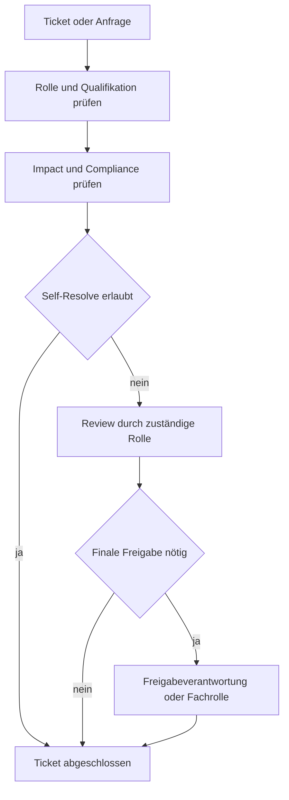

# Rollenmodell: Generisch und fachspezifisch

## Ziel

Dieses Modell stellt sicher, dass:

- jede Person Tickets erstellen kann,
- nur qualifizierte Rollen fachkritische Schritte final entscheiden,
- Freigaben nachvollziehbar und revisionsfest dokumentiert sind.

## 1) Grundprinzip für alle Unternehmen

- Beobachten darf jede Rolle.
- Ein Ticket aufmachen darf jede Rolle.
- Selbst loesen darf jede Rolle nur innerhalb ihrer freigegebenen Kompetenz.
- Fachkritische Entscheidungen brauchen qualifizierte Rollen und ggf. Freigabe.

Beispiel: Wenn Kopierpapier fehlt, muss niemand Notar sein, um das zu melden.

## 2) Generische Mindestrollen

- `mitarbeiter`: darf melden, kommentieren, Status aktualisieren.
- `sachbearbeitung`: darf operative Tickets bearbeiten und abschließen, sofern kein fachkritischer Impact.
- `prozessverantwortung`: darf Arbeitsregeln im Fachprozess freigeben.
- `freigabeverantwortung`: darf approval-pflichtige Schritte final freigeben.
- `revision_audit`: darf prüfen, aber nicht operativ entscheiden.
- `automation`: führt technische Standardaufgaben aus, entscheidet nicht fachlich.

## 3) Fachspezifische Rollen (Beispiel Kanzlei)

- `anwalt_fachlich`: fachliche Entscheidung in Mandats-/RVG-relevanten Schritten.
- `reno`: operativer Ablauf, Fristen, Aktenkoordination.
- `refa`: organisationsnahe Sachbearbeitung und Ablaufunterstützung.
- `notar_fachlich` (nur Notariat): notarielle Freigaben.
- `steuerfachkraft` (nur Steuerbüro): deklarationsnahe Freigaben.

## 4) Qualifikation statt Titel

Entscheidend ist nicht nur die Stellenbezeichnung, sondern die dokumentierte Qualifikation.

Beispiel:

- `rechnung_rvg_erstellen`: erlaubt nur für Rollen mit `qualification: rvg_billing_trained`.

## 5) Entscheidungsmatrix (Self-Resolve vs Approval)

- `impact=low` und `compliance=none`: self-resolve erlaubt.
- `impact=medium` oder `financial=true`: review durch Prozessverantwortung.
- `impact=high` oder `legal=true`: approval durch freigabeberechtigte Fachrolle.

## 6) Workflow-Integration

Technische Pflichtfelder je Prozessantrag:

- `actor_context.actor_role`
- `actor_context.requested_decision_type`
- `actor_context.impact_level`
- `actor_context.compliance_impact`
- optional `actor_context.requested_qualification`
- optional `actor_context.qualification_evidence`
- je nach Entscheidung `actor_context.approver_role`

## 7) Gender und Rollennamen

Die interne Rollen-ID bleibt neutral und stabil, z. B. `anwalt_fachlich` als technische Kennung.
Die sichtbare Sprachform folgt `policies/culture-policy.yaml`.

Empfehlung:

- Technische IDs: neutral/stabil
- Sichttexte: je nach Policy (neutral, Paarform, etc.)
- Gleiche Rechte für alle Schreibformen
