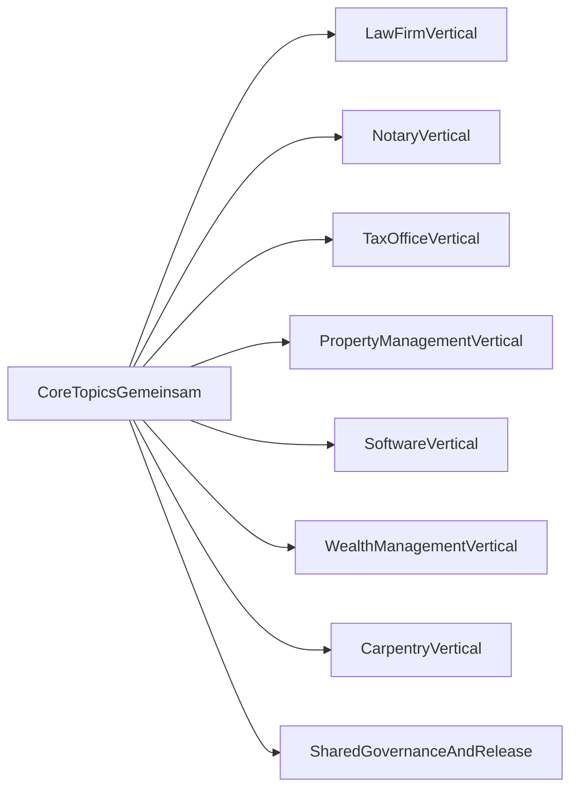

# Blueprint: Core und Vertical Modules für Dienstleistungsunternehmen

## Ziel

Dieses Blueprint definiert eine einheitliche Struktur für ein zentrales `NaC`, das für mehrere Dienstleistungsbranchen nutzbar ist:

- Anwaltskanzlei (`law_firm`)
- Notariat (`notary`)
- Steuerberatung (`tax_office`)
- Hausverwaltung (`property_management`)
- Softwareunternehmen (`software_company`)
- Vermögensverwaltung (`wealth_management`)
- Schreinerei (`carpentry`)

Das Modell setzt auf **einen gemeinsamen Core** plus **Vertical Modules** im selben Repository.

## Leitprinzip

- `core` enthält wiederverwendbare Prozessbausteine für alle Branchen.
- `vertical` enthält nur branchenspezifische Regeln und Arbeitsschritte.
- Jede wirksame Prozessänderung ist versioniert, reviewed und freigegeben.
- Laufende Vorgänge bleiben auf der beim Start gebundenen Prozessversion.

## Gemeinsame Core-Topics

Diese Topics sind für alle Dienstleistungsunternehmen gleich und gehören in den Core:

1. Rollen, Qualifikation und Freigabepfade
2. Intake und Auftrags-/Mandatsstart
3. Vorgangsstatus und Freigabegates
4. Leistungserfassung und Abrechnung
5. Buchhaltung, Steuerbezug und periodischer Abschluss
6. Nachweis, Audit und Archivierung
7. Incident- und Abweichungsbehandlung

## Vertical-Topics

Jedes Vertical erweitert den Core um branchenspezifisches Wissen:

- `law_firm`: Mandat, Konfliktprüfung, Fristenmanagement, RVG-Bezug
- `notary`: Aktenanlage, Identitätsprüfung, Urkundenvollzug, Registerkommunikation
- `tax_office`: Mandantenzyklen, Deklarationsfristen, Plausibilitätsprüfungen
- `property_management`: Mieteraufnahme, Objektbetrieb, Wartungssteuerung, Nebenkostenkontrollen, Übergaben
- `software_company`: Release-Governance, Incident-Management, SLA-/Lizenznachweise
- `wealth_management`: KYC/Client-Intake, Eignungs- und Risikoprofilprüfung, Rebalancing-Kontrollen, Mandatsreporting
- `carpentry`: Aufmass, Materialplanung, Werkstatt-/Montagekoordination, Gewährleistungsfälle

## Abgrenzungsregel Core vs. Vertical

Eine Regel gehört in den Core, wenn sie:

- in mindestens drei Verticals gleich gilt,
- keine branchenspezifische Rechts- oder Fachpflicht enthält,
- ohne Fachjargon branchenneutral formuliert werden kann.

Eine Regel gehört ins Vertical, wenn sie:

- rechtlich oder fachlich branchenspezifisch ist,
- eigene Nachweisartefakte oder Fachfreigaben braucht,
- nur für ein oder zwei Verticals relevant ist.

## Strukturmodell (fachlich)

## Versionierung und Mischbetrieb

- Core und Vertical werden gemeinsam als Release im Unternehmens-Fork freigegeben.
- Beim Vorgangsstart wird ein `process_version` gebunden.
- Neue Releases gelten nur für neue Vorgänge.
- Laufende Vorgänge laufen auf gebundener Version zu Ende.

Details: `docs/de/operations/parallelbetrieb-version-binding.md`

## Entscheidungslogik für Erweiterungen

Wenn ein neues Thema aufkommt:

1. Prüfen, ob Core-Regel erweitert werden kann.
2. Falls nein, als Vertical-Regel dokumentieren.
3. Impact-Assessment durchführen.
4. Versionierte Übernahme über PR + Review + Release.
5. Optional Rückfluss in den Referenzstandard.
