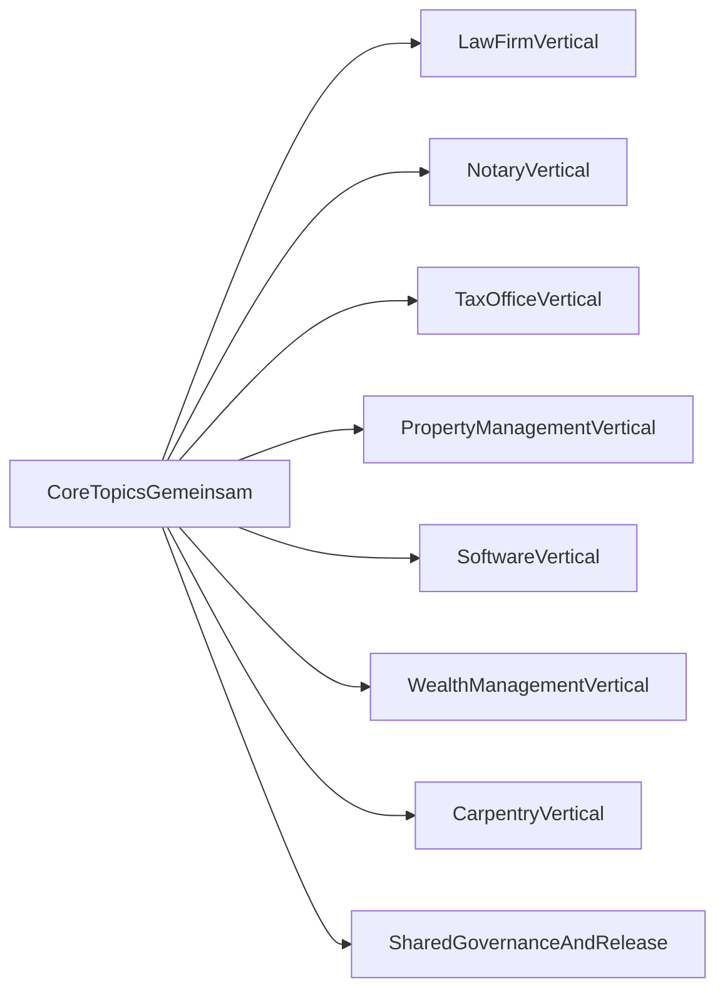

# Blueprint: Core und Vertical Modules fuer Dienstleistungsunternehmen

## Ziel

Dieses Blueprint definiert eine einheitliche Struktur fuer ein zentrales `NoC`, das fuer mehrere Dienstleistungsbranchen nutzbar ist:

- Anwaltskanzlei (`law_firm`)
- Notariat (`notary`)
- Steuerberatung (`tax_office`)
- Hausverwaltung (`property_management`)
- Softwareunternehmen (`software_company`)
- Vermoegensverwaltung (`wealth_management`)
- Schreinerei (`carpentry`)

Das Modell setzt auf **einen gemeinsamen Core** plus **Vertical Modules** im selben Repository.

## Leitprinzip

- `core` enthaelt wiederverwendbare Prozessbausteine fuer alle Branchen.
- `vertical` enthaelt nur branchenspezifische Regeln und Arbeitsschritte.
- Jede wirksame Prozessaenderung ist versioniert, reviewed und freigegeben.
- Laufende Vorgaenge bleiben auf der beim Start gebundenen Prozessversion.

## Gemeinsame Core-Topics

Diese Topics sind fuer alle Dienstleistungsunternehmen gleich und gehoeren in den Core:

1. Rollen, Qualifikation und Freigabepfade
2. Intake und Auftrags-/Mandatsstart
3. Vorgangsstatus und Freigabegates
4. Leistungserfassung und Abrechnung
5. Buchhaltung, Steuerbezug und periodischer Abschluss
6. Nachweis, Audit und Archivierung
7. Incident- und Abweichungsbehandlung

## Vertical-Topics

Jedes Vertical erweitert den Core um branchenspezifisches Wissen:

- `law_firm`: Mandat, Konfliktpruefung, Fristenmanagement, RVG-Bezug
- `notary`: Aktenanlage, Identitaetspruefung, Urkundenvollzug, Registerkommunikation
- `tax_office`: Mandantenzyklen, Deklarationsfristen, Plausibilitaetspruefungen
- `property_management`: Mieteraufnahme, Objektbetrieb, Wartungssteuerung, Nebenkostenkontrollen, Uebergaben
- `software_company`: Release-Governance, Incident-Management, SLA-/Lizenznachweise
- `wealth_management`: KYC/Client-Intake, Eignungs- und Risikoprofilpruefung, Rebalancing-Kontrollen, Mandatsreporting
- `carpentry`: Aufmass, Materialplanung, Werkstatt-/Montagekoordination, Gewaehrleistungsfaelle

## Abgrenzungsregel Core vs. Vertical

Eine Regel gehoert in den Core, wenn sie:

- in mindestens drei Verticals gleich gilt,
- keine branchenspezifische Rechts- oder Fachpflicht enthaelt,
- ohne Fachjargon branchenneutral formuliert werden kann.

Eine Regel gehoert ins Vertical, wenn sie:

- rechtlich oder fachlich branchenspezifisch ist,
- eigene Nachweisartefakte oder Fachfreigaben braucht,
- nur fuer ein oder zwei Verticals relevant ist.

## Strukturmodell (fachlich)

## Versionierung und Mischbetrieb

- Core und Vertical werden gemeinsam als Release im Unternehmens-Fork freigegeben.
- Beim Vorgangsstart wird ein `process_version` gebunden.
- Neue Releases gelten nur fuer neue Vorgaenge.
- Laufende Vorgaenge laufen auf gebundener Version zu Ende.

Details: `docs/de/operations/parallelbetrieb-version-binding.md`

## Entscheidungslogik fuer Erweiterungen

Wenn ein neues Thema aufkommt:

1. Pruefen, ob Core-Regel erweitert werden kann.
2. Falls nein, als Vertical-Regel dokumentieren.
3. Impact-Assessment durchfuehren.
4. Versionierte Uebernahme ueber PR + Review + Release.
5. Optional Rueckfluss in den Referenzstandard.
