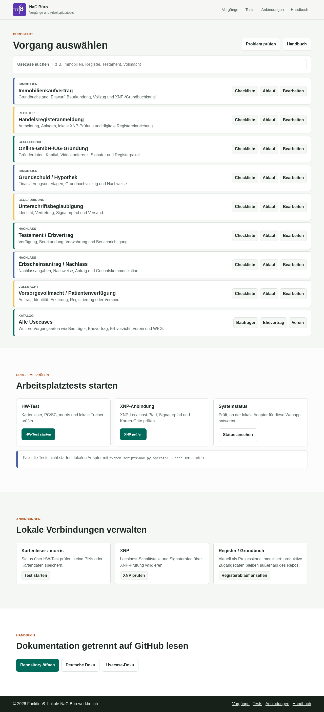
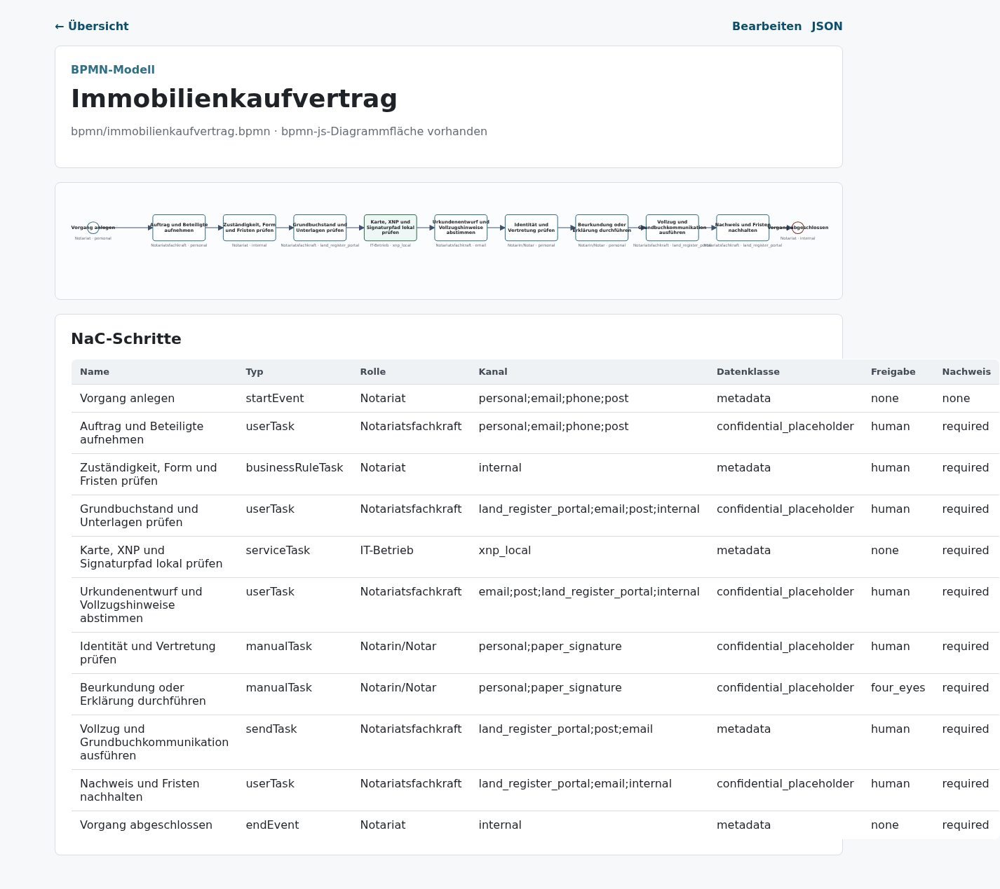
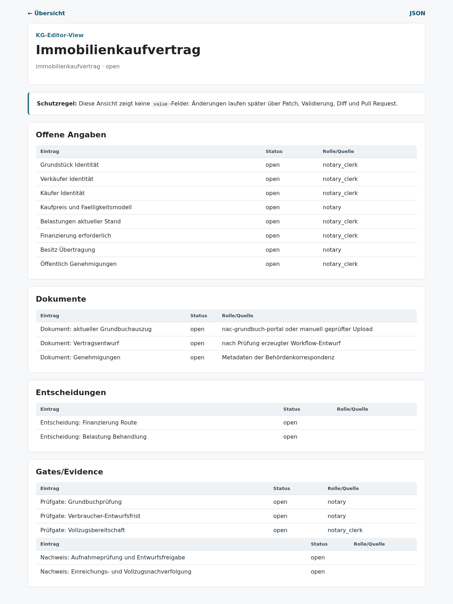
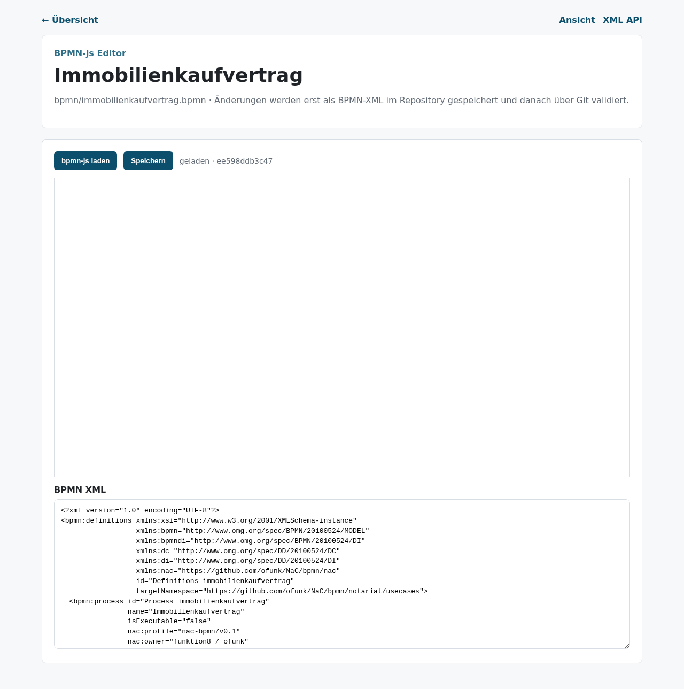
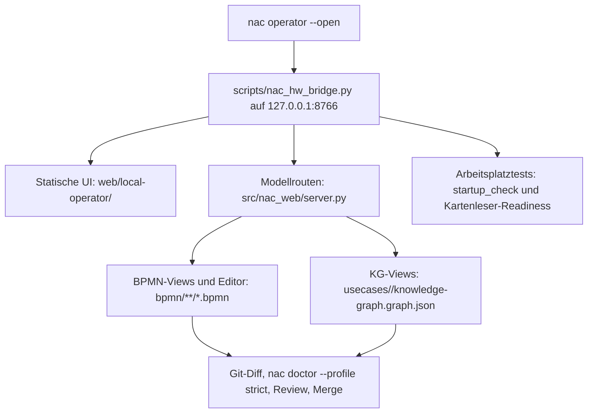

# NaC-Webapp Ohne Zugriff Verstehen

Status: Operator-Webapp und Screenshot-Doku geprüft am 2026-05-19

## Zweck

Diese Seite erklärt die lokale NaC-Webapp für Leser, die sie nicht selbst
öffnen können. Sie zeigt, welche Oberfläche das Notariat sieht, welche
Repo-Dateien dahinterliegen und welche Aktion beim Klick ausgelöst wird.

Die Webapp ist kein produktives Fachsystem. Sie ist eine lokale Lese-,
Prüf- und Bearbeitungsfläche für BPMN-Abläufe, KG-Checklisten und
Arbeitsplatztests.

Die Bedienlogik folgt dem [Operator Styleguide](operator-styleguide.md). Die
Oberfläche unterscheidet Tagesarbeit an Akten von freigaberelevanten
Kanzlei-Workflow-Stammdaten.

## Startpunkt

Die vorgesehene Bedienkante ist die zentrale NaC-CLI:

```bash
python scripts/nac.py operator --open
```

Der Befehl startet lokal `127.0.0.1:8766`. Ohne Browserzugriff kann man die
Funktion über diese Doku, die Screenshots und die Repo-Dateien nachvollziehen.



## Was Die Oberfläche Zeigt

| Bereich | Was man sieht | Was dahinterliegt |
| --- | --- | --- |
| Vorgang auswählen | Suchfeld und Vorgangskarten mit den Blöcken `Aktenverwaltung`, `Kontrolle` und `Kanzlei-Workflow`. | Statische Oberfläche unter [web/local-operator/](../../web/local-operator) plus usecase-lokale KG- und BPMN-Routen. |
| Aktenverwaltung | Akten öffnen, neue Demo-Akte anlegen, Statuszähler und nächsten Schritt sehen. | Demo-Datenrepo über `/api/matters`; neue Akten erhalten `workflow_binding` und `checkliste.json`. |
| Checkliste | Sichere KG-Ansicht ohne Mandatswerte. | [usecases/](../../usecases) mit `knowledge-graph.graph.json`; gerendert über `notary_kg.editor.build_editor_view`. |
| Ablauf | BPMN-Ablauf als lesbare SVG-Ansicht. | [bpmn/](../../bpmn) und [src/nac_web/bpmn.py](../../src/nac_web/bpmn.py). |
| Bearbeiten | BPMN-Editorfläche mit bpmn-js-Ladepfad und XML-Fallback. | `/api/bpmn/<slug>/xml` liefert XML plus SHA-256; Speichern schreibt nur bei unverändertem Basis-Hash. |
| Arbeitsplatztests | HW-Test, XNP-Prüfung und Systemstatus. | [scripts/nac_hw_bridge.py](../../scripts/nac_hw_bridge.py), `startup_check`, Kartenleser-Readiness und zusammengefasste Testlogs. |
| Handbuch | Links zu Repository, deutscher Doku und Usecase-Doku. | GitHub bleibt die verbindliche Nachweis- und Review-Fläche. |

## Ablaufansicht

Die Ablaufansicht macht sichtbar, welche Schritte ein Vorgang durchläuft. Beim
Immobilienkaufvertrag sieht man Auftrag, Beteiligte, Grundbuchstand, Entwurf,
Beurkundung, Vollzug, Nachweise und XNP-/Grundbuchkanäle als BPMN-Modell.



## Checklistenansicht

Die Checklistenansicht ist für fachliche Prüfung gedacht. Sie zeigt offene
Angaben, Dokumente, Entscheidungen, Gates und Nachweise, aber keine
Mandatswerte. Das ist wichtig: echte Beteiligten-, Grundstücks-, Familien-,
Nachlass- oder Gesellschaftsdaten gehören nicht in dieses öffentliche Repo.



## Bearbeitungsansicht

Die Bearbeitungsansicht lädt das BPMN-XML, kann bpmn-js aktivieren und behält
einen SHA-256 des geladenen Stands. Beim Speichern wird nur geschrieben, wenn
das Modell seit dem Laden nicht durch jemand anderes verändert wurde. Danach
ist die Änderung noch nicht fertig: Git-Diff, `nac doctor --profile strict`,
Review und Merge bleiben verbindlich.



## Technische Zuordnung



## Klick Bedeutet Nicht Produktivaktion

| Klick | Ergebnis | Bewusste Grenze |
| --- | --- | --- |
| `Akten öffnen` | Öffnet vorhandene Akten und passende offene Eingänge. | Keine Änderung am Kanzlei-Workflow. |
| `Neu` | Legt eine Demo-Akte mit gebundener Workflow-Version an. | Keine echten Mandatsdaten, nur Demo-Datenrepo. |
| `Checkliste prüfen` | Öffnet eine KG-Reviewansicht. | Keine echten `value`-Felder, keine Mandatsdaten. |
| `Ablauf ansehen` | Rendert ein BPMN-Modell als SVG. | Keine Ausführung im Fachsystem. |
| `Änderung vorschlagen` | Zeigt BPMN-XML und optional bpmn-js als Änderungspfad. | Kein Merge, keine Freigabe, keine Einreichung; Kanzlei-Stammdaten brauchen Review. |
| `HW-Test starten` | Prüft lokale Bereitschaft, soweit die Workstation es erlaubt. | Keine PINs, keine Kartenrohdaten, kein Login. |
| `XNP prüfen` | Prüft lokale XNP-/Kartenpfad-Bereitschaft. | Keine produktive Register- oder Grundbucheinreichung. |

## Versionsbindung Pro Akte

Beim Anlegen bindet die Operator-Bridge jede Akte an die aktuelle
Workflow-Version des Usecases. In `akte.json` steht dafür `workflow_binding`
mit Version, Artefakt-Hashes und Bindungszeitpunkt. Neue freigegebene
Workflow-Versionen gelten nur für neue Akten. Laufende Akten bleiben auf ihrer
gebundenen Version, bis ein dokumentierter Versionswechsel erfasst wird.

Zusätzlich schreibt die Bridge pro Akte `checkliste.json`. Diese Datei enthält
den Fallstand der Usecase-Checkliste mit offenen Angaben, Dokumenten,
Entscheidungen, Prüfgates und Nachweisen. Die Aktenübersicht zeigt daraus den
nächsten offenen Schritt.

## Warum Das Für Nicht-Techniker Verständlich Ist

Die Webapp übersetzt Repo-Struktur in Bürobegriffe:

- Vorgänge statt Dateipfade,
- Checklisten statt JSON,
- Abläufe statt XML,
- Tests statt Shell-Kommandos,
- Handbuch statt verstreuter Links.

Trotzdem bleibt die Nachvollziehbarkeit erhalten. Jede Ansicht zeigt auf
versionierte Dateien, und jede Änderung muss durch Git, NaC-CLI-Prüfung und
Review laufen.
