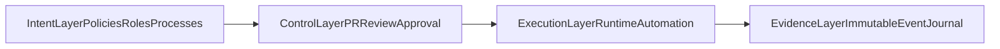
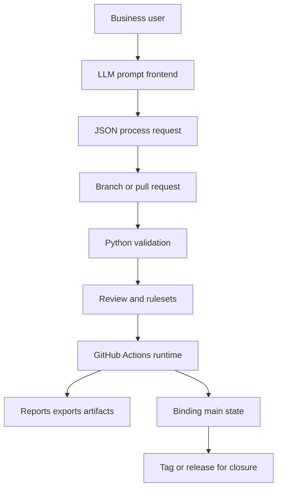
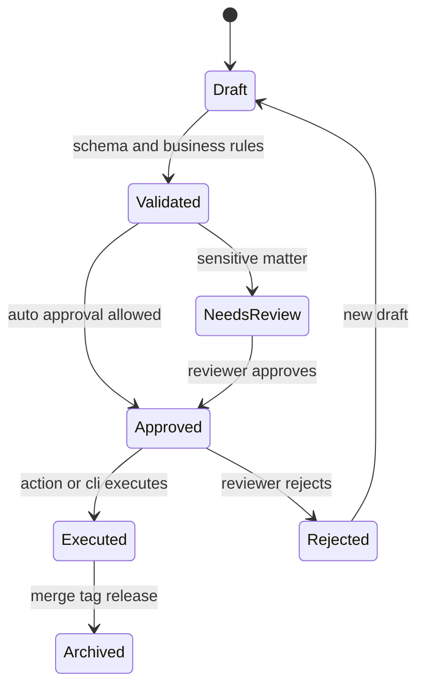
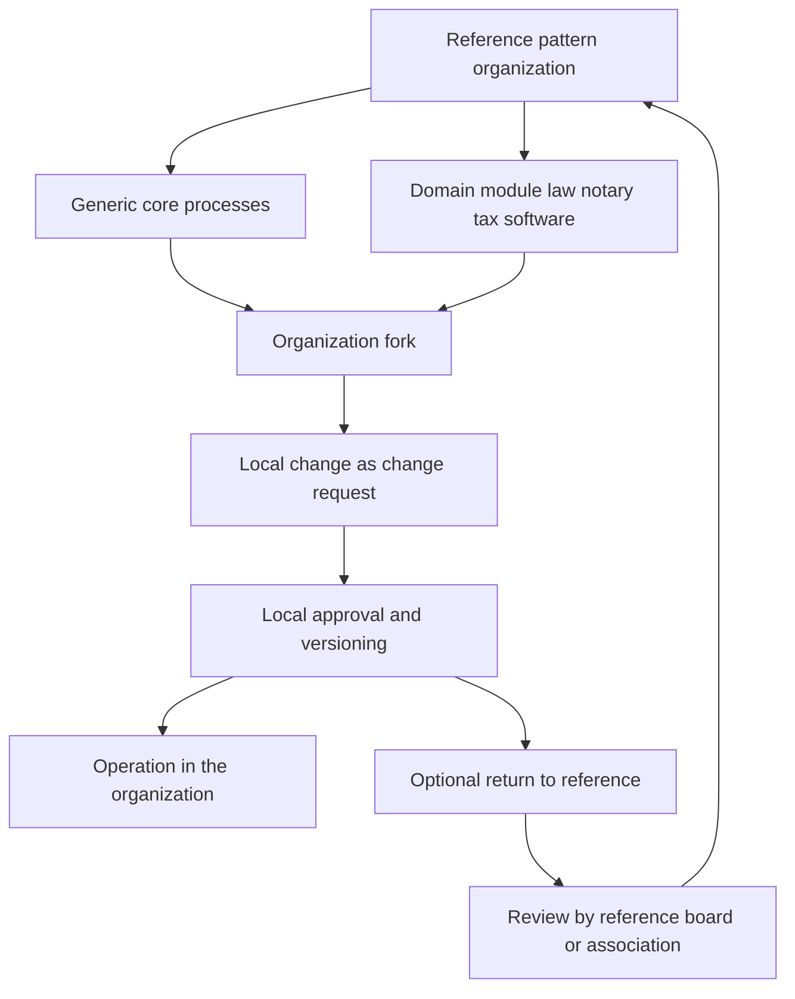

# Architecture

## Architecture Frame

This architecture follows the `Notariat as Code` model with `Enterprise GitOps`
as the control principle. `NaC` is the concrete implementation of this frame.

Reference: [docs/en/organization-as-code-positioning.md](organization-as-code-positioning.md)

The operational CLI-first execution model is described in
[docs/en/ausfuehrungsmodell.md](ausfuehrungsmodell.md).

## Layers

1. `Prompt Frontend`
   An LLM or bot receives natural-language requests and fills standardized
   process requests.
2. `Git Control Plane`
   Branches, pull requests, reviews, rulesets, tags and releases manage the
   official lifecycle.
3. `Python Execution Plane`
   The engine validates schemas, checks state transitions, computes derived
   values and creates summaries.
4. `Automation Plane`
   GitHub Actions execute PR checks, periodic processes and approval gates.
5. `Plugin and Connector Plane`
   Local plugin and connector adapters create plan previews, execute approved
   changes idempotently and write audit evidence back.

## NaC Layer Mapping

## Data Flow

## Subject-Matter State Machine

## Control Through GitHub Actions

### `validate-process.yml`

- starts on `pull_request` and `workflow_dispatch`,
- validates changed process files,
- creates a readable summary for reviewers.

### `run-process.yml`

- allows a targeted manual run for one matter,
- uses the Python CLI entry point,
- is suitable for bot calls from an LLM frontend.

The local operator webapp is an operator channel for workstation gates. It does
not execute NaC remotely. It talks to a `127.0.0.1` bridge started through
`nac operator --open`; the bridge runs approved local check scripts in the
workspace and returns minimized readiness metadata.

### `monthly-close.yml`

- runs periodically or manually,
- aggregates bookings and invoices for a monthly close,
- creates a closing report as an artifact.

## Governance Mapping

- Pull request: subject-matter request.
- Review: human approval.
- Environment: hard approval point for sensitive processes.
- Ruleset: repository-wide enforcement rule.
- Tag: versioned closure.
- Release artifact: externally auditable derivative.

## Reference, Fork And Return Flow

Operational details are maintained in:

- [docs/en/operations/fork-and-release-operating-model.md](operations/fork-and-release-operating-model.md)
- [docs/en/operations/release-sync-playbook.md](operations/release-sync-playbook.md)
- [docs/en/operations/parallelbetrieb-version-binding.md](operations/parallelbetrieb-version-binding.md)
- [docs/en/issues/taxonomy.md](issues/taxonomy.md)
- [docs/en/service-model/core-vertical-blueprint.md](service-model/core-vertical-blueprint.md)
- [docs/en/service-model/vertical-starter-process-catalog.md](service-model/vertical-starter-process-catalog.md)
- [docs/en/operations/single-repo-refactor-plan.md](operations/single-repo-refactor-plan.md)
- [docs/en/plugin-plans/README.md](plugin-plans/README.md)

## Plugin And Connector Principle

Plugins and connectors are execution adapters, not subject-matter truth. The
subject-matter truth remains in Git, policies, schemas and review decisions.
Every adapter must create a readable plan before a change, reconcile
idempotently after approval and make Day 2 drift visible.

Local execution happens in the WSL workspace `~/NaC`. Omnistation is not an
execution location for NaC.

## Python Components

- `models.py`: normalized data classes for process requests.
- `registry.py`: process definitions with allowed state transitions.
- `schema_tools.py`: lightweight validation against JSON schemas.
- `engine.py`: orchestration, idempotency check and monthly close.
- `cli.py`: command-line interface for local and CI runs.
- `scripts/nac_hw_bridge.py`: localhost bridge started through `nac operator`
  for the local operator webapp and hardware-readiness checks.
