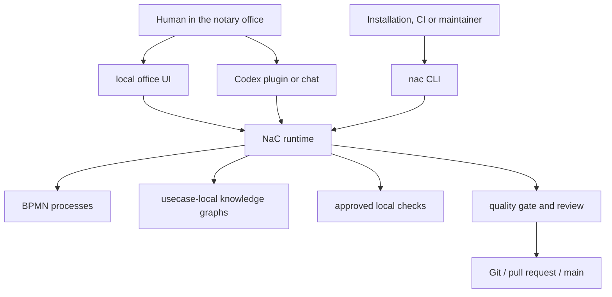

# Execution Model: Office UI First, Checkable Core Behind It

NaC is being developed as executable software for notary offices. The visible
operation should be understandable for subject-matter users: local office UI,
Codex plugins, checklists, process views, BPMN editing and guided checks.

Behind that sits a technical execution layer. It is called `nac` and keeps the
same case work local, traceable, automatable and checkable in the quality gate.

## Three Layers

| Layer | Job | Typical Users |
| --- | --- | --- |
| Visible operation | Select cases, inspect flows, edit checklists, start local tests. | Notary, clerks, office operations. |
| Technical execution | Run the same actions as explicit, repeatable NaC work orders. | local installation, Codex plugin, CI, maintainer. |
| Governance and evidence | Keep rules, validations, review, license, audit and merge traceable. | Owner, technical service providers, reviewers, external evaluation. |

## What Does CLI Mean?

CLI means "Command Line Interface". In NaC, it is not meant to be the daily
surface for notaries.

A CLI is a clearly named work order for the software. The same work order can be
started by a button, a plugin, an automation or directly in a terminal. Example:

```bash
python scripts/nac.py status
```

Subject-matter users should not have to memorize commands. The value of the CLI
is that a visible click and an automated quality run can use the same reviewed
NaC runtime behind the scenes.

## Current Product Picture



## Why This Is Elegant

| Reason | Meaning |
| --- | --- |
| Understandable operation | The office UI can explain the subject-matter task without pushing technical detail to the front. |
| Repeatable execution | The same action remains technically checkable locally, in plugins and in CI. |
| Easy to introduce | Python and Git run on many workstations and servers; a central cloud app is not a prerequisite. |
| Good for sensitive data | NaC can run locally at the workstation; PINs, card data and mandate secrets do not belong in Git. |
| Automatable | GitHub Actions, Codex plugins, local buttons and future apps can call the same runtime. |
| UI-capable without lock-in | The surface can grow without burying the subject-matter logic in one screen. |
| Auditable | Work order, input, result, review and merge can be traced in versioned form. |

## Why Keep A Technical Edge?

A surface alone may feel simpler at first, but it can hide the subject-matter
logic in click paths. NaC must also be able to explain and prove:

1. Which case types exist?
2. Which open information, documents, decisions and approvals are required?
3. Which data must not enter Git or external services?
4. Which local checks are approved?
5. Which human approval remains required?

The visible UI guides people through these questions. `nac` makes the execution
behind it explicitly checkable.

## Today, Pilot, Later

| Layer | State | Role |
| --- | --- | --- |
| Local operator web app | Usable today | Starts as an office UI with `python scripts/nac.py operator --open` and shows cases, checklists, BPMN, KG views and workstation tests. |
| Unified `nac` CLI and Python runtime | Usable today | Checks KG, BPMN, configuration, status, editor view, plugins and quality gates. |
| Codex plugins | Pilot-ready | Guide local readiness, plan and evidence checks. |
| GitHub Actions | Usable today | Run gates and validations reproducibly. |
| BPMN-js business layer | First profile present | Visual BPMN editing for subject-matter flows; Python validates the model before merge. |
| Local web server | Usable today | Shows BPMN and KG views locally in the browser, without cloud use or real mandate data. |
| Sidecar editor | Planned | Graphical operation for KG forms and checklists. |
| ChatGPT app or workspace app | Planned | Comfortable operating surface for authorized users. |
| Standalone NaC web app | Possible | Useful once runtime, roles, permissions and gates are stable enough for broader use. |

## Rule Of Thumb

NaC is not just documentation and not a terminal product. NaC is local,
executable office software with visible operation and a checkable core.

New NaC functionality therefore needs two things: understandable operation for
the subject-matter context and explicit execution through `nac` or the NaC
runtime. Old script names may remain internal or compatibility layers; product
documentation should show the understandable NaC path.

## Next Documents

- [docs/en/notar-start.md](notar-start.md)
- [docs/en/cli.md](cli.md)
- [docs/en/betriebsstart.md](betriebsstart.md)
- [docs/en/integration-start.md](integration-start.md)
- [docs/en/kg-editor-workstream.md](kg-editor-workstream.md)
- [docs/en/bpmn-js-business-layer.md](bpmn-js-business-layer.md)
- [docs/en/lokaler-webserver.md](lokaler-webserver.md)
- [workflows/python/README.md](../../workflows/python/README.md)
