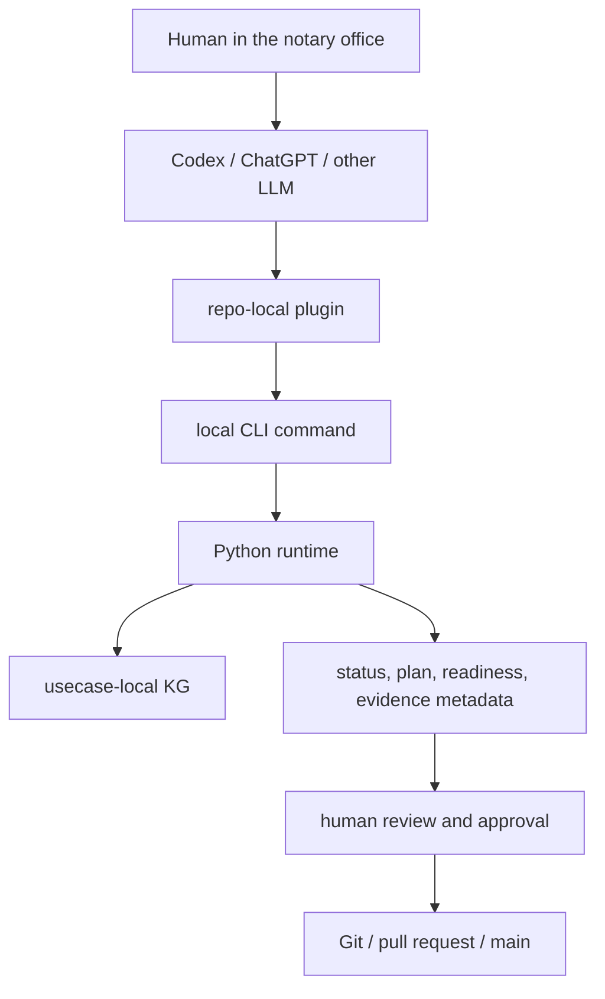

# Execution Model: Why NaC Is CLI-First

NaC is deliberately CLI-first today. This means stable execution lives in local,
checkable commands. Codex plugins, future apps or a UI may operate those
commands, but they are not the subject-matter truth.

## What Does CLI Mean?

CLI means "Command Line Interface". For non-technical readers, the simplest
description is:

A CLI is a clearly named work order for the computer. Instead of clicking a
button, a command is executed, for example:

```bash
python scripts/nac.py status
```

The point is not that humans should enjoy typing commands. The point is that the
same work order can be started from many surfaces in a clean, repeatable and
traceable way.

## Current Product Picture



## Why This Is Elegant

| Reason | Meaning |
| --- | --- |
| Repeatable | The same command gives the same checkable flow locally and in CI. |
| Easy to introduce | Python and Git run in many environments without operating a central web app immediately. |
| Good for sensitive data | Commands can run locally at the workstation; real mandate data does not need to enter an external UI. |
| Automatable | GitHub Actions, Codex plugins, local scripts or future apps can call the same runtime. |
| UI-independent | A future web UI or ChatGPT app is an operating surface, not the core logic. |
| Future-ready | New operating surfaces can be added without reinventing the subject-matter runtime. |
| Auditable | Command, input, result, review and merge can be traced in versioned form. |

## Why Not Start With A UI?

A UI may feel simpler at first, but it can freeze the wrong things too early:
screens, click paths, roles and data flows. NaC first stabilizes the checkable
core:

1. Which case types exist?
2. Which open information, documents, decisions and gates are required?
3. Which data must not enter Git?
4. Which local checks and plugin gates are safe?
5. Which human approval is required?

Once that logic is stable, a UI can operate the same CLI/runtime layer. That
creates a UI on a reviewed foundation instead of a surface without dependable
process logic.

## Today, Pilot, Later

| Layer | State | Role |
| --- | --- | --- |
| Unified `nac` CLI and Python runtime | Usable today | Checks KG, BPMN, configuration, status, editor view and quality gates. |
| Codex plugins | Pilot-ready | Guide local readiness, plan and evidence checks. |
| GitHub Actions | Usable today | Run gates and validations reproducibly. |
| BPMN-js business layer | First profile present | Visual BPMN editing for subject-matter flows; Python validates the model before merge. |
| Local web server | Usable today | Shows BPMN and KG views locally in the browser, without cloud use or real mandate data. |
| Sidecar editor | Planned | Graphical operation for KG forms and checklists. |
| ChatGPT app or workspace app | Planned | Comfortable operating surface for authorized users. |
| Standalone NaC web app | Not today's core | Possible, but useful only after runtime, roles and gates are stable. |

## Rule Of Thumb

CLI-first does not mean "for technicians only". It means: the core is small,
local, checkable, automatable and later operable from many surfaces.

The binding operating surface is now `nac`. Direct scripts may remain as
internal or compatibility layers, but new product functionality should be
reachable through the unified CLI.

## Next Documents

- [docs/en/notar-start.md](notar-start.md)
- [docs/en/cli.md](cli.md)
- [docs/en/betriebsstart.md](betriebsstart.md)
- [docs/en/integration-start.md](integration-start.md)
- [docs/en/kg-editor-workstream.md](kg-editor-workstream.md)
- [docs/en/bpmn-js-business-layer.md](bpmn-js-business-layer.md)
- [docs/en/lokaler-webserver.md](lokaler-webserver.md)
- [workflows/python/README.md](../../workflows/python/README.md)
