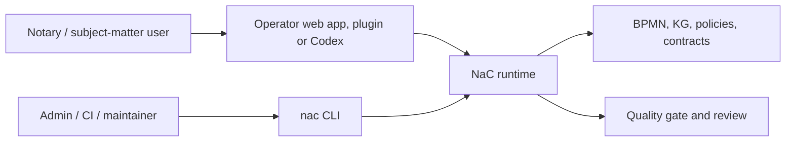

# NaC CLI: Technical Control Surface Behind The Office UI

Status: first unified CLI implemented on 2026-05-19

## Idea

The NaC CLI is not the product surface for a notary office. It is the
technical control and validation layer behind the local office UI, Codex
plugins and later automations.

For subject-matter users, NaC starts with the local operator web app:

```bash
python scripts/nac.py operator --open
```

The CLI remains important because it makes the same checks reproducible:
status, quality gate, BPMN, knowledge graphs, plugins and configuration.

The shared entry point is:

```bash
nac
```

Without installation, the same entry point can be started from the repository:

```bash
python scripts/nac.py status
```

After a local editable installation, the short command is available:

```bash
python -m pip install -e .
nac status
```

## Why This Still Matters For Non-Technical Readers

A CLI is a clearly named work order for the computer. A notary does not need
to memorize these commands. The office benefits because every button, plugin
action and automated check can be traced back to a checkable technical action.

| Question | Answer |
| --- | --- |
| Does the notary need to memorize commands? | No. The visible entry point is the office UI; the CLI is the technical validation surface behind it. |
| Why not only a web UI? | A UI alone can hide logic. The CLI keeps checks, results and repetition visible. |
| Why is this future-ready? | Local web app, Codex plugin, CI and later apps can reuse the same reviewed runtime. |
| What becomes traceable? | Command, input, result, review and Git change. |

## First Commands

```bash
python scripts/nac.py status
python scripts/nac.py doctor --profile strict
python scripts/nac.py web
python scripts/nac.py kg status
python scripts/nac.py bpmn validate
python scripts/nac.py config list
python scripts/nac.py plugins actions
```

After installation:

```bash
nac status
nac doctor --profile strict
nac web
nac kg status
nac bpmn validate
nac config list
nac plugins actions
nac tenant status --repo ../demo8notariat
```

## Technical Operating Areas

| Area | Command | Purpose |
| --- | --- | --- |
| Overview | `nac status` | Shows usecases, open required information, BPMN models and configuration files. |
| Quality | `nac doctor --profile strict` | Runs the strict quality gate. |
| Office UI | `nac operator --open` | Starts the local operator web app with cases, checklists, BPMN, editor and workstation tests. |
| Graphical model view | `nac web` | Starts the local web server for BPMN and KG views. |
| Knowledge graphs | `nac kg status` | Shows the state of usecase-local knowledge graphs. |
| BPMN | `nac bpmn list` and `nac bpmn validate` | Lists and validates subject-matter BPMN process models. |
| Processes | `nac process validate-all` | Validates deterministic process requests. |
| Plugins | `nac plugins actions` and `nac plugins install --mode dry-run` | Lists subject-matter plugin commands and checks local plugin mirroring. |
| Configuration | `nac config list` and `nac config validate` | Shows and validates policies, contracts and runtime configuration. |
| Data repository | `nac tenant status --repo ../demo8notariat` | Checks a separate NaC data repository for demo or later production data. |

## Separate Data Repository

NaC does not write case and test data into the product repository. Synthetic
demo data lives in a separate data repository, for example `../demo8notariat`:

```bash
nac tenant init --repo ../demo8notariat --name demo8notariat --remote-url https://github.com/ofunk/demo8notariat.git
nac tenant write-demo immobilienkaufvertrag --repo ../demo8notariat --case-id DEMO-2026-0001
```

GitHub is only intended for synthetic demo data here. Productive notary-office
data requires a reviewed sovereign/GDPR Git provider. The separation is
documented in [datenrepo-demo8notariat.md](datenrepo-demo8notariat.md).

## Plugin Commands

Plugin management and the existing local plugin checks now also run through
`nac`:

```bash
nac plugins actions
nac plugins validate
nac plugins install --mode dry-run
nac plugins card-readiness
nac plugins xnp-reader-prompt
nac plugins pkcs7-inspect --input example.p7b
```

| Command | Meaning |
| --- | --- |
| `nac plugins card-readiness` | Checks local card-reader, SAK/XNP and readiness metadata. With installed hardware, a real local hardware test is possible; PINs and raw card data are not stored. |
| `nac plugins xnp-reader-prompt` | Creates a safe XNP reader prompt with the card gate in front. |
| `nac plugins pkcs7-inspect` | Inspects a local PKCS7/P7B/P7C certificate bundle metadata-only, without signing or private-key access. |

The old plugin scripts remain the internal execution layer. The visible path
for users, docs and agents is `nac plugins ...`.

For a workstation with installed real hardware:

```bash
nac plugins card-readiness --manual-card-present yes --manual-rfid-off yes --probe-morris-api --json
nac plugins xnp-reader-prompt --manual-card-present yes --manual-rfid-off yes --probe-morris-api --json
```

These commands may check real local drivers, morris, PC/SC, card-reader and XNP
reachability. Productive portal actions, signing, PIN capture, raw card data,
secrets and mandate data in the repository remain blocked.

## Architecture Rule

New NaC functionality needs an understandable user surface and a checkable
technical execution path. For subject-matter use, that may be a web app,
plugin or Codex surface; for reproducibility, tests and operations, the
technical edge should be reachable through `nac`. Direct scripts such as
`scripts/quality_gate.py` may remain as internal or compatibility layers.

For configuration writes, there is an additional boundary: until a configuration
family has a clear schema, validation and approval rule, the CLI only shows and
validates it. Write commands are added per configuration family once the safe
change contract exists.

## Relationship To The Local Web App

The local web app is the visible office surface. It starts through `nac`,
reads the same BPMN/KG files and uses the same reviewed runtime family. The
target picture is:



This makes NaC visually usable for the office while keeping it machine-checkable
for operations, review and further development.
