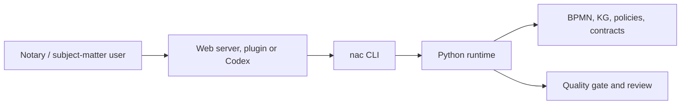

# NaC CLI: One Control Surface For The Repository

Status: first unified CLI implemented on 2026-05-19

## Idea

NaC is built CLI-first. This does not mean a notary must live in a terminal. It
means every subject-matter action has a named, checkable command. A web UI,
plugin or Codex can call that command later while the underlying logic remains
the same.

The shared entry point is:

```bash
nac
```

Without installation, the same entry point can be started from the repository:

```bash
python scripts/nac.py status
```

After a local editable installation, the short command is available:

```bash
python -m pip install -e .
nac status
```

## Why This Matters For Non-Technical Readers

A CLI is a clearly named work order for the computer. Later, that work order can
be triggered by a button, plugin action or guided web view. The important part
is that all surfaces run the same reviewed action.

| Question | Answer |
| --- | --- |
| Does the notary need to memorize commands? | No. The CLI is the stable technical operating surface. User interfaces can call it. |
| Why not only a web UI? | A UI alone can hide process logic. The CLI keeps each step repeatable and auditable. |
| Why is this future-ready? | Local web server, Codex plugin, CI and later apps can reuse the same commands. |
| What becomes traceable? | Command, input, result, review and Git change. |

## First Commands

```bash
python scripts/nac.py status
python scripts/nac.py doctor --profile strict
python scripts/nac.py web
python scripts/nac.py kg status
python scripts/nac.py bpmn validate
python scripts/nac.py config list
```

After installation:

```bash
nac status
nac doctor --profile strict
nac web
nac kg status
nac bpmn validate
nac config list
```

## Operating Areas

| Area | Command | Purpose |
| --- | --- | --- |
| Overview | `nac status` | Shows usecases, open required information, BPMN models and configuration files. |
| Quality | `nac doctor --profile strict` | Runs the strict quality gate. |
| Graphical view | `nac web` | Starts the local web server for BPMN and KG views. |
| Knowledge graphs | `nac kg status` | Shows the state of usecase-local knowledge graphs. |
| BPMN | `nac bpmn list` and `nac bpmn validate` | Lists and validates subject-matter BPMN process models. |
| Processes | `nac process validate-all` | Validates deterministic process requests. |
| Plugins | `nac plugins install --mode dry-run` | Checks local plugin mirroring without changing files. |
| Configuration | `nac config list` and `nac config validate` | Shows and validates policies, contracts and runtime configuration. |

## Architecture Rule

New NaC functionality must expose a CLI operating surface. Direct scripts such
as `scripts/quality_gate.py` may remain as internal or compatibility layers, but
documentation should show the central `nac` path.

For configuration writes, there is an additional boundary: until a configuration
family has a clear schema, validation and approval rule, the CLI only shows and
validates it. Write commands are added per configuration family once the safe
change contract exists.

## Relationship To The Local Web Server

The local web server is an operating surface. It does not replace the CLI; it
uses the same runtime layer. The target picture is:



This keeps NaC visually usable and machine-checkable at the same time.
