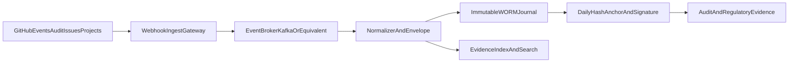

# Audit-Proof Evidence With Eventstreaming, Instead Of Export-Only

## Starting Point

GitHub Issues are a strong operational work surface, but not the only
audit-proof storage layer. The audit-proof layer is implemented as an immutable
event journal.

## Why Eventstreaming Fits Better

- Events are captured close to real time, not only through periodic export.
- The journal is append-only, cryptographically linked and signed.
- Deletions or manipulations in the operational layer remain provable in the
  journal.
- Subject operation, such as issues and projects, is cleanly separated from the
  evidence layer.

## Reference Architecture

## Binding Data Model Per Event

Required fields:

- `event_id`, globally unique
- `event_time_utc`
- `event_source`
- `repo`
- `issue_or_object_id`
- `actor_login`
- `action_type`
- `payload_hash`
- `previous_event_hash`
- `event_hash`
- `signature_ref`

This creates a hash-chained, verifiable event chain.

## Technical Guardrails

1. Check webhook signatures through HMAC.
2. Operate broker with TLS and clear producer identity.
3. Dead-letter queue is mandatory for invalid events.
4. Store only in WORM-capable targets.
5. Create a daily anchor with signature.
6. Run regular restore and integrity tests.

## Operating Model

- Issues remain the operational control surface.
- The event journal is the legally relevant evidence layer.
- Auditors work primarily against journal and evidence index, not mutable issue
  histories.

## Step-By-Step Implementation

1. Define event sources: organization audit, issues, projects, approvals.
2. Provide webhook ingest endpoint in a protected runtime.
3. Set up stream broker such as Kafka, Event Hubs or Kinesis.
4. Implement normalizer with hash-chain logic.
5. Enable WORM store with retention period.
6. Build evidence index for queries.
7. Activate daily hash anchor and signature process.
8. Finalize governance process and incident playbook.

## Note On GRC Assistants

The approach fits the direction of auditable GRC assistants: traceable sources,
guardrails and controlled operations. For this case it must be complemented by
an immutable event journal so daily audit-proof evidence becomes robust:
[heise article](https://www.heise.de/news/iX-Workshop-GenAI-fuer-Security-Auditierbare-GRC-Assistenten-und-SOC-Reporting-11211724.html).
