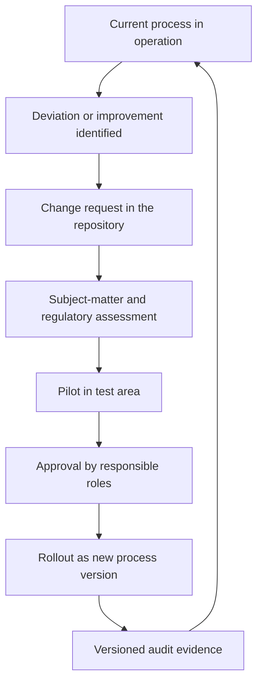

# Business-User Guide: Git As A Business OS Without IT Specialist Knowledge

## Why This Model Helps

An organization depends on repeatable decisions and traceable flows. In many
companies these rules exist only in people's heads, emails or individual tools.
That leads to:

- unclear responsibilities,
- incomplete documentation,
- difficult auditability for audits, tax or quality evidence,
- high dependency on individual people.

Git as a business OS solves this by versioning, approving and permanently
documenting every relevant process step.

In short:

- The LLM is the simple language input for employees.
- Git is the reliable protocol and approval system.
- Python is the standardized execution layer for repeatable processes.

## Why Processes Should Be Built First

Before a process is rolled out in the organization, it should be modeled cleanly
in the pattern. Otherwise errors become visible only in day-to-day operations.
The pattern provides:

- clear roles,
- unambiguous status steps,
- defined approval points,
- auditable documentation duties.

Therefore: process design first, operational rollout second.

## Why Already Implemented Processes Should Also Be Documented

Existing flows also need to be transferred into the system so that:

- current-state processes become transparent,
- risks and deviations become visible,
- improvements can be planned in a versioned way,
- audits can rely on robust evidence.

Practically this means that existing processes are first captured as an
"as-is version" and then gradually transformed into improved "target versions".

## Generic And Domain-Specific Building Blocks

### Generic Processes For Almost All Organizations

- roles and approvals,
- invoicing,
- bookkeeping,
- tax processes,
- monthly and annual closing,
- deadline and evidence management.

### Domain-Specific Knowledge As Options

- Law firm: mandate acceptance, deadline calendar, conflict check, file closure.
- Notary office: deed preparation, identity check, completion steps.
- Tax office: client onboarding, declaration cycles, plausibility checks.
- Software company: release approvals, SLA/support processes, compliance
  evidence.

The pattern organization always combines both:

- core processes from the generic standard,
- domain modules from the respective industry.

## Decision Principle For Different Ways Of Working

When organizations work differently, this must be modeled as a configurable
choice, not as an exception.

Example:

- Variant A: the invoice is sent automatically after subject-matter approval.
- Variant B: the invoice is sent only after final commercial approval.

Both variants can be valid. The system documents which variant applies to which
organization and since when.

## How A Non-IT Decision Maker Starts In Their Own Company

## Step 1: Define Responsibility And Target Picture

- Name a subject-matter process owner.
- Define three to five core processes for the start.
- Define which evidence is mandatory from audit or liability perspectives.

## Step 2: Set Up A Company Repository

- Create a dedicated Git repository for your organization.
- Use this pattern as a template and adopt only the suitable parts.
- Define access and roles: who may propose, review and approve.

## Step 3: Clone The Pattern And Create The First Company Variant

- Clone the pattern into your environment.
- Adapt domain modules to your concrete business.
- Start with a pilot path, for example the invoicing process for one location.

## Step 4: Make Approval Rules Binding

- Processes may be changed only through pull requests.
- Sensitive steps receive four-eyes approval.
- Monthly closings are marked as versioned states.

## Step 5: Operate With Continuous Improvement

- Every deviation is documented as a change request.
- Every change receives a version number with rationale.
- Every new version is tested in a pilot path before rollout.

## Continuous Improvement In Git

## How Everyone Can Benefit From Improvements

A useful model consists of:

- a central reference pattern, generic plus domain,
- organization forks for local adjustments,
- a controlled return path for good improvements into the reference standard.

This creates:

- local flexibility,
- shared learning,
- stable, versioned documentation standards.

## Running Old And New Processes In Parallel

When a new release arrives while matters are running:

- running matters remain on their start version,
- new matters start on the newly approved version,
- both lines remain cleanly separable in the audit.

Example notary office:

- File A starts at 10:15 on `v1.4.0` and remains there.
- File B starts after approval at 13:00 on `v1.5.0`.

Details: [docs/en/operations/parallelbetrieb-version-binding.md](operations/parallelbetrieb-version-binding.md)

## Role Of Associations And Certification

The idea is sound from a subject-matter perspective: when, for example, 1,000
law firms use the same core process, an association can review and recommend a
referenced standard version.

Possible model:

- association reference process with clear version history,
- formal review against quality and compliance criteria,
- optional certificate or attestation for a specific process version,
- public evidence of which version was reviewed.

Important:

- A certificate should always refer to a concrete version.
- Every change after certification requires a new assessment.
- Organizations may extend locally, but may lose certification status for
  modified parts until those parts have been reviewed again.

## Practical 90-Day Start Recommendation

- Weeks 1-2: define target picture, roles and pilot processes.
- Weeks 3-4: set up repository, adopt pattern, define approval rules.
- Weeks 5-8: run pilot for invoicing and bookkeeping.
- Weeks 9-10: connect tax and deadline process.
- Weeks 11-12: lessons learned, change requests, approve version 1.0.

This gives the organization a robust, auditable and learnable process operating
system.
