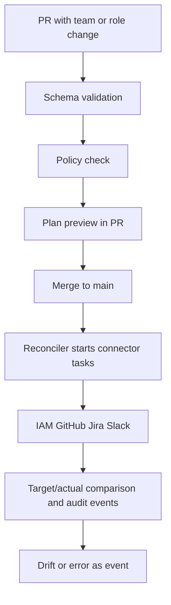

# NaC Enterprise Control Plane MVP, 6 Months

## Goal And Frame

This document makes a realistic MVP for `Notariat as Code` concrete within the
existing `NaC + Enterprise GitOps + NaC` model.

The MVP closes a small but complete end-to-end loop:

- declarative change in Git,
- policy and approval check,
- reconciliation into target systems,
- audit and drift visibility.

The default synchronous pilot paths are `software_company`, `notary` and
`wealth_management`. Domain modules remain switchable through
[policies/process-policy.yaml](../../policies/process-policy.yaml).

## MVP Scope

Focus domain:

- organization, access and tooling onboarding,
- additional domain path as MVP usecase: `property_management`.

Included change types, schema v1:

- `team`
- `role_change`
- `joiner_mover`

Not in the MVP:

- compensation,
- performance management,
- complex financial planning,
- autonomous AI approvals for sensitive topics.

## Reference Flow

## Repository Shape For The Pilot

- `org-model` remains implemented in the current repository as modeling process
  artifacts under [processes/](../../processes) plus new change types.
- `policy-repo` corresponds to the existing rules under
  [policies/](../../policies).
- `connector-config` initially appears as configuration files under `docs/en/`
  and later becomes its own directory.
- [schemas/](../../schemas) contains the machine-checkable contract
  definitions.

## Six-Month Plan

### Month 1: Fix The Model

- Make core objects and change types binding.
- Define target systems for the pilot, for example IAM, GitHub and Jira.
- Make the minimum policy for approvals and segregation of duties checkable.

### Month 2: Validation And Policy

- CI validates the new schemas.
- Policy checks provide PR-ready feedback.
- Plan preview becomes a human-readable change sequence.

### Month 3: Reconciler Plus First Connector

- Merge event starts reconciliation.
- First real target-system change is reproducible and idempotent.
- Audit trail exists for every execution.

### Month 4: Two Additional Connectors

- IAM, GitHub and Jira are integrated.
- Retry, error classification and idempotency path are stable.

### Month 5: Observability And Drift

- Target/actual comparison with clear drift signals.
- Dashboard for lead time, errors and governance.

### Month 6: Pilot Operation

- One real area works productively through the flow.
- `joiner_mover`, `team` and `role_change` run end to end.
- KPI review with scaling decision.

## KPI Set For The MVP

Delivery:

- lead time per team or role change,
- automation rate compared with manual tickets.

Governance:

- policy violations per PR,
- audit coverage per executed change.

User value:

- time to access for new employees,
- time to team setup for new teams.

Platform health:

- drift rate,
- reconciliation latency,
- connector failure rate.

## AI Use In The MVP

Allowed:

- plan suggestions, policy explanation and prioritization support.

Not allowed:

- final approvals in sensitive HR, finance or security steps.

Principle:

- AI proposes, humans decide.
