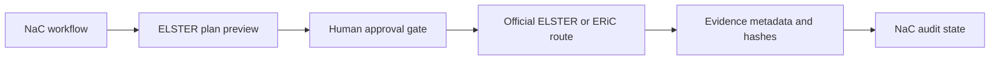

# ELSTER Developer Plugin Integration Plan

Status: `draft`

## Target Picture

This plan defines how NaC can support ELSTER and ERiC related workflows as a
local companion first and, only after separate approval, as a deeper technical
integration.

The goal is not to replace ELSTER, Mein Unternehmenskonto, tax-adviser
responsibility or official ERiC onboarding. The goal is to structure filing
readiness, evidence, approval gates and local integration prerequisites.

## Official Fact Baseline

- ELSTER/ERiC access is bound to official onboarding and authorization rules.
- Server-side ERiC integration can require manufacturer or operator approval.
- Tax filing decisions remain subject-matter decisions and must not be made by
  an LLM.
- Certificates, PINs and tax identifiers are sensitive and must not be stored in
  the repository.

## Leading Decision

The MVP is a **local workflow companion**:

- check local prerequisites,
- create filing readiness and evidence plans,
- keep real filing and authentication in the approved official route,
- store only metadata, hashes and attestations by default.

Direct ERiC submission, certificate handling and portal automation are excluded
until the exact legal and technical authorization path is approved.

## Architecture

## What The Plugin May Do

- Ask for filing type, period, tenant and authorization context.
- Check whether local prerequisites are documented.
- Generate a filing-readiness plan.
- Prepare evidence metadata and hash records.
- Identify missing approvals, certificates or operator decisions.
- Provide day-2 follow-up for rejected, postponed or corrected filings.

## What The Plugin Must Not Do

- Store certificates, PINs, tax IDs or real taxpayer data in Git.
- Submit tax filings without approved connector scope.
- Automate protected portals.
- Make final tax or legal decisions.
- Reuse data across tenants or purposes.

## Integration Paths

### Path A: Local/Workflow Companion, MVP

The user executes official ELSTER or specialist-system steps manually. NaC
tracks readiness, approvals, package version and evidence metadata.

### Path B: ERiC Manufacturer Integration

This path is evaluated only after manufacturer, license, test and operational
requirements are known. It needs separate security and release approval.

### Path C: Mein Unternehmenskonto Or Portal Operator

This path requires clarification of portal-operator responsibilities, identity
flow, organization account handling and evidence export.

## Plugin Interface

- `elster.readiness`
- `elster.filing_plan`
- `elster.period_check`
- `elster.authorization_check`
- `elster.evidence_record`
- `elster.day2_followup`

All outputs must be safe for repository storage and must redact personal or
certificate-related data.

## Evidence Model

Default evidence:

- `case_id`
- `tenant_id`
- `filing_type`
- `period`
- `actor_role`
- `approval_ref`
- `package_version`
- `source_system`
- `document_hashes`
- `submission_attestation`
- `result_status`
- `retention_class`

Personal data, certificate material and tax identifiers are excluded by default.
If a process needs them, the customer policy must define purpose, retention,
recipients and review path.

## NaC Process Types

- `tax_filing_readiness`
- `tax_period_package`
- `elster_submission_evidence`
- `elster_rejection_followup`
- `tax_correction_package`

## Tenant And Compartment Concept

- Each customer remains separated by tenant and evidence area.
- Certificates and secrets stay in local or tenant-controlled stores.
- Audit metadata is scoped to case and purpose.
- Cross-customer aggregation is prohibited.

## MVP

The first implementation covers:

1. readiness prompt and schema,
2. filing-plan preview,
3. evidence metadata model,
4. policy gates for certificate and submission boundaries,
5. local `elster.health` check placeholder,
6. day-2 follow-up structure.

## Security Requirements

- No certificate, PIN or password in Git.
- No real tax identifiers in examples.
- Redaction by default.
- Hash-first evidence for documents.
- Four-eyes approval before any filing-adjacent action.

## Provider Runbook

1. Clarify operating model: companion, ERiC manufacturer path or portal path.
2. Confirm customer authorization and representation scope.
3. Confirm evidence storage and retention.
4. Confirm local tooling and certificate boundary.
5. Document unsupported automation explicitly.

## Customer Onboarding Runbook

1. Choose filing types and periods for the pilot.
2. Name responsible reviewer and approver.
3. Confirm official ELSTER/ERiC access outside Git.
4. Run readiness check.
5. Execute first filing manually in official route.
6. Record evidence metadata and hashes.

## Open Decisions

- Is the first productive customer route portal-based or ERiC-based?
- Which specialist tax software is authoritative?
- Which evidence may be stored in NaC and which must stay in the DMS?
- Who approves corrections and re-submissions?

## Acceptance Criteria For The First Implementation

- The plugin returns only readiness, plan, approval and evidence sections.
- No certificate or personal taxpayer data is stored.
- Every filing-adjacent step has a human approval gate.
- Day-2 handling covers rejection, correction and resubmission.
