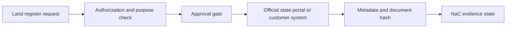

# Land Register Portal Plugin Integration Plan

Status: `draft`

## Target Picture

This plan defines how NaC can support processes around the German joint land
register portal and online land-register inspection. The goal is not to scrape
land-register portals or automate retrieval without authorization. The goal is
a secure, tenant-capable workflow and evidence approach that can later become a
direct retrieval connector only after formal authorization and technical
approval.

## Official Fact Baseline

- Online land-register inspection depends on legal and technical prerequisites.
- Access is tied to authorization, user group, federal state and purpose.
- Retrievals can be fee-relevant and must be traceable.
- Courts, authorities, notaries and publicly appointed surveyors can receive
  broader access; other groups usually operate under restricted conditions.
- Federal-state differences remain relevant.

## Leading Decision

The MVP is an **authorization and evidence companion**:

- check whether authorization, state, purpose and user group are documented,
- prepare a retrieval plan and approval gate,
- keep the actual retrieval in the official portal or customer system,
- import only metadata, hashes and attestations by default.

Direct retrieval or storage of land-register content is out of scope until the
customer has documented authorization and the technical interface is formally
approved.

## Architecture

## What The Plugin May Do

- Structure the land-register-related workflow.
- Ask for federal state, user group, authorization status, property reference
  and purpose.
- Create a retrieval or evidence plan.
- Enforce approval gates for sensitive retrievals.
- Prepare fee and retrieval-count metadata for internal control.
- Import hashes and attestations after manual retrieval.

## What The Plugin Must Not Do

- Access protected portals without authorization.
- Circumvent official state portal processes.
- Store land-register content by default.
- Build a cross-customer register copy.
- Use retrieved content for unrelated purposes.
- Replace notarial or legal responsibility.

## Integration Paths

### Path A: Authorization And Evidence Companion, MVP

This path is immediately plannable. NaC checks authorization documentation and
purpose, creates the workflow plan, and records evidence after the authorized
user completes the official portal step.

### Path B: Controlled Document And Evidence Import

If a customer stores documents in a DMS, NaC can import hashes, references and
attestations. Content storage in NaC remains disabled by default.

### Path C: Authorized Direct Adapter

This path is allowed only after authorization, interface approval and legal
review. It needs separate tenant isolation, retention, logging and abuse
prevention.

## Plugin Interface

- `grundbuch.readiness`
- `grundbuch.authorization_check`
- `grundbuch.retrieval_plan`
- `grundbuch.evidence_import`
- `grundbuch.fee_control`
- `grundbuch.day2_followup`

## Evidence Model

Default evidence:

- `case_id`
- `tenant_id`
- `federal_state`
- `user_group`
- `authorization_ref`
- `purpose`
- `property_ref`
- `actor_role`
- `approval_ref`
- `retrieval_time_utc`
- `document_hash`
- `source_portal`
- `retention_class`

Land-register content is excluded by default. If content must be stored, it must
be tenant-isolated, encrypted, retained according to policy and exportable.

## NaC Process Types

- `land_register_readiness`
- `land_register_retrieval_plan`
- `land_register_evidence_import`
- `land_register_fee_review`
- `land_register_day2_followup`

## Tenant And Compartment Concept

- Each customer has a separate evidence area.
- Purpose and authorization are documented per matter.
- Cross-tenant pooling is prohibited.
- Retention, legal hold and export rules are customer-specific.

## MVP

The first iteration implements:

1. readiness schema for state, authorization, purpose and actor,
2. retrieval-plan preview,
3. evidence metadata and hash model,
4. policy gate for content storage,
5. official portal and state-portal reference list,
6. sample workflow for restricted retrieval with power of attorney or file
   reference.

## Security Requirements

- No land-register content in Git by default.
- Hash-first design for imported documents.
- Tenant isolation and strict need-to-know.
- Configurable four-eyes principle for high-risk retrievals.
- Domain allowlist for official portals to reduce phishing risk.

## Provider Runbook

1. Identify relevant federal states for the first customers.
2. Determine customer and user groups: notary office, law firm, bank,
   authority, utility or other.
3. Document authorization and permitted scope.
4. Document TOMs for proper data processing and abuse prevention.
5. Define retention and evidence rules.

## Customer Onboarding Runbook

1. Customer defines relevant states and user groups.
2. Customer documents authorization status and purpose categories.
3. Customer defines approval rules and retention for evidence.
4. First retrieval is performed manually in the official portal.
5. Evidence is imported as hash and attestation.
6. Review whether content may later be stored or processed automatically.

## Open Decisions

- Which federal states are relevant for the first customers?
- Should land-register excerpts ever be stored in NaC, or only in the customer
  system?
- Which retention applies to evidence and imported documents?
- Are there state-specific technical interfaces officially approved for
  service providers?
- How is cost control implemented per customer and retrieval?

## Acceptance Criteria For The First Implementation

- Every matter contains federal state, authorization status, retrieval purpose,
  file reference and responsible person.
- Every imported document is hashed.
- Land-register content is not stored in NaC by default.
- Four-eyes approval can be configured for sensitive retrievals.
