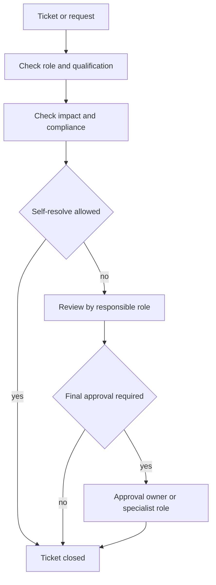

# Role Model: Generic And Domain-Specific

## Goal

This model ensures that:

- every person can create tickets,
- only qualified roles can make final decisions in subject-critical steps,
- approvals are documented in a traceable and audit-proof way.

## 1. Basic Principle For All Organizations

- Every role may observe.
- Every role may open a ticket.
- Every role may self-resolve only within its approved competence.
- Subject-critical decisions require qualified roles and, where necessary,
  approval.

Example: if copy paper is missing, nobody has to be a notary to report it.

## 2. Generic Minimum Roles

- `mitarbeiter`: may report, comment and update status.
- `sachbearbeitung`: may process and close operational tickets when there is no
  subject-critical impact.
- `prozessverantwortung`: may approve working rules in the subject process.
- `freigabeverantwortung`: may finally approve approval-required steps.
- `revision_audit`: may review, but not decide operationally.
- `automation`: executes technical standard tasks and does not decide on
  subject matter.

## 3. Domain-Specific Roles, Example Law Office

- `anwalt_fachlich`: subject-matter decision in mandate or RVG-relevant steps.
- `reno`: operational flow, deadlines and file coordination.
- `refa`: organization-adjacent case handling and process support.
- `notar_fachlich` for notary offices only: notarial approvals.
- `steuerfachkraft` for tax offices only: declaration-adjacent approvals.

## 4. Qualification Instead Of Title

The decisive factor is not only the job title, but the documented
qualification.

Example:

- `rechnung_rvg_erstellen`: allowed only for roles with
  `qualification: rvg_billing_trained`.

## 5. Decision Matrix, Self-Resolve vs Approval

- `impact=low` and `compliance=none`: self-resolve allowed.
- `impact=medium` or `financial=true`: review by process owner.
- `impact=high` or `legal=true`: approval by an authorized specialist role.

## 6. Workflow Integration

Required technical fields per process request:

- `actor_context.actor_role`
- `actor_context.requested_decision_type`
- `actor_context.impact_level`
- `actor_context.compliance_impact`
- optional `actor_context.requested_qualification`
- optional `actor_context.qualification_evidence`
- depending on the decision, `actor_context.approver_role`

## 7. Gender And Role Names

The internal role ID remains neutral and stable, for example
`anwalt_fachlich` as a technical identifier. Visible wording follows
[policies/culture-policy.yaml](../../policies/culture-policy.yaml).

Recommendation:

- Technical IDs: neutral and stable.
- Display texts: according to policy, for example neutral or paired forms.
- Same rights for all wording variants.
