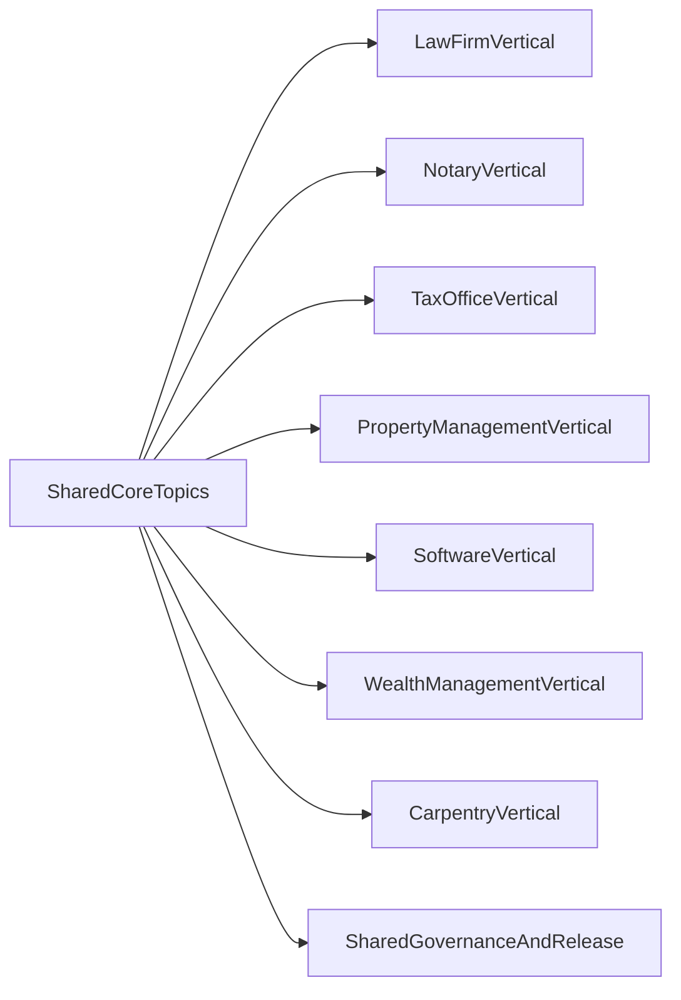

# Blueprint: Core And Vertical Modules For Service Organizations

## Goal

This blueprint defines a uniform structure for a central `NaC` that can be used
across several service industries:

- law firm (`law_firm`)
- notary office (`notary`)
- tax office (`tax_office`)
- property management (`property_management`)
- software company (`software_company`)
- wealth management (`wealth_management`)
- carpentry (`carpentry`)

The model uses **one shared core** plus **vertical modules** in the same
repository.

## Guiding Principle

- `core` contains reusable process building blocks for all industries.
- `vertical` contains only industry-specific rules and work steps.
- Every effective process change is versioned, reviewed and approved.
- Running matters remain on the process version bound at their start.

## Shared Core Topics

These topics are the same for all service organizations and belong in the core:

1. roles, qualifications and approval paths,
2. intake and order or mandate start,
3. matter status and approval gates,
4. service recording and billing,
5. accounting, tax relation and periodic close,
6. evidence, audit and archiving,
7. incident and deviation handling.

## Vertical Topics

Each vertical extends the core with industry-specific knowledge:

- `law_firm`: mandate, conflict check, deadline management, RVG relation.
- `notary`: file creation, identity check, deed completion, register
  communication.
- `tax_office`: client cycles, declaration deadlines, plausibility checks.
- `property_management`: tenant intake, property operations, maintenance
  control, service-charge controls, handovers.
- `software_company`: release governance, incident management, SLA/license
  evidence.
- `wealth_management`: KYC/client intake, suitability and risk-profile checks,
  rebalancing controls, mandate reporting.
- `carpentry`: measurement, material planning, workshop/installation
  coordination, warranty cases.

## Boundary Rule: Core vs Vertical

A rule belongs in the core when it:

- applies equally in at least three verticals,
- contains no industry-specific legal or subject-matter duty,
- can be phrased industry-neutrally without domain jargon.

A rule belongs in the vertical when it:

- is legally or technically industry-specific,
- needs its own evidence artifacts or specialist approvals,
- is relevant only for one or two verticals.

## Structural Model, Subject-Matter View

## Versioning And Mixed Operation

- Core and vertical are approved together as a release in the organization fork.
- A `process_version` is bound at matter start.
- New releases apply only to new matters.
- Running matters finish on the bound version.

Details: [docs/en/operations/parallelbetrieb-version-binding.md](../operations/parallelbetrieb-version-binding.md)

## Decision Logic For Extensions

When a new topic appears:

1. Check whether a core rule can be extended.
2. If not, document it as a vertical rule.
3. Perform impact assessment.
4. Adopt through PR, review and release.
5. Optionally return the improvement to the reference standard.
