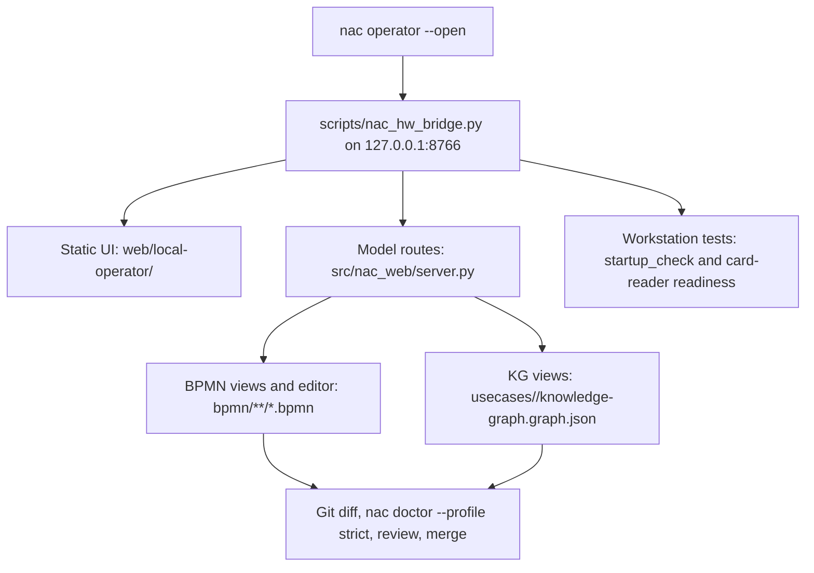

# Understanding The NaC Web App Without Access

Status: operator web app and screenshot documentation checked on 2026-05-19

## Purpose

This page explains the local NaC web app for readers who cannot open it
themselves. It shows what a notary office sees, which repository files back the
screen, and what each click triggers.

The web app is not a production case-management system. It is a local reading,
review and editing surface for BPMN flows, KG checklists and workstation tests.

The operating logic follows the [operator style guide](operator-styleguide.md).
The surface separates daily matter work from approval-relevant office workflow
master data.

## Entry Point

The intended operating edge is the central NaC CLI:

```bash
python scripts/nac.py operator --open
```

The command starts a local server on `127.0.0.1:8766`. Without browser access,
the same behavior can be understood from this documentation, the screenshots
and the repository files.


## What The Surface Shows

| Area | What the user sees | What backs it |
| --- | --- | --- |
| Case selection | Search field and case cards with the blocks `Aktenverwaltung`, `Kontrolle` and `Kanzlei-Workflow`. | Static surface in [web/local-operator/](../../web/local-operator) plus usecase-local KG and BPMN routes. |
| Matter management | Open matters, create a new demo matter and see status counters plus next step per use case. | Demo data repository via `/api/matters`; new matters receive `workflow_binding` and `checkliste.json`. |
| Checklist | Safe KG view without mandate values. | [usecases/](../../usecases) with `knowledge-graph.graph.json`, rendered through `notary_kg.editor.build_editor_view`. |
| Flow | BPMN flow as a readable SVG view. | [bpmn/](../../bpmn) and [src/nac_web/bpmn.py](../../src/nac_web/bpmn.py). |
| Edit | BPMN editor surface with bpmn-js loading path and XML fallback. | `/api/bpmn/<slug>/xml` returns XML plus SHA-256; saving writes only when the base hash still matches. |
| Workstation tests | Hardware test, XNP check and system status. | [scripts/nac_hw_bridge.py](../../scripts/nac_hw_bridge.py), `startup_check`, card-reader readiness and summarized test logs. |
| Handbook | Links to repository, German documentation and usecase documentation. | GitHub remains the binding evidence and review surface. |

## Flow View

The flow view makes the procedural sequence visible. For the real-estate
purchase contract, it shows intake, parties, land-register status, draft,
notarization, completion, evidence and XNP/land-register channels as a BPMN
model.


## Checklist View

The checklist view is meant for subject-matter review. It shows open
information, documents, decisions, gates and evidence, but no mandate values.
That boundary matters: real party, property, family, estate or company data do
not belong in this public repository.


## Editing View

The editing view loads the BPMN XML, can activate bpmn-js, and keeps a SHA-256
of the loaded state. Saving only writes when the model has not changed since it
was loaded. After that, the change is still not finished: Git diff,
`nac doctor --profile strict`, review and merge remain binding.


## Technical Mapping



## A Click Is Not A Production Action

| Click | Result | Deliberate boundary |
| --- | --- | --- |
| `Akten öffnen` | Opens existing matters and matching pending inbox items. | No change to the office workflow. |
| `Neu` | Creates a demo matter with a bound workflow version. | No real mandate data, demo data repository only. |
| `Checkliste prüfen` | Opens a KG review view. | No real `value` fields, no mandate data. |
| `Ablauf ansehen` | Renders a BPMN model as SVG. | No execution in a production system. |
| `Änderung vorschlagen` | Shows BPMN XML and optional bpmn-js as a change path. | No merge, no approval, no filing; office master data needs review. |
| `HW-Test starten` | Checks local readiness where the workstation allows it. | No PINs, no raw card data, no login. |
| `XNP prüfen` | Checks local XNP/card-path readiness. | No productive register or land-register filing. |

## Version Binding Per Matter

When a matter is created, the operator bridge binds it to the current workflow
version of the use case. `akte.json` stores this as `workflow_binding` with
version, artifact hashes and binding timestamp. New approved workflow versions
apply only to new matters. Running matters stay on their bound version until a
documented version migration is recorded.

The bridge also writes `checkliste.json` per matter. This file contains the
case state of the use-case checklist with open information, documents,
decisions, gates and evidence. The matter overview shows the next open step
from this state.

## Why This Is Understandable For Non-Technical Readers

The web app translates repository structure into office terms:

- cases instead of file paths,
- checklists instead of JSON,
- flows instead of XML,
- tests instead of shell commands,
- handbook instead of scattered links.

Traceability still stays intact. Every view points back to versioned files, and
every change must pass Git, NaC CLI validation and review.
