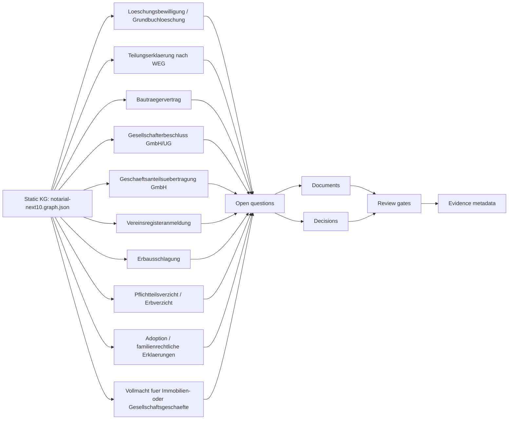

# Notarial Next 10 Knowledge Graph

Status: draft  
Last update: 2026-05-15  
Static DB: `knowledge-graph/notarial-next10.graph.json`

## Operating Model

This KG extends the canonical Top-10 catalog with ten additional frequent
notarial case types. It uses the same static DB pattern: JSON is machine-readable
workflow state, Markdown/Mermaid is the review view in GitHub.

All `value` fields stay empty in Git. Workflows may update status and evidence
references only through reviewed changes and without committing real mandate
data.

## Overview

## Case Coverage

| Priority | Case | Usecase folder | Main plugins | KG focus |
| --- | --- | --- | --- | --- |
| P0 | Loeschungsbewilligung / Grundbuchloeschung | `usecases/loeschungsbewilligung-grundbuchloeschung/` | `noc-grundbuch-portal`, `noc-bnotk-xnp` | Right identity, beneficiary authorization, letter handling and deletion trace. |
| P0 | Teilungserklaerung nach WEG | `usecases/teilungserklaerung-weg/` | `noc-grundbuch-portal`, `noc-bnotk-xnp` | Base property, unit structure, plans, certificate, shares and encumbrances. |
| P0 | Bautraegervertrag | `usecases/bautraegervertrag/` | `noc-grundbuch-portal`, `noc-bnotk-xnp`, `noc-idaas` | Developer, buyer, unit, construction specification, installment model and consumer gates. |
| P0 | Gesellschafterbeschluss GmbH/UG | `usecases/gesellschafterbeschluss-gmbh-ug/` | `noc-bnotk-xnp`, `noc-handelsregister`, `noc-cyberjack-rfid` | Resolution type, votes, majority, articles wording and register package. |
| P0 | Geschaeftsanteilsuebertragung GmbH | `usecases/geschaeftsanteilsuebertragung-gmbh/` | `noc-bnotk-xnp`, `noc-handelsregister`, `noc-idaas` | Share chain, parties, consent restrictions, purchase/gift route and shareholder list. |
| P1 | Vereinsregisteranmeldung | `usecases/vereinsregisteranmeldung/` | `noc-bnotk-xnp`, `noc-idaas` | Association, board signers, resolutions, articles and register-court route. |
| P0 | Erbausschlagung | `usecases/erbausschlagung/` | `noc-regulated-core`, `noc-idaas` | Deadline, renouncer, heirship basis, minors/approvals and court delivery. |
| P1 | Pflichtteilsverzicht / Erbverzicht | `usecases/pflichtteilsverzicht-erbverzicht/` | `noc-regulated-core`, `noc-idaas` | Waiver scope, compensation, descendants, personal participation and fairness. |
| P1 | Adoption / familienrechtliche Erklaerungen | `usecases/adoption-familienrechtliche-erklaerungen/` | `noc-regulated-core`, `noc-idaas` | Declaration type, consent party, court destination, warnings and approvals. |
| P0 | Vollmacht fuer Immobilien- oder Gesellschaftsgeschaefte | `usecases/vollmacht-immobilien-gesellschaftsgeschaefte/` | `noc-idaas`, `noc-grundbuch-portal`, `noc-bnotk-xnp` | Principal, agent, transaction scope, form route, limitations and copy control. |

## Backlog Candidates

The following frequent matters are recorded as backlog candidates, not yet as
canonical KG cases:

- Genehmigungserklaerungen
- Rangruecktritt/Rangaenderung im Grundbuch
- Dienstbarkeiten
- Baulasten-bezogene Erklaerungen
- Niessbrauchsbestellungen
- Wohnrechte
- Auseinandersetzungsvertraege zwischen Erben
- Scheidungsimmobilien-Uebertragungen

## Source Anchors

The graph uses official statutory anchors for structure only. Important anchors
include GBO for register authorization/evidence/deletion, BGB for cancellation
of land rights, inheritance renunciation, waiver contracts and powers of
attorney, WEG for division declarations, GmbHG for shareholder resolutions and
share transfers, and BeurkG for notarial recording and certification duties.

