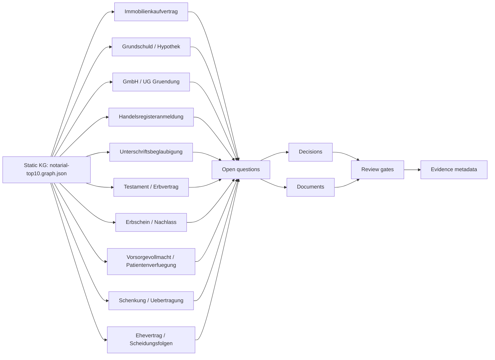
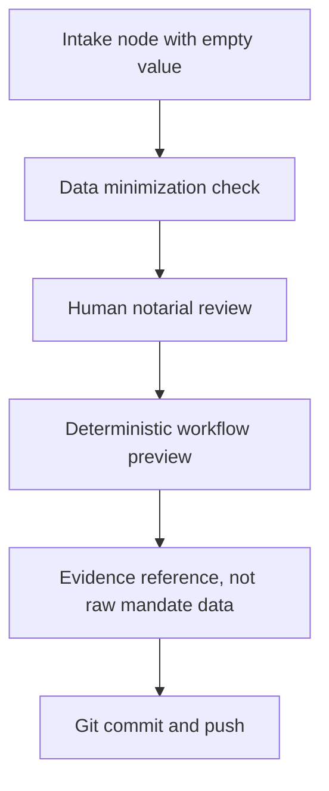

# Notarial Top 10 Knowledge Graph

Status: draft  
Last update: 2026-05-15  
Static DB: `knowledge-graph/notarial-top10.graph.json`

## Operating Model

The JSON file is the machine-readable static database. Each workflow can read a
case node, mark required information as open, in progress or provided, and write
reviewed state back through a Git change. The Markdown view exists for human
review and GitHub rendering.

No real mandate values are stored in this graph. The `value` fields in the JSON
must remain empty until a reviewed local evidence store is available and the
privacy model allows references instead of content.

## Overview

## Shared Gate Pattern

## Case Coverage

| Priority | Case | Usecase folder | Main plugins | KG focus |
| --- | --- | --- | --- | --- |
| P0 | Immobilienkaufvertrag | `usecases/immobilienkaufvertrag/` | `noc-grundbuch-portal`, `noc-bnotk-xnp` | Property, parties, price, financing, approvals and filing evidence. |
| P0 | Grundschuld / Hypothekenbestellung | `usecases/grundschuld-hypothekenbestellung/` | `noc-grundbuch-portal`, `noc-bnotk-xnp` | Bank order, owner/debtor, amount, rank and enforcement clause. |
| P0 | GmbH-/UG-Gruendung | `usecases/online-gmbh-gruendung/` | `noc-cyberjack-rfid`, `noc-bnotk-xnp`, `noc-handelsregister`, `noc-idaas` | Company, founders, capital, management, register route and AML flags. |
| P0 | Handelsregisteranmeldung | `usecases/handelsregisteranmeldung/` | `noc-bnotk-xnp`, `noc-handelsregister`, `noc-cyberjack-rfid` | Event type, signers, authority evidence, attachments and electronic filing. |
| P1 | Unterschriftsbeglaubigung | `usecases/unterschriftsbeglaubigung/` | `noc-idaas`, `noc-bnotk-xnp` | Identity, signature act, representation, language and routing. |
| P0 | Testament / Erbvertrag | `usecases/testament-erbvertrag/` | `noc-regulated-core` | Capacity, family situation, dispositions, prior wills and custody. |
| P0 | Erbscheinsantrag / Nachlass | `usecases/erbscheinsantrag-nachlass/` | `noc-regulated-core` | Decedent, applicants, heirship basis, family evidence and oath. |
| P0 | Vorsorgevollmacht / Patientenverfuegung | `usecases/vorsorgevollmacht-patientenverfuegung/` | `noc-idaas` | Principal, agents, authority scope, patient directive and register route. |
| P0 | Schenkung / Uebertragung | `usecases/schenkungsvertrag-uebertragungsvertrag/` | `noc-grundbuch-portal` | Asset, reserved rights, reversion, approvals, tax and family flags. |
| P1 | Ehevertrag / Scheidungsfolgen | `usecases/ehevertrag-scheidungsfolgenvereinbarung/` | `noc-idaas`, `noc-grundbuch-portal` | Spouses, asset categories, property regime, maintenance and fairness review. |

## Detailed Node Types

| Node type | Meaning | Required handling |
| --- | --- | --- |
| `required_information` | Open information needed before drafting or execution. | `value` stays empty in Git; status may be updated by reviewed workflow state. |
| `documents` | Documents or document references expected for the case. | Store only metadata or synthetic placeholders in Git. |
| `decisions` | Notarial or operational decisions blocking the next step. | Options are enumerated to make workflow state deterministic. |
| `gates` | Human review, technical readiness or filing checkpoints. | Sensitive gates require human approval and evidence metadata. |
| `evidence` | Traceable reference to reviewed evidence, filing or approval state. | No raw personal, property, estate, health or family data in the repo. |

## Source Anchors

The graph uses official statutory anchors for shape, not for automated legal
truth. Current anchors are maintained in the JSON `source_refs` section:
BeurkG, BGB, GBO, GmbHG and HGB. The LLM remains an intake interface; legal
truth is produced through reviewed notarial work and versioned change control.

