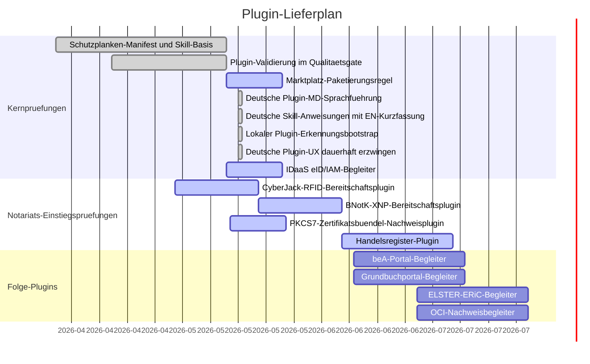

# Plugin Gantt

Letzte Aktualisierung: 2026-05-17

## Status

| Plugin | Zweck | Status | Naechster Pruefpunkt |
| --- | --- | --- | --- |
| `noc-regulated-core` | Gemeinsame Schutzplanken fuer regulierte Arbeitsablaeufe | Basis bereit | GPT-Store-/Arbeitsbereich-Paketierungsannahmen erneut pruefen. |
| `noc-idaas` | Deutsche eID-Pruefung und IAM-Projektionsbereitschaft | Aktiv | Connector-Grenze und Datenverarbeitungsgrundlage vor jedem Produktionspiloten bestaetigen. |
| `noc-cyberjack-rfid` | Lokale Karten-, RFID-aus-, SAK- und XNP-Schnittstellenbereitschaft | Aktiv | Windows DriverPackage, morris-Middleware, optionale morris-Loopback-API/PCSC-Pruefung und Linux-Treiber-Vorpruefung sind implementiert; die lokale Pruefung braucht weiterhin einen angeschlossenen cyberJack-Leser oder eine manuelle Bestaetigung. |
| `noc-bnotk-xnp` | XNP-Authentifizierungsbereitschaft | Aktiv | Der lokale Leser-Prompt-Nachweis bindet die XNP-Vorpruefung an die cyberJack-Pruefung und kann die optionale morris-API-Pruefung durchreichen; naechste Pruefung ist Workstation-Validierung mit installiertem XNP. |
| `noc-pkcs7-certbundle` | Lokaler PKCS#7/P7B-Zertifikatsbuendel-Nachweis ohne Signatur | Aktiv | Installierbares MVP mit metadatenbasierter lokaler Pruefung, ohne PFX/PKCS#12-Import, ohne Private-Key-Zugriff und ohne Signaturvorgang; CI-Haertung entfernt PEM-aehnliche Testliterale aus Quellfixtures. |
| `noc-handelsregister` | Registeranmeldungsbereitschaft | Aktiv | An GmbH-Gruendungs-Usecase binden. |
| `noc-bea-portal` | beA-Arbeitsablauf-Begleiter | Geplant | Prioritaet fuer Notariats-/Kanzleibetrieb bestaetigen. |
| `noc-elster-eric` | ELSTER-/ERiC-Begleiter | Geplant | Von notariellem Kern getrennt halten, solange nicht benoetigt. |
| `noc-grundbuch-portal` | Grundbuch-Begleiter | Geplant | An Immobilienkaufvertrags-Starter binden. |
| `noc-oci-evidence` | OCI-Nachweisbetrieb | Geplant | Als Infrastruktur-/Nachweisplugin fuehren, nicht als Usecase. |

Plugin-Skills werden fachlich deutsch gefuehrt und enthalten eine kurze
englische Kurzfassung; technische Namen, Ordner, Befehle, IDs und stabile
Output-Labels bleiben englisch/ASCII.

Repo-lokale Plugins werden ueber `scripts/install_local_plugins.py` in einen
home-lokalen Plugin-Root gespiegelt: `~/.agents/plugins/marketplace.json` plus
`~/plugins/<plugin>`. Danach muss Codex neu gestartet beziehungsweise eine neue
Session geoeffnet werden, weil aktive Plugins beim Session-Start geladen
werden.

## Paketierungshinweis

OpenAI-GPT-Store-Veroeffentlichung und Arbeitsbereich-App-Installation sind
verschiedene Kanaele. Oeffentliche GPT-Store-Pakete muessen vor Veroeffentlichung gegen
die aktuellen OpenAI-Veroeffentlichungsregeln geprueft werden; arbeitsbereichsinterne
Apps und interne Notariatspiloten bleiben ein separater Arbeitsstrang.
