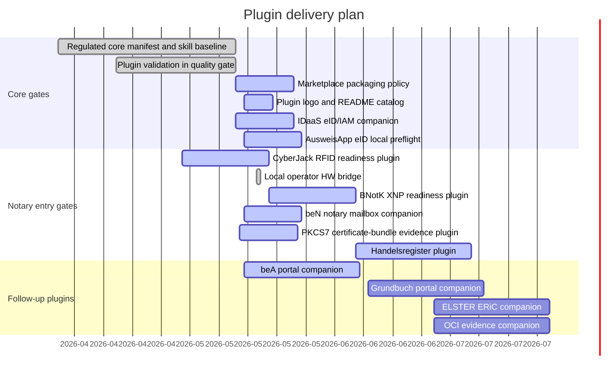

# Plugin Gantt

Last update: 2026-05-19

## Status

| Plugin | Purpose | Status | Next gate |
| --- | --- | --- | --- |
| `noc-regulated-core` | Shared regulated workflow guardrails | Baseline ready | Recheck GPT Store/workspace packaging assumptions. |
| `noc-idaas` | German eID verification and IAM projection readiness | Active | Confirm connector boundary and data-processing basis before any production pilot. |
| `noc-ausweisapp-eid` | Local AusweisApp eID session preflight without PIN or identity dumps | Active | Installable MVP added; next gate is workstation validation against the local AusweisApp status endpoint and an approved eID backend route. |
| `noc-cyberjack-rfid` | Local card, RFID-off, SAK and XNP local-interface readiness | Active | Windows DriverPackage, morris middleware, optional morris loopback API/PCSC probe, Linux driver preflight and CLI-started local Operator-Webapp bridge are implemented; current local gate still needs a connected cyberJack reader or manual attestation. |
| `noc-bnotk-xnp` | XNP authentication readiness | Active | Runnable local reader-prompt evidence now binds XNP preflight to the CyberJack gate and can pass through the optional morris API probe; next gate is workstation validation with XNP installed. |
| `noc-ben-portal` | beN notary mailbox companion | Active | Installable MVP added with NotarNet beN visual identity, XNP-first Day0 boundary and local metadata-only preflight; next gate is workstation validation with XNP and beN installed. |
| `noc-pkcs7-certbundle` | Local PKCS#7/P7B certificate-bundle evidence without signing | Active | Installable MVP added with metadata-only local inspection, no PFX/PKCS#12 import, no private-key access and no signature operation; CI hardening removes PEM-shaped test literals from source fixtures. |
| `noc-handelsregister` | Register filing readiness | Active | Bind to GmbH formation usecase. |
| `noc-bea-portal` | beA workflow companion | Active | BRaK beA visual identity is bound to the plugin manifest and rendered assets; next gate is local Client Security and card-reader readiness scripting. |
| `noc-elster-eric` | ELSTER/ERiC companion | Planned | Keep separate from notarial core unless needed. |
| `noc-grundbuch-portal` | Land register companion | Planned | Bind to purchase-contract starter. |
| `noc-oci-evidence` | OCI evidence operations | Planned | Keep as infrastructure/evidence plugin, not a usecase. |

## Packaging Note

OpenAI GPT Store publication and workspace app installation are different
channels. Public GPT Store packages must be checked against current OpenAI
publishing rules before release; workspace-only apps and internal notary pilots
remain a separate track.

## Visual Catalog Note

[plugins/README.md](README.md) now acts as the readable plugin catalog with
logo/icon assets, primary workflow links, source links and operating-boundary
summaries for every installable plugin.
