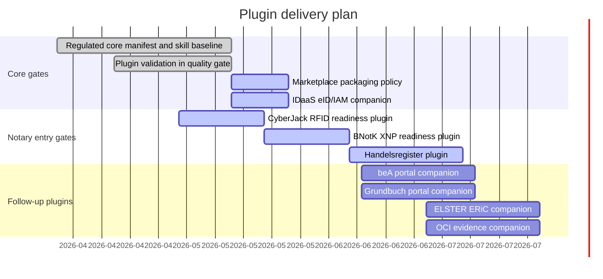

# Plugin Gantt

Last update: 2026-05-14

## Status

| Plugin | Purpose | Status | Next gate |
| --- | --- | --- | --- |
| `noc-regulated-core` | Shared regulated workflow guardrails | Baseline ready | Recheck GPT Store/workspace packaging assumptions. |
| `noc-idaas` | German eID verification and IAM projection readiness | Active | Confirm connector boundary and data-processing basis before any production pilot. |
| `noc-cyberjack-rfid` | Local card and SAK readiness | Active | Verify local-only evidence shape. |
| `noc-bnotk-xnp` | XNP authentication readiness | Active | Bind to CyberJack gate output. |
| `noc-handelsregister` | Register filing readiness | Active | Bind to GmbH formation usecase. |
| `noc-bea-portal` | beA workflow companion | Planned | Confirm notary-office priority. |
| `noc-elster-eric` | ELSTER/ERiC companion | Planned | Keep separate from notarial core unless needed. |
| `noc-grundbuch-portal` | Land register companion | Planned | Bind to purchase-contract starter. |
| `noc-oci-evidence` | OCI evidence operations | Planned | Keep as infrastructure/evidence plugin, not a usecase. |

## Packaging Note

OpenAI GPT Store publication and workspace app installation are different
channels. Public GPT Store packages must be checked against current OpenAI
publishing rules before release; workspace-only apps and internal notary pilots
remain a separate track.
