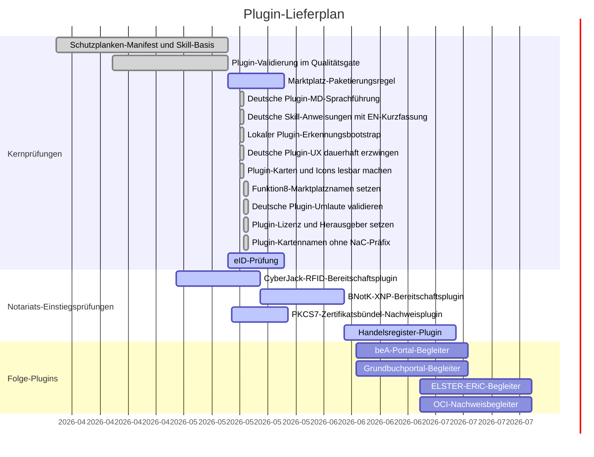

# Plugin Gantt

Letzte Aktualisierung: 2026-05-18

## Status

| Plugin | Zweck | Status | Nächster Prüfpunkt |
| --- | --- | --- | --- |
| `nac-regulated-core` | Gemeinsame Schutzplanken für regulierte Arbeitsabläufe | Basis bereit | Plugin-Manifeste führen `AGPL-3.0-or-later` und `funktion8 / ofunk` sichtbar; GPT-Store-/Arbeitsbereich-Paketierungsannahmen erneut prüfen. |
| `nac-idaas` | Deutsche eID-Prüfung und IAM-Projektionsbereitschaft | Aktiv | Connector-Grenze und Datenverarbeitungsgrundlage vor jedem Produktionspiloten bestätigen. |
| `nac-cyberjack-rfid` | Lokale Karten-, RFID-aus-, SAK- und XNP-Schnittstellenbereitschaft | Aktiv | Windows DriverPackage, morris-Middleware, optionale morris-Loopback-API/PCSC-Prüfung und Linux-Treiber-Vorprüfung sind implementiert; die lokale Prüfung braucht weiterhin einen angeschlossenen cyberJack-Leser oder eine manuelle Bestätigung. |
| `nac-bnotk-xnp` | XNP-Authentifizierungsbereitschaft | Aktiv | Der lokale Leser-Prompt-Nachweis bindet die XNP-Vorprüfung an die cyberJack-Prüfung und kann die optionale morris-API-Prüfung durchreichen; nächste Prüfung ist Workstation-Validierung mit installiertem XNP. |
| `nac-pkcs7-certbundle` | Lokaler PKCS#7/P7B-Zertifikatsbündel-Nachweis ohne Signatur | Aktiv | Installierbares MVP mit metadatenbasierter lokaler Prüfung, ohne PFX/PKCS#12-Import, ohne Private-Key-Zugriff und ohne Signaturvorgang; CI-Härtung entfernt PEM-ähnliche Testliterale aus Quellfixtures. |
| `nac-handelsregister` | Registeranmeldungsbereitschaft | Aktiv | An GmbH-Gründungs-Usecase binden. |
| `nac-bea-portal` | beA-Arbeitsablauf-Begleiter | Geplant | Priorität für Notariats-/Kanzleibetrieb bestätigen. |
| `nac-elster-eric` | ELSTER-/ERiC-Begleiter | Geplant | Von notariellem Kern getrennt halten, solange nicht benötigt. |
| `nac-grundbuch-portal` | Grundbuch-Begleiter | Geplant | An Immobilienkaufvertrags-Starter binden. |
| `nac-oci-evidence` | OCI-Nachweisbetrieb | Geplant | Als Infrastruktur-/Nachweisplugin führen, nicht als Usecase. |

Plugin-Skills werden fachlich deutsch geführt und enthalten eine kurze
englische Kurzfassung; technische Namen, Ordner, Befehle, IDs und stabile
Output-Labels bleiben englisch/ASCII.

Plugin-Karten müssen kurze Anzeigenamen ohne `NaC`-Präfix, knappe
Kurzbeschreibungen und echte PNG-Icons/-Logos haben.
`scripts/validate_plugins.py` blockiert leere Platzhalterbilder, zu lange
Kartenanzeigen und erneute `NaC`-Präfixe.

Der repo-lokale Marktplatz wird sichtbar als `funktion8 - NaC` geführt;
technische Marketplace- und Plugin-IDs bleiben stabil.

Repo-lokale Plugins werden über `scripts/install_local_plugins.py` in einen
home-lokalen Plugin-Root gespiegelt: `~/.agents/plugins/marketplace.json` plus
`~/plugins/<plugin>`. Danach muss Codex neu gestartet beziehungsweise eine neue
Session geöffnet werden, weil aktive Plugins beim Session-Start geladen
werden.

## Paketierungshinweis

OpenAI-GPT-Store-Veröffentlichung und Arbeitsbereich-App-Installation sind
verschiedene Kanäle. Öffentliche GPT-Store-Pakete müssen vor Veröffentlichung gegen
die aktuellen OpenAI-Veröffentlichungsregeln geprüft werden; arbeitsbereichsinterne
Apps und interne Notariatspiloten bleiben ein separater Arbeitsstrang.
