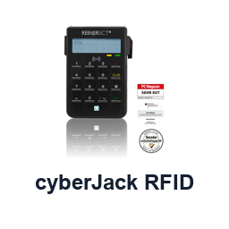
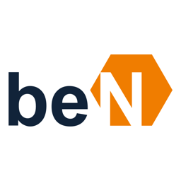
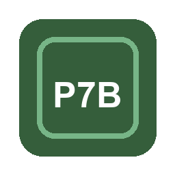
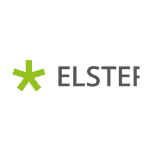

# NoC Regulated Industry Plugins

This directory contains installable repo-local Codex plugins for NoC regulated-industry workflows. The suite is local-first and currently focuses on notary offices, law firms, tax workflows, identity checks and evidence operations.

## Plugin Matrix

| Logo | Plugin | Primary workflow | Plan / source | Operating boundary |
| --- | --- | --- | --- | --- |
|  | [NoC Regulated Core](noc-regulated-core/) | Shared guardrails for plan previews, approvals and evidence. | [Core plugin](noc-regulated-core/) | Local policy and evidence guidance only. |
|  | [NoC IDaaS](noc-idaas/) | German eID verification planning and IAM projection readiness. | [IDaaS plan](../docs/de/plugin-plans/idaas-plugin-integration.md) | No production eID or IAM writes without approved connector and human approval. |
|  | [NoC AusweisApp eID](noc-ausweisapp-eid/) | Local AusweisApp/eID session preflight. | [AusweisApp/eID plan](../docs/de/plugin-plans/ausweisapp-eid-plugin-integration.md), [Personalausweisportal](https://www.personalausweisportal.de/Webs/PA/DE/buergerinnen-und-buerger/online-ausweisen/online-ausweisen-node.html) | No PIN capture and no identity-attribute dump into Git. |
|  | [NoC cyberJack RFID](noc-cyberjack-rfid/) | Local card-reader, RFID-off and SAK-lite readiness before XNP/login flows. | [cyberJack plan](../docs/de/plugin-plans/cyberjack-rfid-plugin-integration.md), [REINER SCT cyberJack](https://www.reiner-sct.com/produkt/cyberjack-rfid-standard/) | Reader readiness only; no PIN, card data or credential handling. |
|  | [NoC BNotK XNP](noc-bnotk-xnp/) | XNP authentication and local notary workstation gate. | [XNP plan](../docs/de/plugin-plans/bnotk-xnp-notariatssoftware.md), [NotarNet XNP](https://notarnet.de/produkte/xnp) | Local XNP companion only; no cloud control of XNP. |
|  | [NoC beN Portal](noc-ben-portal/) | beN notary mailbox readiness after XNP first setup. | [beN plan](../docs/de/plugin-plans/ben-portal-plugin-integration.md), [NotarNet beN](https://notarnet.de/produkte/ben) | No mailbox automation, no PINs and no notarial matter content in Git or LLM context. |
|  | [NoC PKCS7 CertBundle Gate](noc-pkcs7-certbundle/) | Local PKCS#7/P7B/P7C certificate-bundle metadata evidence. | [PKCS7 plugin](noc-pkcs7-certbundle/), [RFC 2315](https://www.rfc-editor.org/rfc/rfc2315.html) | No signing, no PFX/PKCS#12 import and no private-key access. |
|  | [NoC Handelsregister](noc-handelsregister/) | HRA-first online register application readiness. | [Handelsregister plan](../docs/de/plugin-plans/handelsregister-online-anmeldung.md), [Handelsregister](https://www.handelsregister.de/) | Preparation and evidence only; no protected portal scraping or filing automation. |
|  | [NoC beA Portal](noc-bea-portal/) | beA card-reader, Client Security and evidence companion for law firms. | [beA plan](../docs/de/plugin-plans/bea-portal-plugin-integration.md), [BRaK beA und ERV](https://www.brak.de/anwaltschaft/bea-erv/) | No PINs, card data, mailbox secrets or mandate content in Git. |
|  | [NoC ELSTER ERiC](noc-elster-eric/) | ELSTER/ERiC filing readiness and evidence planning. | [ELSTER plan](../docs/de/plugin-plans/elster-developer-plugin-integration.md), [ELSTER](https://www.elster.de/eportal/start) | No central tax credential storage and no productive filing without approval. |
|  | [NoC Grundbuchportal](noc-grundbuch-portal/) | Land-register authorization, retrieval planning and evidence import. | [Grundbuch plan](../docs/de/plugin-plans/grundbuch-portal-plugin-integration.md), [Grundbuchportal](https://www.grundbuch-portal.de/) | No unauthorized retrieval automation and no uncontrolled document storage. |
|  | [NoC OCI Evidence](noc-oci-evidence/) | OCI landing-zone, audit, drift and evidence operations. | [OCI plan](../docs/de/plugin-plans/oci-infrastructure.md), [Oracle Cloud Infrastructure](https://www.oracle.com/cloud/) | Dry-run and evidence-first; Resource Manager applies require explicit approval. |

## Asset Policy

- Official or product-derived marks are used only as recognition cues for local companion plugins.
- Where no single authoritative product mark fits the plugin, the asset is NoC-internal.
- Product systems remain authoritative: beA, beN, XNP, ELSTER, Grundbuchportal, Handelsregister and OCI are not replaced by NoC.
- Trademark and usage rights remain with their respective owners.

## Safety Model

- Plugins default to local companion, dry-run, plan-preview and metadata-only evidence.
- External write adapters are not enabled in this MVP.
- Missing accounts or approvals are tracked in [docs/de/plugin-operations/account-and-approval-requests.md](../docs/de/plugin-operations/account-and-approval-requests.md) and [docs/en/plugin-operations/account-and-approval-requests.md](../docs/en/plugin-operations/account-and-approval-requests.md).
- Validate with `python scripts/validate_plugins.py` before publishing or installing.

## Progress Tracking

Plugin progress is tracked in [plugins/GANTT.md](GANTT.md) and rolled up into [roadmap/GANTT.md](../roadmap/GANTT.md). Every plugin change must update both files before it is push-ready.

## Marketplace Boundary

Public GPT Store packages and workspace-only app installations are separate release targets. Each plugin must be checked against the current OpenAI publishing rules before public release, and actions must retain valid privacy and terms URLs.
