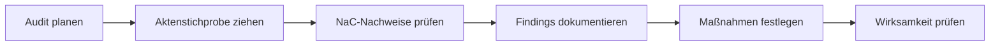

# Internes Auditprogramm

Dieses Auditprogramm ist ein Startpunkt für ein Notariat, das NaC als
QMS-Grundlage nutzt.

## Auditzyklus

| Feld | Vorgabe |
| --- | --- |
| Regelzyklus | jährlich |
| Anlassbezogen | nach wesentlichen Prozess-, Tool- oder Rollenänderungen |
| Stichproben | mindestens drei Akten aus unterschiedlichen Vorgangsarten |
| Auditnachweise | Akten-JSON, Dokumentmetadaten, Ereignisjournal, Reviews, Quality-Gate-Bericht |
| Ergebnis | Auditbericht, Findings, Korrekturmaßnahmen, Wirksamkeitsprüfung |

## Prüffelder

1. QMS-Scope und Qualitätspolitik freigegeben.
2. Rollen und Verantwortlichkeiten verstanden.
3. Vorgangsaufnahme vollständig und nachvollziehbar.
4. Identitäts-, Zuständigkeits- und Dokumentprüfungen nachweisbar.
5. Notarielle Freigaben dokumentiert.
6. Vollzugsschritte und Fristen nachvollziehbar.
7. Dokumente und Binärdateien über IDs auffindbar.
8. Abweichungen und Beschwerden erfasst.
9. Korrekturmaßnahmen wirksam geprüft.
10. Änderungen an Prozessen versioniert und freigegeben.

## Auditablauf



## NaC-Befehle

```bash
nac qms status
nac qms evidence --repo ../demo8notariat
nac doctor --profile strict
```
