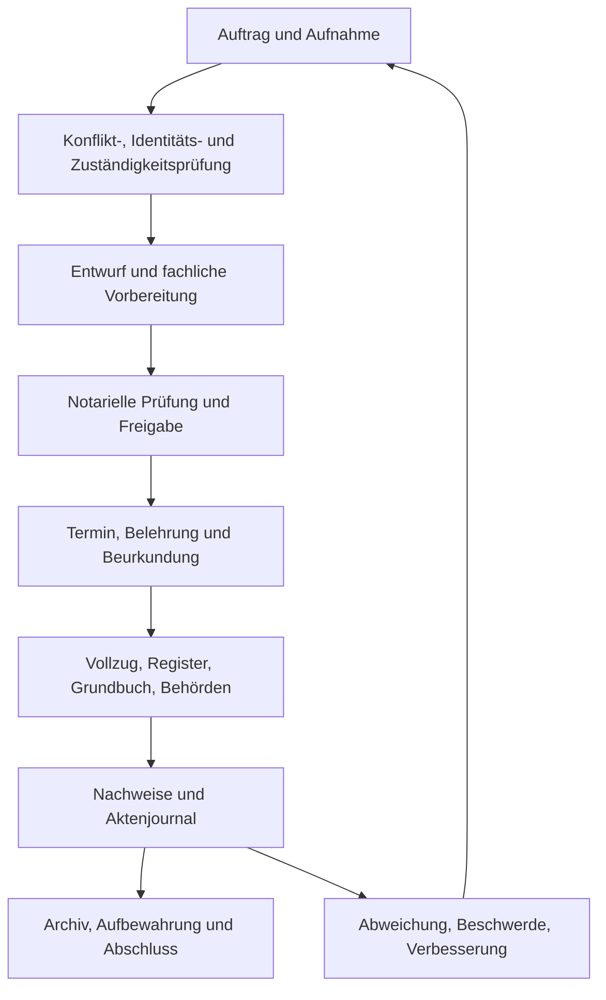

# Prozesslandkarte

Die Prozesslandkarte verbindet NaC-Abläufe mit einem auditierbaren
Qualitätsmanagementsystem.

## Prozessgruppen

| Prozessgruppe | NaC-Artefakt | QMS-Frage |
| --- | --- | --- |
| Aufnahme | Usecase-KG, Aktenmodell | Sind Auftrag, Beteiligte und offene Angaben vollständig erfasst? |
| Identität und Zuständigkeit | Plugin-Gates, Checklisten | Sind notwendige Prüfungen durchgeführt und nachweisbar? |
| Entwurf | BPMN, KG-Dokumentliste | Sind Dokumente, Entscheidungen und Freigaben vor Entwurf bekannt? |
| Notarielle Prüfung | Gates, Rollen, Review | Ist die verantwortliche Freigabe dokumentiert? |
| Termin | Aktenereignisse, Dokumente | Sind Status, Belehrung, Signatur- und Terminereignisse nachvollziehbar? |
| Vollzug | BPMN-Schritte, Dokumentmetadaten | Sind Einreichungen, Rückläufe und Fristen verfolgbar? |
| Archiv | Datenrepo, Journal, Exporte | Sind Nachweise auffindbar und stabil referenziert? |
| Verbesserung | Abweichungsschema, Auditprogramm | Werden Fehler und Beschwerden in Maßnahmen überführt? |

## Prozessnachweise

Jeder Prozess soll mindestens folgende Nachweise erzeugen:

- Akte mit Aktenzeichen, Status, Notar und Beteiligten.
- Dokumentliste mit Dokument-IDs und Metadaten.
- Ereignisjournal der wesentlichen Bearbeitungsschritte.
- Freigabe- oder Review-Vermerk.
- Offene Punkte und Abweichungen, falls vorhanden.
