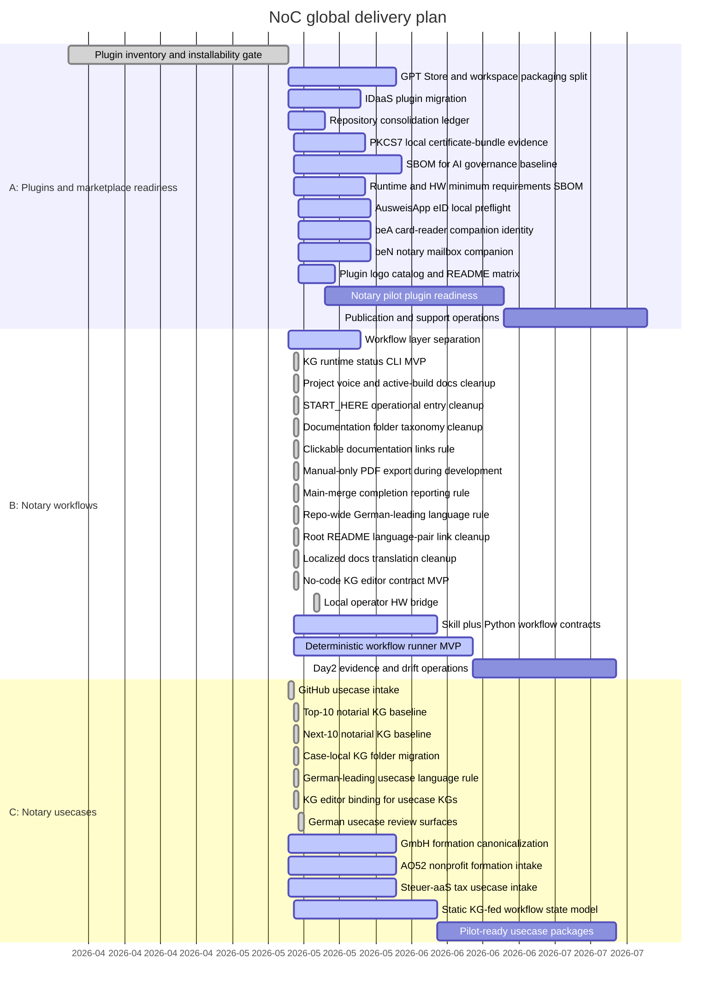

# NoC Global Gantt

Last update: 2026-05-19

Every push must update this global Gantt. Changes under `plugins/`,
`workflows/`, or `usecases/` must also update the matching area Gantt:

- `plugins/GANTT.md`
- `workflows/GANTT.md`
- `usecases/GANTT.md`

## Progress Snapshot

| Track | Scope | Status | Progress | Current gate |
| --- | --- | --- | --- | --- |
| A | Installable plugins for notary offices | Active | 71% | `plugins/README.md` now provides a readable logo catalog with plugin links, source links and operating boundaries; `noc-ausweisapp-eid` now adds a local AusweisApp eID preflight boundary between card-reader readiness and IDaaS claims; `noc-bea-portal` has BRaK beA visual identity and an active card-reader/Client-Security readiness boundary; `noc-ben-portal` adds the NotarNet beN visual identity, XNP-first Day0 boundary and local metadata-only preflight for notary mailbox workflows; `noc-cyberjack-rfid` detects REINER SCT DriverPackage, morris middleware and optional morris loopback API/PCSC locally; `noc-pkcs7-certbundle` adds a separate local certificate-bundle evidence track without signing; OpenAI-backed processing has an AVV/DPA governance section; and SBOM for AI has a repo-wide baseline, minimum-requirements inventory and strict validator. |
| B | Installable skills and deterministic Python workflows | Active | 43% | First executable KG runtime package and CLI are implemented with unit tests; `START_HERE` is now the operational entry path distinct from the README overview, startup verification has environment profiles for base, plugin-dev and notary-workstation setups, docs are grouped into `eventstream/`, `issues/`, `operations/` and `service-model/`, README/index references now have clickable-link validation, PDF export is manual-only during active development, `fertig` means merged to `main` plus clean local `main`, the GitHub root README uses a Deutsch/English start table, language parity now blocks copied identical localized Markdown/text mirrors, the KG editor exposes a safe no-code form/checklist view plus patch contract, and the local Operator-Webapp now uses a CLI-started `127.0.0.1` bridge for hardware-readiness checks. |
| C | Notarial usecases such as property, register, company, association, estate, family and power-of-attorney matters | Active | 59% | Every usecase now owns a case-local static KG; German is explicit as the leading and legally binding language for German-law notarial usecases; README files, KG review views and human-readable KG values are German-led; Fachpersonal edits those KGs through the no-code editor view instead of raw JSON. |

## Rule

The strict quality gate includes `scripts/validate_gantt_progress.py`. A change
set that does not update `roadmap/GANTT.md` is not push-ready. A change set that
touches `plugins/`, `workflows/`, or `usecases/` must update the matching area
Gantt as well.
