# NaC Globaler Gantt

Letzte Aktualisierung: 2026-05-19

Jedes Change-Set mit repo-relevanten Dateien muss diesen globalen Gantt
mitpflegen. Repo-relevant sind alle Änderungen außer generierten Artefakten
unter `out/` und Git-Interna. Änderungen unter `plugins/`, `workflows/` oder
`usecases/` müssen zusätzlich den passenden Themen-Gantt mitpflegen:

- `plugins/GANTT.md`
- `workflows/GANTT.md`
- `usecases/GANTT.md`

```mermaid
gantt
    title NaC globaler Lieferplan
    dateFormat  YYYY-MM-DD
    axisFormat  %Y-%m

    section A: Plugins und Marktplatz-Bereitschaft
    Plugin-Inventar und Installierbarkeitsprüfung :done, a1, 2026-04-01, 2026-05-14
    GPT-Store-/Arbeitsbereich-Paketierung trennen :active, a2, 2026-05-14, 21d
    IDaaS-Plugin-Migration                       :active,  a3, 2026-05-14, 14d
    Repository-Konsolidierungsledger             :active,  a4, 2026-05-14, 7d
    Lokaler PKCS7-Zertifikatsbündel-Nachweis    :active,  a4a, 2026-05-15, 14d
    SBOM für AI-Governance-Basis                :active,  a4b, 2026-05-15, 21d
    Runtime-/HW-Mindestanforderungs-SBOM         :active,  a4c, 2026-05-15, 14d
    Deutsche Plugin-MD-Sprachführung            :done,    a4d, 2026-05-17, 1d
    Deutsch geführte Plugin-Skills              :done,    a4e, 2026-05-17, 1d
    Lokaler Plugin-Erkennungsbootstrap           :done,    a4f, 2026-05-17, 1d
    Deutsche Plugin-UX dauerhaft erzwingen       :done,    a4g, 2026-05-17, 1d
    Plugin-Karten und Icons lesbar machen        :done,    a4h, 2026-05-17, 1d
    Funktion8-Marktplatznamen setzen             :done,    a4i, 2026-05-18, 1d
    Plugin-Kartennamen ohne NaC-Präfix setzen    :done,    a4j, 2026-05-18, 1d
    Plugin-Fachprüfungen über nac-CLI            :done,    a4k, 2026-05-19, 1d
    Echte Hardware-Readiness dokumentieren       :done,    a4l, 2026-05-19, 1d
    Notariats-Pilot-Plugin-Bereitschaft          :         a5, after a4, 35d
    Veröffentlichung und Supportbetrieb         :         a6, after a5, 28d

    section B: Notarielle Arbeitsabläufe
    Arbeitsablauf-Schichten trennen              :active,  b1, 2026-05-14, 14d
    KG-Runtime-Status-CLI-MVP                    :done,    b1a, 2026-05-15, 1d
    Projektstimme und Aktivbau-Doku bereinigen   :done,    b1b, 2026-05-15, 1d
    START_HERE-Betriebseinstieg bereinigen       :done,    b1c, 2026-05-15, 1d
    Dokumentationsordner-Taxonomie bereinigen    :done,    b1d, 2026-05-15, 1d
    Regel für klickbare Dokumentationslinks     :done,    b1e, 2026-05-15, 1d
    PDF-Export im Aufbau nur manuell             :done,    b1f, 2026-05-15, 1d
    Fertigmeldung nach Main-Merge                :done,    b1g, 2026-05-15, 1d
    Repo-weite deutsch führende Sprachregel     :done,    b1h, 2026-05-15, 1d
    Root-README-Sprachpaar-Links bereinigen      :done,    b1i, 2026-05-15, 1d
    Lokalisierte Doku-Übersetzung bereinigen    :done,    b1j, 2026-05-15, 1d
    No-code-KG-Editor-Vertrag-MVP                :done,    b1k, 2026-05-15, 1d
    Deutsche Arbeitsablauf-MD-Sprachführung     :done,    b1l, 2026-05-17, 1d
    Skill-Sprachregel und EN-Kurzfassung         :done,    b1m, 2026-05-17, 1d
    Deutsche Umlautpflicht validieren            :done,    b1n, 2026-05-18, 1d
    Sprachgleiche lokalisierte Links erzwingen   :done,    b1na, 2026-05-19, 1d
    BPMN-js Business-Layer-Profil                :done,    b1o, 2026-05-19, 1d
    Lokalen Webserver für Grafikflächen bauen   :done,    b1p, 2026-05-19, 1d
    Zentrale NaC-CLI-Bedienkante                 :done,    b1q, 2026-05-19, 1d
    Lokale Operator-HW-Bridge                    :done,    b1r, 2026-05-19, 1d
    BPMN-Editor-Speicherfläche                   :done,    b1s, 2026-05-19, 1d
    BPMN-Editor-Menü und Eigenschaftenpanel      :done,    b1t, 2026-05-19, 1d
    Skill- und Python-Arbeitsablauf-Verträge    :active,  b2, 2026-05-15, 28d
    Deterministischer Arbeitsablauf-Runner-MVP   :active,  b3, 2026-05-15, 35d
    BPMN-Modellvalidierung im Quality Gate       :done,    b3a, 2026-05-19, 1d
    Day2-Nachweis- und Driftbetrieb              :         b4, after b3, 28d

    section C: Notarielle Usecases
    GitHub-Usecase-Aufnahme                      :done,    c1, 2026-05-14, 1d
    Top-10 notarielle KG-Basis                   :done,    c2, 2026-05-15, 1d
    Nächste-10 notarielle KG-Basis              :done,    c3, 2026-05-15, 1d
    Usecase-lokale KG-Ordner-Migration           :done,    c3a, 2026-05-15, 1d
    Deutsch führende Usecase-Sprachregel        :done,    c3b, 2026-05-15, 1d
    KG-Editor-Bindung für Usecase-KGs           :done,    c3c, 2026-05-15, 1d
    Deutscher KG-Inhalt und Sprachgate           :done,    c3d, 2026-05-17, 1d
    Deutsche Usecase-Vorderseiten                :done,    c3e, 2026-05-17, 1d
    Usecase-BPMN-Basismodelle                    :done,    c3f, 2026-05-19, 1d
    GmbH-Gründung kanonisieren                  :active,  c4, 2026-05-14, 21d
    Usecase-Katalog bereinigen                 :done,    c5, 2026-05-17, 1d
    Steuer-aaS-Usecase aus Katalog entfernen     :done,    c6, 2026-05-19, 1d
    Statisches KG-gestütztes Arbeitsablauf-Modell :active, c7, 2026-05-15, 28d
    Pilotfähige Usecase-Pakete                  :         c8, after c7, 35d

    section D: Produktkommunikation und Adoption
    Zielgruppenpfade und Owner-Sichtbarkeit      :done,    d1, 2026-05-17, 1d
    Reifegrad Glossar und Beispielpfad           :done,    d1a, 2026-05-17, 1d
    Bürobedienung und prüfbaren Kern erklären  :done,    d1b, 2026-05-17, 1d
    Regel zur Gantt-Pflege präzisieren         :done,    d1c, 2026-05-17, 1d
    AGPL-/CC-BY-Lizenzmodell setzen              :done,    d1d, 2026-05-18, 1d
    Codex-Logo-Assets importieren                :done,    d1e, 2026-05-19, 1d
    Operator-Webapp-n8-Logo setzen               :done,    d1f, 2026-05-19, 1d
    Operator-BPMN-Menü sichtbar machen           :done,    d1g, 2026-05-19, 1d
    Operator-Webapp auf Büroarbeit trennen       :done,    d1h, 2026-05-19, 1d
    Operator-Usecase-Routen vollständig prüfen   :done,    d1i, 2026-05-19, 1d
    KG-Arbeitsansicht deutsch beschriften        :done,    d1j, 2026-05-19, 1d
    BPMN-Modellansicht responsiv machen          :done,    d1k, 2026-05-19, 1d
    Operator-Webapp ohne Zugriff erklären        :done,    d1l, 2026-05-19, 1d
    Operator-Vorgangsliste vollständig machen    :done,    d1m, 2026-05-19, 1d
    Bürooberfläche-vor-CLI-Modell schärfen       :done,    d1n, 2026-05-19, 1d
    Operator-Rechtsgebiets-Navigation bauen      :done,    d1o, 2026-05-19, 1d
    Notariats-Startseite weiter schärfen        :active,  d2, 2026-05-17, 14d
```

## Fortschrittsbild

| Arbeitsstrang | Umfang | Status | Fortschritt | Aktueller Prüfpunkt |
| --- | --- | --- | --- | --- |
| A | Installierbare Plugins für Notariate | Aktiv | 79% | `nac-cyberjack-rfid` erkennt lokal REINER-SCT-DriverPackage, morris-Browser-Middleware und den optionalen morris-Loopback-API-/PCSC-Pfad und ist über `nac plugins card-readiness` aufrufbar; bei installierter echter Hardware sind reale lokale Kartenleser-/SAK-Readiness-Tests vorgesehen, ohne PINs oder Kartenrohdaten zu speichern; `nac-bnotk-xnp` ist über `nac plugins xnp-reader-prompt` an das Karten-Gate gebunden und kann lokale XNP-Workstation-Validierung vorbereiten; `nac-pkcs7-certbundle` führt über `nac plugins pkcs7-inspect` einen getrennten lokalen Zertifikatsbündel-Nachweistrack ohne Signatur; OpenAI-gestützte Verarbeitung hat einen AVV/DPA-Governance-Abschnitt; die AI-SBOM hat eine repo-weite Basis, Mindestanforderungsinventar, strikten Validator, deutsche Plugin-MD-Führung, deutsch geführte Skill-Anweisungen mit englischer Kurzfassung, kurzen deutschen Plugin-Anzeigenamen ohne `NaC`-Präfix, knappen Kurzbeschreibungen, echten Icon-/Logo-Assets, sichtbarem Marktplatznamen `funktion8 - NaC` und einen lokalen Codex-Erkennungsbootstrap für neue Rechner. |
| B | Installierbare Skills und deterministische Python-Arbeitsabläufe | Aktiv | 59% | Das erste ausführbare KG-Runtime-Paket ist unter der zentralen `nac`-CLI erreichbar; `nac status`, `nac kg`, `nac bpmn`, `nac config`, `nac plugins`, `nac process`, `nac web`, `nac operator` und `nac doctor` bilden die gemeinsame Bedienkante für Runtime, Konfiguration, Webserver, lokale Operator-Bridge und Quality Gate; `START_HERE` ist der operative Einstieg getrennt vom README-Überblick; Startprüfungen haben Profile für Basis-, Plugin-Dev- und Notariats-Arbeitsplatz-Setups; README-/Index-Referenzen haben klickbare-Link-Validierung; PDF-Export bleibt im aktiven Aufbau manuell; `fertig` bedeutet Merge nach `main` plus sauberer lokaler `main`; Sprachparität blockiert kopierte lokalisierte Markdown-/Textspiegel, prüft SKILL.md-Sprachmarker, erzwingt echte Umlaute in deutscher Menschensprache und hält lokalisierte Markdown-Links im jeweiligen Sprachpfad; der KG-Editor stellt sichere No-code-Formular-/Checklisten-Sichten plus Patch-Vertrag bereit; der BPMN-js Business Layer hat ein NaC-Modellprofil, Usecase-BPMN-Modelle, `nac:channel`, eine Python-Validierung im strikten Quality Gate und einen lokalen Webserver mit BPMN-XML/Editierfläche, sichtbarem Editor-Menü, Schritt-Navigation, bpmn-js-Palette und NaC-Eigenschaftenpanel. |
| C | Notarielle Usecases für Immobilien, Register, Gesellschaften, Vereine, Nachlass, Familie und Vollmachten | Aktiv | 67% | Jeder aktive Usecase besitzt eine usecase-lokale statische KG und ein bpmn-js-taugliches BPMN-Basismodell mit Rolle, Ausführungskanal, Freigabe, Nachweis und KG-Referenz; die Kanäle unterscheiden persönliche, E-Mail-, Fax-/Post-, Portal-, XNP- und digital signierte Schritte; Deutsch ist explizit die führende und rechtlich bindende Sprache für deutschrechtliche notarielle Usecases; KG-JSON-Reviewtexte, Markdown-Review-Sichten und kurze Usecase-Vorderseiten sind deutsch geführt und durch den Sprachvalidator abgedeckt; nicht passende aktive Aufnahmequellen, darunter `Steuer-aaS`, wurden aus NaC entfernt und sind nicht mehr Teil des Katalogs. |
| D | Produktkommunikation, Adoption und externe Bewertung | Aktiv | 45% | Root-README führt jetzt mit Nutzen, Grenzen, Owner-Sichtbarkeit, vier Zielgruppenpfaden plus Maintainer-Pfad und sichtbarer Attribution; separate Startseiten erklären Notariatsentscheidung, Betrieb, Integration sowie Prüfung und Standardisierung; Reifegrad, Glossar, Ausführungsmodell für Bürooberfläche und prüfbaren Kern, präzisierte Gantt-Regel, AGPL-/CC-BY-Lizenzmodell, ein durchgehender Immobilienkaufvertrag-Pfad und ein repo-lokaler Codex-Logo-Assetbestand machen den Stand für Nicht-Technik-Leser greifbarer; die lokale Operator-Webapp ist als Büroarbeitsfläche von Handbuch-/Doku-Inhalten getrennt, startet usecase-zentriert, führt alle 22 Vorgänge als gleichartige Arbeitskarten mit Checkliste, Ablauf und Bearbeiten, filtert die Vorgangsliste über obere App-Tabs nach Immobilienrecht, Gesellschaft/Register, Erbrecht, Familienrecht/Vorsorge und allgemeinem Zivilrecht, zeigt KG-Status/Rollen in deutschen Büro-Bezeichnungen statt technischer Roh-IDs, hält BPMN-Diagramme sowie Schritt-Tabellen auf schmalen Breiten lesbar und ist mit Screenshots für Leser ohne Webapp-Zugriff erklärt; README und CLI-Doku stellen `nac` als prüfbaren Kern hinter der verständlichen Bürobedienung dar, nicht als reine Kommandozeilenbedienung. |

## Regel

Die strikte Qualitätsprüfung umfasst `scripts/validate_gantt_progress.py` und setzt
diese Regel technisch durch:

1. Sobald ein Change-Set repo-relevante Dateien ändert, muss
   `roadmap/GANTT.md` Teil desselben Change-Sets sein.
2. Änderungen unter `plugins/`, `workflows/` oder `usecases/` müssen
   zusätzlich das jeweilige `GANTT.md` im selben Root mitpflegen.
3. Reine Änderungen am jeweiligen Themen-Gantt zählen bereits als
   Themen-Gantt-Pflege.
4. Generierte Quality-Artefakte unter `out/` und Git-Interna werden ignoriert.
