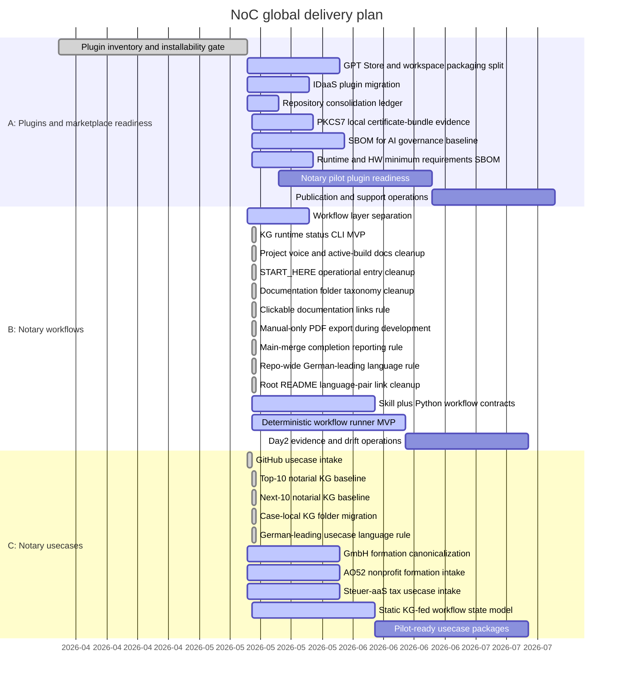

# NoC Global Gantt

Last update: 2026-05-15

Every push must update this global Gantt. Changes under `plugins/`,
`workflows/`, or `usecases/` must also update the matching area Gantt:

- `plugins/GANTT.md`
- `workflows/GANTT.md`
- `usecases/GANTT.md`

## Progress Snapshot

| Track | Scope | Status | Progress | Current gate |
| --- | --- | --- | --- | --- |
| A | Installable plugins for notary offices | Active | 67% | `noc-cyberjack-rfid` now detects REINER SCT DriverPackage, morris browser middleware and the optional morris loopback API/PCSC path locally; `noc-pkcs7-certbundle` adds a separate local certificate-bundle evidence track without signing; OpenAI-backed processing has an AVV/DPA governance section; and SBOM for AI now has a repo-wide baseline, minimum-requirements inventory and strict validator. |
| B | Installable skills and deterministic Python workflows | Active | 35% | First executable KG runtime package and CLI are implemented with unit tests; `START_HERE` is now the operational entry path distinct from the README overview, startup verification has environment profiles for base, plugin-dev and notary-workstation setups, docs are grouped into `eventstream/`, `issues/`, `operations/` and `service-model/`, README/index references now have clickable-link validation, PDF export is manual-only during active development, `fertig` means merged to `main` plus clean local `main`, and the GitHub root README follows the repo-wide German-leading language rule with paired de/en links. |
| C | Notarial usecases such as property, register, company, association, estate, family and power-of-attorney matters | Active | 54% | Every usecase now owns a case-local static KG; German is explicit as the leading and legally binding language for German-law notarial usecases. |

## Rule

The strict quality gate includes `scripts/validate_gantt_progress.py`. A change
set that does not update `roadmap/GANTT.md` is not push-ready. A change set that
touches `plugins/`, `workflows/`, or `usecases/` must update the matching area
Gantt as well.
