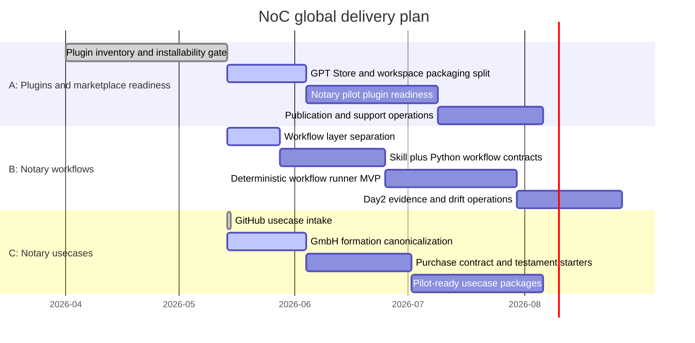

# NoC Global Gantt

Last update: 2026-05-14

Every push must update this global Gantt. Changes under `plugins/`,
`workflows/`, or `usecases/` must also update the matching area Gantt:

- `plugins/GANTT.md`
- `workflows/GANTT.md`
- `usecases/GANTT.md`

## Progress Snapshot

| Track | Scope | Status | Progress | Current gate |
| --- | --- | --- | --- | --- |
| A | Installable plugins for notary offices | Active | 35% | Publish track must separate public GPT Store packages from workspace-only apps. |
| B | Installable skills and deterministic Python workflows | Active | 10% | Workflow root and execution boundaries are now explicit. |
| C | Notarial usecases such as GmbH formation, purchase contract, testament | Active | 15% | GitHub intake identified `ofunk/Online-GmbH-Gruendung` as the first canonical usecase. |

## Rule

The strict quality gate includes `scripts/validate_gantt_progress.py`. A change
set that does not update `roadmap/GANTT.md` is not push-ready. A change set that
touches `plugins/`, `workflows/`, or `usecases/` must update the matching area
Gantt as well.
