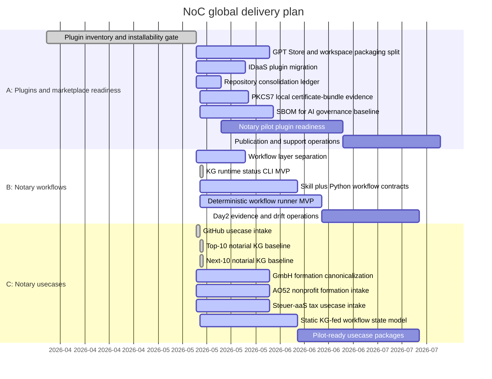

# NoC Global Gantt

Last update: 2026-05-15

Every push must update this global Gantt. Changes under `plugins/`,
`workflows/`, or `usecases/` must also update the matching area Gantt:

- `plugins/GANTT.md`
- `workflows/GANTT.md`
- `usecases/GANTT.md`

## Progress Snapshot

| Track | Scope | Status | Progress | Current gate |
| --- | --- | --- | --- | --- |
| A | Installable plugins for notary offices | Active | 64% | `noc-cyberjack-rfid` now detects REINER SCT DriverPackage, morris browser middleware and the optional morris loopback API/PCSC path locally; `noc-pkcs7-certbundle` adds a separate local certificate-bundle evidence track without signing; OpenAI-backed processing has an AVV/DPA governance section; and SBOM for AI now has a repo-wide baseline, draft artifact and strict validator. |
| B | Installable skills and deterministic Python workflows | Active | 24% | First executable KG runtime package and CLI are implemented with unit tests; next step is KG-to-contract generation. |
| C | Notarial usecases such as property, register, company, association, estate, family and power-of-attorney matters | Active | 52% | Top-10 and Next-10 usecase catalogs now exist with static KG nodes, detailed usecase folders and a strict KG validator. |

## Rule

The strict quality gate includes `scripts/validate_gantt_progress.py`. A change
set that does not update `roadmap/GANTT.md` is not push-ready. A change set that
touches `plugins/`, `workflows/`, or `usecases/` must update the matching area
Gantt as well.
