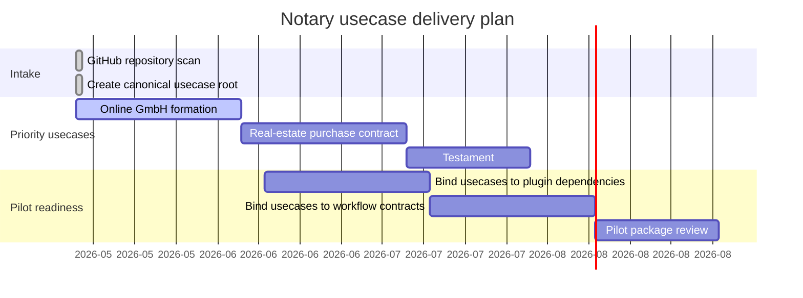

# Usecase Gantt

Last update: 2026-05-14

## Status

| Usecase | Folder | Status | Source |
| --- | --- | --- | --- |
| Online GmbH formation | `usecases/online-gmbh-gruendung/` | Active | Canonicalized from the empty GitHub repo `ofunk/Online-GmbH-Gruendung`. |
| Real-estate purchase contract | `usecases/grundstueckskaufvertrag/` | Planned | New canonical starter in this repository. |
| Testament | `usecases/testament/` | Planned | New canonical starter in this repository. |
