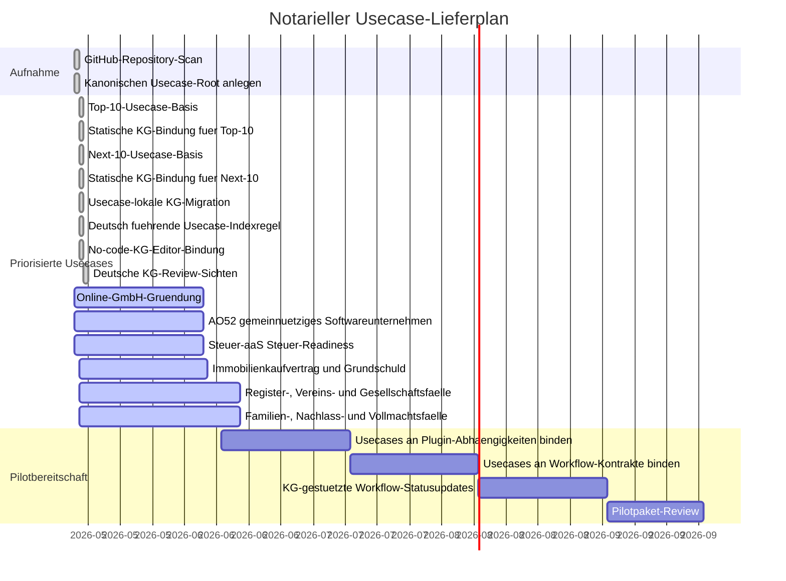

# Usecase-Gantt

Letzte Aktualisierung: 2026-05-16

## Status

| Usecase | Ordner | Status | Quelle |
| --- | --- | --- | --- |
| Top-10 notarielle Usecase-Basis | `usecases/*/knowledge-graph.graph.json` | Abgeschlossen | Kanonische Usecase-Ordner und usecase-lokale KG-Knoten fuer die zehn wichtigsten notariellen Vorgangsarten angelegt. |
| Next-10 notarielle Usecase-Basis | `usecases/*/knowledge-graph.graph.json` | Abgeschlossen | Kanonische Usecase-Ordner und usecase-lokale KG-Knoten fuer die naechsten zehn haeufigen notariellen Vorgangsarten angelegt. |
| Deutsch fuehrende Usecase-Sprache | [usecases/README.md](README.md) | Abgeschlossen | Deutsch ist als fuehrende und rechtlich bindende Sprache fuer deutsche notarielle Usecases festgeschrieben. |
| Deutsche KG-Review-Sichten | `usecases/*/README.md`, `usecases/*/knowledge-graph.md`, `usecases/*/knowledge-graph.graph.json` | Abgeschlossen | Alle Usecase-README-Dateien, Markdown-KG-Review-Sichten und menschenlesbaren KG-Werte sind deutsch gefuehrt; technische Identifier bleiben stabil. |
| No-code-KG-Editor-Bindung | [usecases/README.md](README.md) plus [src/notary_kg/editor.py](../src/notary_kg/editor.py) | Abgeschlossen | Fachpersonal bearbeitet Usecase-KGs ueber eine Formular-/Checklistenansicht; rohes JSON und `value`-Felder bleiben blockiert. |
| Online GmbH-/UG-Gruendung | [online-gmbh-gruendung/](online-gmbh-gruendung) | Aktiv | Aus dem leeren GitHub-Repository `ofunk/Online-GmbH-Gruendung` kanonisiert; jetzt Teil des Top-10-KG. |
| AO52 gemeinnuetziges Softwareunternehmen | [ao52aas-gemeinnuetzigkeit/](ao52aas-gemeinnuetzigkeit) | Aktiv | Aus `ofunk/AO52aaS` migriert. |
| Steuer-aaS Steuer-Readiness | [steuer-aas/](steuer-aas) | Aktiv | Aus dem leeren GitHub-Repository `ofunk/Steuer-aaS` kanonisiert. |
| Immobilienkaufvertrag | [immobilienkaufvertrag/](immobilienkaufvertrag) | KG-Basis | Neuer kanonischer Top-10-Usecase in diesem Repository. |
| Grundschuld / Hypothekenbestellung | [grundschuld-hypothekenbestellung/](grundschuld-hypothekenbestellung) | KG-Basis | Neuer kanonischer Top-10-Usecase in diesem Repository. |
| Handelsregisteranmeldung | [handelsregisteranmeldung/](handelsregisteranmeldung) | KG-Basis | Neuer kanonischer Top-10-Usecase in diesem Repository. |
| Beglaubigung von Unterschriften | [unterschriftsbeglaubigung/](unterschriftsbeglaubigung) | KG-Basis | Neuer kanonischer Top-10-Usecase in diesem Repository. |
| Testament / Erbvertrag | [testament-erbvertrag/](testament-erbvertrag) | KG-Basis | Neuer kanonischer Top-10-Usecase in diesem Repository. |
| Erbscheinsantrag / Nachlass | [erbscheinsantrag-nachlass/](erbscheinsantrag-nachlass) | KG-Basis | Neuer kanonischer Top-10-Usecase in diesem Repository. |
| Vorsorgevollmacht und Patientenverfuegung | [vorsorgevollmacht-patientenverfuegung/](vorsorgevollmacht-patientenverfuegung) | KG-Basis | Neuer kanonischer Top-10-Usecase in diesem Repository. |
| Schenkungsvertrag / Uebertragungsvertrag | [schenkungsvertrag-uebertragungsvertrag/](schenkungsvertrag-uebertragungsvertrag) | KG-Basis | Neuer kanonischer Top-10-Usecase in diesem Repository. |
| Ehevertrag / Scheidungsfolgenvereinbarung | [ehevertrag-scheidungsfolgenvereinbarung/](ehevertrag-scheidungsfolgenvereinbarung) | KG-Basis | Neuer kanonischer Top-10-Usecase in diesem Repository. |
| Loeschungsbewilligung / Grundbuchloeschung | [loeschungsbewilligung-grundbuchloeschung/](loeschungsbewilligung-grundbuchloeschung) | KG-Basis | Neuer kanonischer Next-10-Usecase in diesem Repository. |
| Teilungserklaerung nach WEG | [teilungserklaerung-weg/](teilungserklaerung-weg) | KG-Basis | Neuer kanonischer Next-10-Usecase in diesem Repository. |
| Bautraegervertrag | [bautraegervertrag/](bautraegervertrag) | KG-Basis | Neuer kanonischer Next-10-Usecase in diesem Repository. |
| Gesellschafterbeschluss GmbH/UG | [gesellschafterbeschluss-gmbh-ug/](gesellschafterbeschluss-gmbh-ug) | KG-Basis | Neuer kanonischer Next-10-Usecase in diesem Repository. |
| Geschaeftsanteilsuebertragung GmbH | [geschaeftsanteilsuebertragung-gmbh/](geschaeftsanteilsuebertragung-gmbh) | KG-Basis | Neuer kanonischer Next-10-Usecase in diesem Repository. |
| Vereinsregisteranmeldung | [vereinsregisteranmeldung/](vereinsregisteranmeldung) | KG-Basis | Neuer kanonischer Next-10-Usecase in diesem Repository. |
| Erbausschlagung | [erbausschlagung/](erbausschlagung) | KG-Basis | Neuer kanonischer Next-10-Usecase in diesem Repository. |
| Pflichtteilsverzicht / Erbverzicht | [pflichtteilsverzicht-erbverzicht/](pflichtteilsverzicht-erbverzicht) | KG-Basis | Neuer kanonischer Next-10-Usecase in diesem Repository. |
| Adoption / familienrechtliche Erklaerungen | [adoption-familienrechtliche-erklaerungen/](adoption-familienrechtliche-erklaerungen) | KG-Basis | Neuer kanonischer Next-10-Usecase in diesem Repository. |
| Vollmacht fuer Immobilien- oder Gesellschaftsgeschaefte | [vollmacht-immobilien-gesellschaftsgeschaefte/](vollmacht-immobilien-gesellschaftsgeschaefte) | KG-Basis | Neuer kanonischer Next-10-Usecase in diesem Repository. |

## Plugin-klassifizierte Quellen

| Quelle | Entscheidung |
| --- | --- |
| `ofunk/IDaaS` | Als [plugins/noc-idaas/](../plugins/noc-idaas) migriert, nicht als Usecase. |

## KG-Regel

Jeder Usecase fuehrt seinen KG unter `usecases/<slug>/knowledge-graph.graph.json`
plus `usecases/<slug>/knowledge-graph.md`. Das strikte Quality Gate verwirft
einen zentralen `knowledge-graph/` Ordner und jeden Usecase-Ordner ohne lokalen
KG. Jedes KG-Update muss alle `value`-Felder leer oder `null` halten und dieses
Gantt plus das globale Gantt aktualisieren. Fachpersonal nutzt die
KG-Editor-Ansicht und den Patch-Workflow; direkte Roh-JSON-Bearbeitung bleibt
reviewter Entwicklerwartung vorbehalten.
