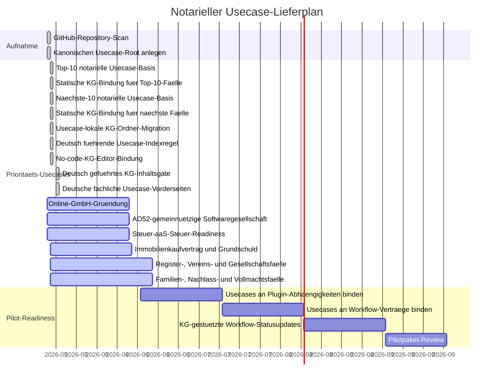

# Usecase-Gantt

Letzte Aktualisierung: 2026-05-17

## Status

| Usecase | Ordner | Status | Quelle |
| --- | --- | --- | --- |
| Top-10 notarielle Usecase-Basis | `usecases/*/knowledge-graph.graph.json` | Fertig | Kanonische Usecase-Ordner und usecase-lokale KG-Knoten fuer die zehn wichtigsten notariellen Falltypen angelegt. |
| Naechste-10 notarielle Usecase-Basis | `usecases/*/knowledge-graph.graph.json` | Fertig | Kanonische Usecase-Ordner und usecase-lokale KG-Knoten fuer die naechsten zehn haeufigen notariellen Falltypen angelegt. |
| Deutsch fuehrende Usecase-Sprache | `usecases/README.md` | Fertig | Deutsch ist jetzt explizit als fuehrende und rechtlich bindende Sprache fuer deutschrechtliche notarielle Usecases festgelegt. |
| No-code-KG-Editor-Bindung | `usecases/README.md` plus `src/notary_kg/editor.py` | Fertig | Fachpersonal bearbeitet Usecase-KGs ueber eine Formular-/Checklisten-Editor-View; rohes JSON und `value`-Felder bleiben gesperrt. |
| Deutsch gefuehrtes KG-Inhaltsgate | `usecases/*/knowledge-graph.*` plus `scripts/validate_language_parity.py` | Fertig | KG-Markdown-Review-Sichten und fachliche JSON-Textfelder sind deutsch gefuehrt; alte englische KG-Geruesttexte werden vom Sprachvalidator abgelehnt. |
| Deutsche fachliche Usecase-Vorderseiten | `usecases/*/README.md` plus `scripts/validate_language_parity.py` | Fertig | Jeder Usecase hat eine kurze deutsche Vorderseite fuer Nicht-Technik-Leser; alte englische Usecase-README-Geruesttexte werden vom Sprachvalidator abgelehnt. |
| Online-GmbH-/UG-Gruendung | `usecases/online-gmbh-gruendung/` | Aktiv | Aus dem leeren GitHub-Repo `ofunk/Online-GmbH-Gruendung` kanonisiert; jetzt Teil der Top-10-KG. |
| AO52-gemeinnuetzige Softwaregesellschaft | `usecases/ao52aas-gemeinnuetzigkeit/` | Aktiv | Aus `ofunk/AO52aaS` migriert. |
| Steuer-aaS-Steuer-Readiness | `usecases/steuer-aas/` | Aktiv | Aus dem leeren GitHub-Repo `ofunk/Steuer-aaS` kanonisiert. |
| Immobilienkaufvertrag | `usecases/immobilienkaufvertrag/` | KG-Basis | Neuer kanonischer Top-10-Usecase in diesem Repository. |
| Grundschuld / Hypothekenbestellung | `usecases/grundschuld-hypothekenbestellung/` | KG-Basis | Neuer kanonischer Top-10-Usecase in diesem Repository. |
| Handelsregisteranmeldung | `usecases/handelsregisteranmeldung/` | KG-Basis | Neuer kanonischer Top-10-Usecase in diesem Repository. |
| Beglaubigung von Unterschriften | `usecases/unterschriftsbeglaubigung/` | KG-Basis | Neuer kanonischer Top-10-Usecase in diesem Repository. |
| Testament / Erbvertrag | `usecases/testament-erbvertrag/` | KG-Basis | Neuer kanonischer Top-10-Usecase in diesem Repository. |
| Erbscheinsantrag / Nachlass | `usecases/erbscheinsantrag-nachlass/` | KG-Basis | Neuer kanonischer Top-10-Usecase in diesem Repository. |
| Vorsorgevollmacht und Patientenverfuegung | `usecases/vorsorgevollmacht-patientenverfuegung/` | KG-Basis | Neuer kanonischer Top-10-Usecase in diesem Repository. |
| Schenkungsvertrag / Uebertragungsvertrag | `usecases/schenkungsvertrag-uebertragungsvertrag/` | KG-Basis | Neuer kanonischer Top-10-Usecase in diesem Repository. |
| Ehevertrag / Scheidungsfolgenvereinbarung | `usecases/ehevertrag-scheidungsfolgenvereinbarung/` | KG-Basis | Neuer kanonischer Top-10-Usecase in diesem Repository. |
| Loeschungsbewilligung / Grundbuchloeschung | `usecases/loeschungsbewilligung-grundbuchloeschung/` | KG-Basis | Neuer kanonischer Naechste-10-Usecase in diesem Repository. |
| Teilungserklaerung nach WEG | `usecases/teilungserklaerung-weg/` | KG-Basis | Neuer kanonischer Naechste-10-Usecase in diesem Repository. |
| Bautraegervertrag | `usecases/bautraegervertrag/` | KG-Basis | Neuer kanonischer Naechste-10-Usecase in diesem Repository. |
| Gesellschafterbeschluss GmbH/UG | `usecases/gesellschafterbeschluss-gmbh-ug/` | KG-Basis | Neuer kanonischer Naechste-10-Usecase in diesem Repository. |
| Geschaeftsanteilsuebertragung GmbH | `usecases/geschaeftsanteilsuebertragung-gmbh/` | KG-Basis | Neuer kanonischer Naechste-10-Usecase in diesem Repository. |
| Vereinsregisteranmeldung | `usecases/vereinsregisteranmeldung/` | KG-Basis | Neuer kanonischer Naechste-10-Usecase in diesem Repository. |
| Erbausschlagung | `usecases/erbausschlagung/` | KG-Basis | Neuer kanonischer Naechste-10-Usecase in diesem Repository. |
| Pflichtteilsverzicht / Erbverzicht | `usecases/pflichtteilsverzicht-erbverzicht/` | KG-Basis | Neuer kanonischer Naechste-10-Usecase in diesem Repository. |
| Adoption / familienrechtliche Erklaerungen | `usecases/adoption-familienrechtliche-erklaerungen/` | KG-Basis | Neuer kanonischer Naechste-10-Usecase in diesem Repository. |
| Vollmacht fuer Immobilien- oder Gesellschaftsgeschaefte | `usecases/vollmacht-immobilien-gesellschaftsgeschaefte/` | KG-Basis | Neuer kanonischer Naechste-10-Usecase in diesem Repository. |

## Plugin-klassifizierte Quellen

| Quelle | Entscheidung |
| --- | --- |
| `ofunk/IDaaS` | Als `plugins/noc-idaas/` migriert, nicht als Usecase. |

## KG-Regel

Jeder Usecase besitzt seine KG unter
`usecases/<slug>/knowledge-graph.graph.json` plus
`usecases/<slug>/knowledge-graph.md`. Das strikte Quality Gate lehnt einen
zentralen `knowledge-graph/`-Ordner und jeden Usecase-Ordner ohne lokale KG ab.
Jede KG-Aenderung muss alle fallbezogenen `value`-Felder in Git leer halten und
bei Push diesen Gantt plus den globalen Gantt aktualisieren. Fachpersonalnahe
Aenderungen laufen ueber die KG-Editor-View und den Patch-Workflow; direkte
Roh-JSON-Bearbeitung bleibt gepruefter Entwicklerwartung vorbehalten.
