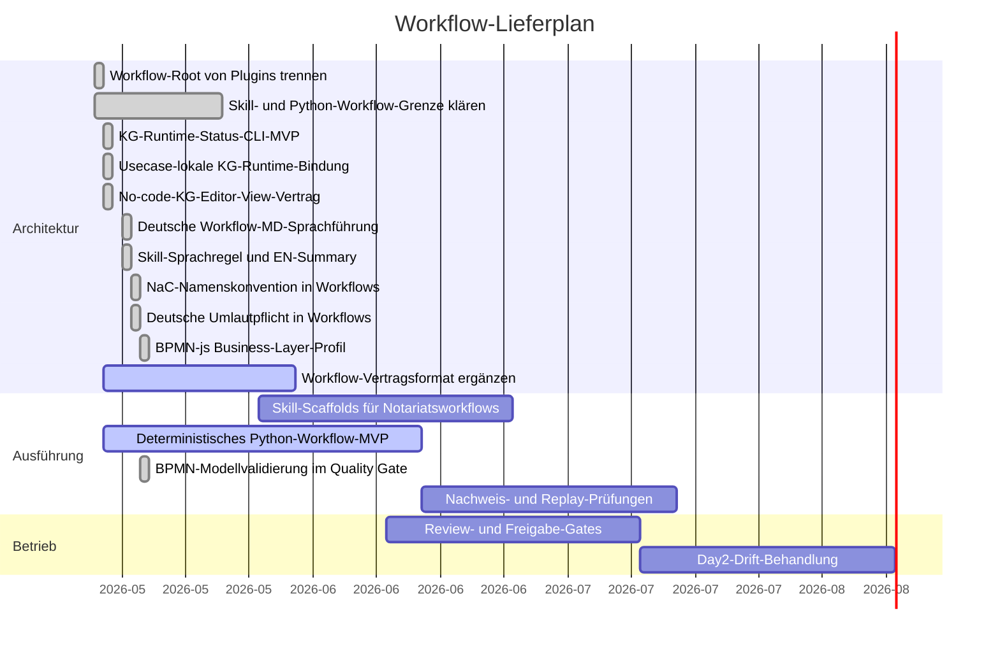

# Workflow Gantt

Letzte Aktualisierung: 2026-05-18

## Status

| Schicht | Root | Status | Grenze |
| --- | --- | --- | --- |
| Installierbare Skills | `workflows/skills/` | Geplant / Sprachregel bereit | Deutsche fachliche Anweisung führt; englische Summary dient technischer Anschlussfähigkeit, keine finale rechtliche Wahrheit. |
| Python-Workflows | `workflows/python/` plus `src/notary_kg/` | Aktiv | Die deterministische KG-Status-Runtime liest usecase-lokale KG-Dateien und stellt die sichere No-code-Editor-View bereit. |
| BPMN-js Business Layer | `bpmn/` plus `workflows/contracts/bpmn-js-editor.contract.json` | Profil bereit | BPMN ist fachliche Prozessquelle; `bpmn-js` wird Editor, Python validiert NaC-Properties, Sequenzflüsse und bpmn-js-taugliche Modelle. |
| Workflow-Verträge | `workflows/contracts/` | Aktiv | Eingaben, Ausgaben, Freigaben, Datenklassen, Plugin-Abhängigkeiten sowie KG-Editor- und BPMN-js-Editor-Vertrag. |

Der repo-weite Marken- und ID-Standard heißt `NaC` für `Notariat as Code`;
alte Schreibweisen sind in Workflow-Dokumenten nicht mehr
zulässig.
Deutsche Menschentexte nutzen echte Umlaute; technische IDs, Pfade und Befehle
bleiben ASCII-stabil.
