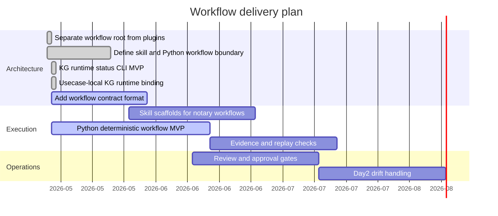

# Workflow Gantt

Last update: 2026-05-15

## Status

| Layer | Root | Status | Boundary |
| --- | --- | --- | --- |
| Installable skills | `workflows/skills/` | Planned | LLM-facing operational guidance, no final legal truth. |
| Python workflows | `workflows/python/` plus `src/notary_kg/` | Active | Deterministic KG status runtime now reads usecase-local KG files; next step is contract generation. |
| Workflow contracts | `workflows/contracts/` | Active next | Inputs, outputs, approvals, data classes, and plugin dependencies. |
